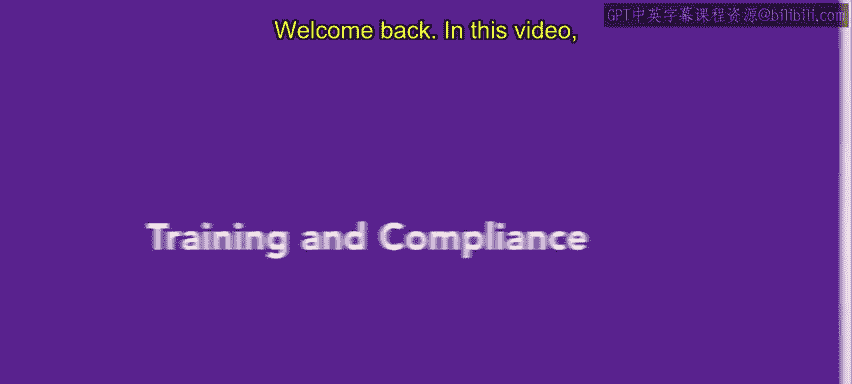
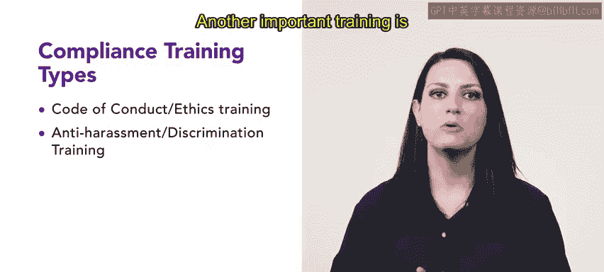

# 人力资源助理：第1课：培训与合规 📚

在本节课中，我们将学习关于培训与合规的一些基础知识。我们会介绍美国的合规培训要求，特别是行业和州规定的培训内容。接下来，我们将逐一探讨各种不同的合规培训类型及其重要性。

## 1. 合规培训简介

合规培训是指员工根据州、行业或组织的规定，必须参加的培训课程。以下是一些常见的合规培训类型：

- **行为规范与伦理培训**
- **反骚扰与反歧视培训**
- **健康与安全培训**
- **多样性与包容性培训**
- **管理培训**

## 2. 各类合规培训详解

### 行为规范与伦理培训

行为规范与伦理培训涵盖组织内部与伦理行为相关的政策和程序，具体包括：

- 利益冲突
- 伦理行为标准

### 反骚扰与反歧视培训

此培训内容关注预防和应对工作场所中的骚扰和歧视行为，培训内容涉及：

- 组织的骚扰与歧视防范政策
- 响应骚扰与歧视的措施

### 信息安全培训

信息安全培训专注于组织内部保护敏感信息的政策和程序，培训内容包括：

- 防止数据泄露的措施
- 保护敏感信息的政策

### 健康与安全培训

健康与安全培训涉及组织在工作场所提供的健康与安全保障，培训内容包括：

- 紧急应对程序
- 危险物质处理方法

### 多样性与包容性培训

此类培训帮助组织创建一个多元化和包容性的工作环境，涵盖的主题有：

- 无意识偏见
- 文化敏感性
- 促进包容性

### 管理培训

管理培训重点提升管理者的管理技能，包括：

- 如何衡量管理成效
- 如何进行困难对话
- 管理最佳实践

## 3. 合规培训的必要性

在美国，**职业安全与健康管理局（OSH）**通过制定和执行标准，确保员工在安全健康的工作环境中工作。合规培训帮助员工了解组织的相关政策，并遵守这些规定，从而保障工作环境的安全与公正。

## 4. 总结

本节课中，我们学习了合规培训的定义与类型，包括行为规范、反骚扰、健康安全、多样性与包容性，以及管理培训等。每种培训类型都旨在确保员工在符合行业标准和法律要求的环境中工作。