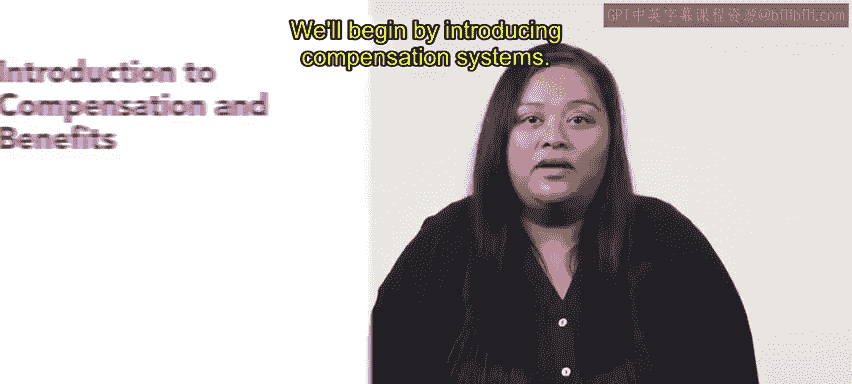
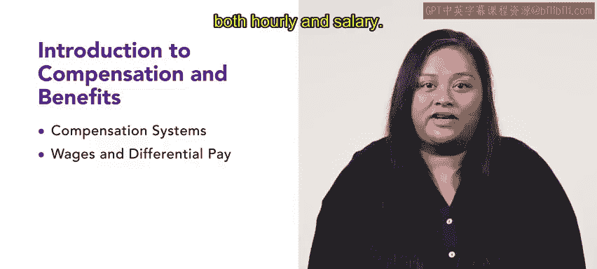

# HRCI《人力资源助理（招聘、学习发展、薪酬福利，1-3课／共5课）》：第3章：薪酬与福利导论 💼

在本节课中，我们将要学习薪酬与福利的基本概念。薪酬和福利的管理是人力资源管理中至关重要的一部分。作为一名HR专业人员，掌握这些任务将是你未来工作中的核心内容。接下来，我们将逐步了解薪酬系统，工资与差别薪酬的概念，并学习如何管理员工的薪酬和福利。

## 薪酬管理的重要性

薪酬和福利管理在每个组织中都扮演着重要角色。作为HR专业人员，了解如何管理薪酬是你工作的一部分。通过有效的薪酬管理，组织能够吸引并保留优秀人才，确保员工满意度，并提高工作效率。

## 薪酬系统的介绍

了解薪酬系统是管理薪酬和福利的基础。薪酬系统决定了员工如何获得报酬。以下是关于薪酬系统的几个关键点：

- 薪酬系统通常包括固定薪资、绩效奖金和福利等组成部分。
- 不同的薪酬系统适用于不同类型的工作和行业。

**公式：**
薪酬 = 基本工资 + 绩效奖金 + 福利

掌握薪酬系统后，你就能够设计合适的薪酬结构，以满足员工需求和公司目标。

## 工资与差别薪酬

在本节中，我们将进一步探讨工资和差别薪酬。工资是员工为完成工作而获得的固定报酬，而差别薪酬则是基于员工表现、技能或职位不同，给予不同薪酬的方式。

### 工资
工资通常有两种形式：

1. **时薪**：按小时支付报酬。
2. **月薪**：按月支付固定薪酬。

### 差别薪酬
差别薪酬是一种根据员工的不同表现、技能或职位差异来设定薪资的方式。差别薪酬可以帮助激励员工，提高工作效率。

## 总结

本节课中，我们介绍了薪酬和福利管理的基本概念。首先，我们学习了薪酬系统的构成，然后探讨了工资和差别薪酬的不同类型。在接下来的课程中，我们将进一步深入讨论如何管理员工的薪酬和福利，帮助你在HR工作中更好地应用这些知识。