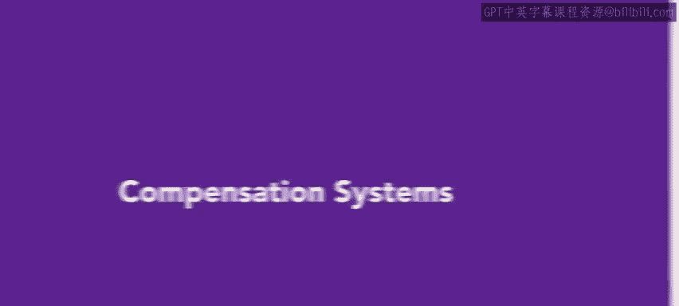
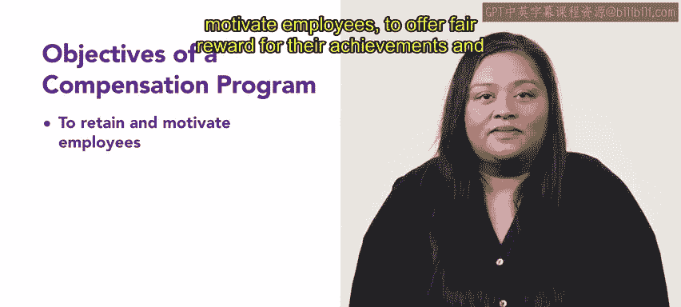

# HRCI《人力资源助理（招聘、学习发展、薪酬福利，1-3课／共5课）｜HRCI Human Resource Associate》 - P127：5_薪酬体系.zh_en - GPT中英字幕课程资源 - BV1qi421r7ba

The many elements that make up compensation and benefits are broadly referred to as a compensation system。

 Remember， a worker receives more than just a wage or salary from an organization。 Their pay。

 plus additional incentives， benefits and services is the total compensation a worker has given for their effort。

In this video， we'll explore the concept of a compensation system and what it includes。

A compensation system can be used to promote an organization's objectives if appropriately designed。

 it can be a vital component of an organization's business strategy。First。

 a compensation system can serve as the ultimate management tool for attracting， capturing。

 and retaining top talent。Second， it can be a powerful way to shape this talent and to promote constant learning and growth。

The main objectives of a compensation program are。To retain and motivate employees。

 to offer fair reward for their achievements and to create incentives for future efforts。

To be effective， a compensation system needs to do two things。

 it should clearly align overall company goals with employee goals and it should accurately match the company's performance against each individual's performance。

When an employee feels like they're contributing to the success of an organization。

 they will want their compensation to reflect that success。

It's important that the features of the program express the organization's objectives directly and also account for the conditions in the marketplace。

Most systems offer several forms of compensation， including face wage or salary benefits and incentives。

 each of these components serves a different purpose in motivating and rewarding employees。

Wages and salary are fairly straightforward， they refer to the money that an employee earns and can include hourly wages。

 weekly monthly or annual salaries and overtime pay。

Incentives can be monetary or non monetary and include things that an employee earns in addition to their wages or salary。

They can include bonuses， commissions， profit sharing， and extra time off。Finally。

 benefits are the additional entitlements an employee receives， they can include health insurance。

 life insurance， paid vacation， and a 401K plan or pension。

Compensation elements motivate employees， however， different people are of course。

 motivated by different things， an important part of your role as an HR professional will be balancing intrinsic rewards like recognition and personal growth and extrinsic rewards like paying benefits for your employees。

Coming up， you'll learn more about wages， incentives， and benefits。

