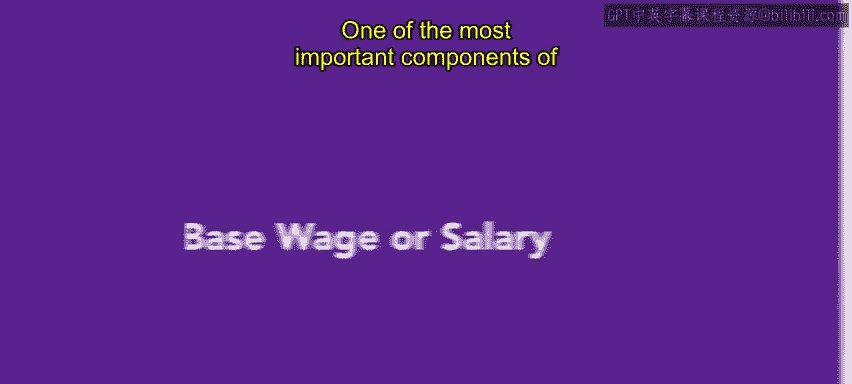
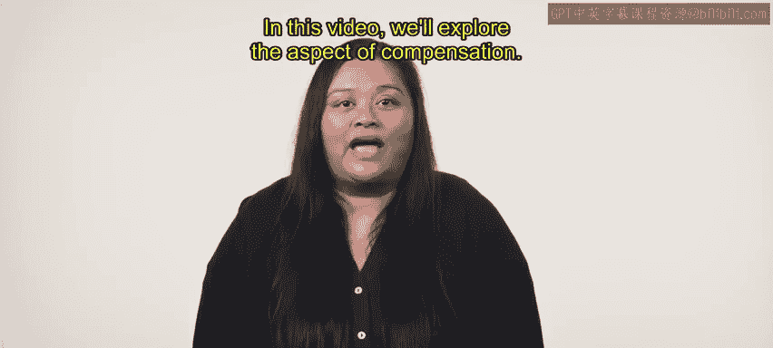
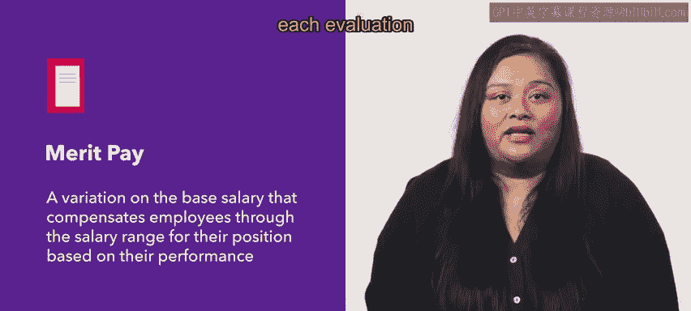
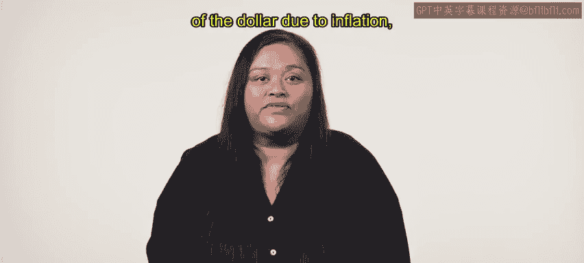
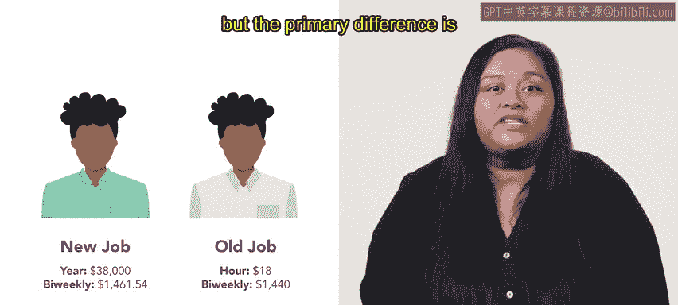
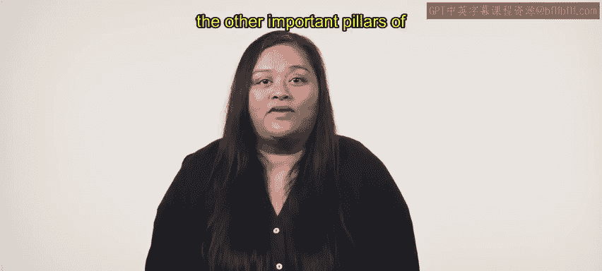

# HRCI《人力资源助理（招聘、学习发展、薪酬福利，1-3课／共5课）》：第6课：基本工资或薪金 💵

在本节课中，我们将探讨薪酬体系中的基本工资或薪金。基本工资是薪酬结构中最重要的组成部分之一，涉及员工的直接经济奖励。了解基本工资的设置和调整对于任何人力资源角色都至关重要。

## 基本工资简介

基本工资通常指的是工资或薪金，也可以称为直接薪酬。这是员工最基本的薪酬形式，通常是员工的主要动力来源之一。然而，基本工资并不是唯一的激励因素。

有些学者认为，支付给员工不合适的工资金额可能会成为一种负面激励，降低员工的工作积极性。因此，确保工资的合理性至关重要。本节将介绍如何理解和管理基本工资。

## 标准基本工资方案

以下是标准基本工资方案的基本概念：

- **固定金额**：标准基本工资是对员工执行标准工作职责的固定货币奖励。
- **不包括福利和奖金**：该金额通常不包括福利、奖金或提成。
- **最低和最高工资标准**：这些工资标准设有最低和最高水平，通常根据员工的经验和技能水平来设定。

然而，标准基本工资是一种基于能力的薪酬体系，通常不会考虑员工的学习进展，因此它并不鼓励员工不断学习和提升技能。

## 奖励性薪酬

除了基本工资外，许多公司还采用了一种名为**绩效薪酬**的薪酬方案，这种薪酬基于员工的工作表现调整其工资。绩效薪酬的特点包括：

- **基于表现的薪酬调整**：员工的工资会随着年终绩效评估的结果进行调整。
- **可能的期望问题**：由于每年都会进行评估，员工可能会期望每次评估后都能获得加薪，从而减少了额外加薪的激励作用。

## 生活成本调整

随着经济的变化，一些公司也会通过提供**生活成本调整**来帮助员工应对通货膨胀的影响。生活成本调整是指：

- **工资或薪金的增加**：这种增加通常是为了弥补由于通货膨胀导致的美元贬值，使员工的购买力保持不变。

## 基本工资示例

为了更好地理解基本工资，以下是一个例子：

- Kiyo的年薪为38,000美元，每两周发一次薪。
- 在Kiyo的上一份工作中，他的时薪为18美元，每周领取一次工资。

虽然Kiyo在两份工作中的年收入大致相同，但主要的区别在于他以前的工资是按小时计算，而现在的工资则是固定薪资。

## 结论

本节课中，我们学习了基本工资和薪金在薪酬体系中的重要性，并探讨了标准基本工资、绩效薪酬和生活成本调整等概念。理解这些概念对于任何从事人力资源管理工作的人员来说都是必不可少的。接下来，我们将进一步了解薪酬体系中的其他重要组成部分——激励措施和福利。