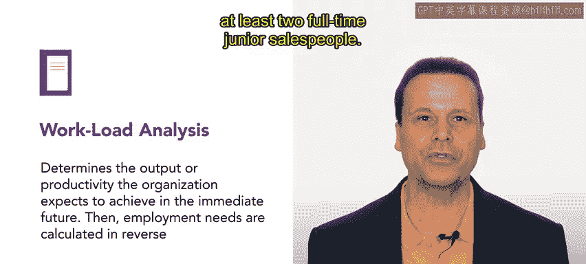

# HRCI《人力资源助理》课程：P12：示例：预测和规划人才获取 📊

在本节课中，我们将通过一个真实世界的示例，来探索如何进行人才获取的预测与规划。你将看到如何将理论应用于实践，以确保组织拥有满足其需求的人员数量。

## 示例背景介绍

上一节我们介绍了人才预测与规划的基本概念，本节中我们来看看一个名为“Connective”的现代通信公司的具体案例。

Connective是一家帮助分布式团队协作的软件公司，提供视频会议和云端电话系统等工具。近年来，随着远程工作的兴起，公司业务增长迅速，团队工作负荷也随之增加。

## 需求分析与规划过程

为了应对增长，Connective的人力资源团队正在规划团队扩张。人力资源专员Alex负责这个项目。他首先从各部门经理那里收集了业务量和人员需求信息。

以下是Alex从销售团队了解到的情况：

*   **核心问题**：销售团队收到的咨询量激增，现有人员难以应对。
*   **业务影响**：这是一个积极的挑战，但当前需求已超出团队处理能力。
*   **初步目标**：团队希望尽快增加销售人员。

## 制定招聘策略

基于以上信息，Alex和人力资源团队与销售主管合作，进行了工作量分析。他们共同确定了实现销售目标所需的工作量，并将其转化为具体的人时数。

分析得出的结论是：**公司有足够的需求来招聘至少两名全职初级销售人员**。

考虑到销售团队即将进入繁忙季度，且市场部的新广告活动已带来新客户，Alex决定采取快速行动与长期规划相结合的策略。

## 分步实施招聘方案

为了迅速缓解压力，Alex决定立即引入一名临时员工。具体方案如下：

1.  **立即引入临时员工**：与一家销售领域的临时员工派遣机构合作，由该机构负责招聘、背景调查、薪酬福利等事宜。这名临时员工可以帮助销售团队度过下一个季度，如果表现良好，未来可能转为正式员工。
2.  **同步招聘正式员工**：在临时员工熟悉工作的同时，Alex将继续为团队寻找一名合适的全职销售人员。招聘全职带薪员工需要更多时间，但能确保找到与团队和组织文化高度匹配的人选。

## 岗位设计与工作安排

在确定招聘正式员工时，Alex和团队还需要明确岗位细节。他们知道，这个新职位很可能属于《公平劳动标准法案》（FLSA）的**豁免员工**类别。随着岗位职责的最终确定，其豁免状态将更加清晰。

与Connective的所有员工一样，这个新职位将是**完全远程**的。此外，公司的管理者通常对灵活的工作安排持开放态度。例如，Alex本人就采用了一种灵活的工作安排：除了远程办公，他还实行“9/80压缩工作周”计划，即每两周工作80小时（例如每天工作9小时），从而每隔一个周五休息。

## 总结与展望

本节课中，我们一起学习了Connective公司进行人才获取预测与规划的实际案例。我们看到了Alex如何通过**工作量分析**确定具体招聘人数，并采取**临时雇佣与正式招聘相结合**的策略来快速响应业务需求，同时为长期发展做准备。此外，我们也了解了在招聘过程中需要考虑的**岗位豁免状态**和**灵活工作安排**等因素。

Alex的人才获取工作才刚刚开始，后续还有招聘、筛选、录用和入职等一系列工作要做。这是一个复杂的过程，但借助合适的工具和方法可以使其简化。接下来，我们将学习岗位设计与再设计的相关知识。