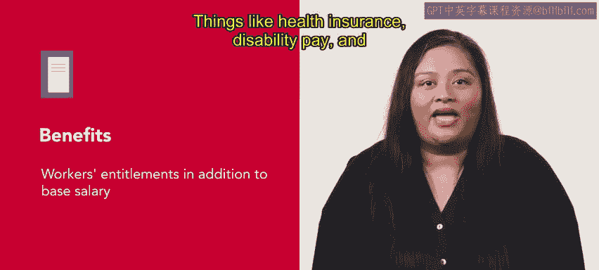
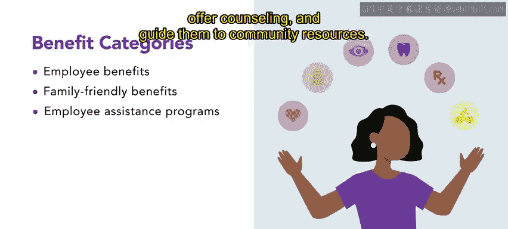
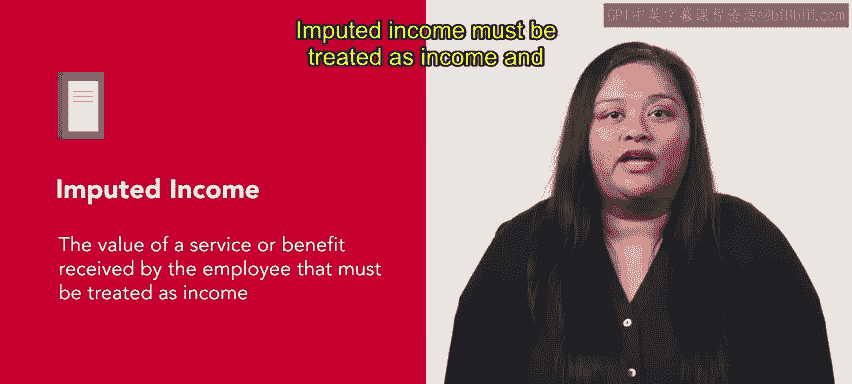

# HRCI人力资源助理课程：第8课：福利体系详解 💼

在本节课中，我们将学习薪酬体系的最后一个重要组成部分——福利。福利计划旨在提升员工的经济安全感和工作与生活的平衡，从而增强他们在工作场所的参与度。

## 什么是福利？

福利是员工在基本工资之外享有的权益。例如，健康保险、伤残补助和退休养老金都属于福利范畴。

福利通常适用于以下三个主要类别：员工福利、家庭友好型福利和员工援助计划。

## 福利的主要类别

以下是各类福利的具体内容：

*   **员工福利**：例如带薪休假或病假、健康/人寿/牙科保险、伤残保障以及退休计划。
*   **家庭友好型福利**：可能包括儿童保育、老人照护、弹性工作时间、育儿假以及兼职工作选择。
*   **员工援助计划**：帮助员工处理个人问题，提供咨询服务，并引导他们利用社区资源。

## 应计收入与税务处理

上一节我们介绍了福利的种类，本节中我们来看看一个重要的税务概念。某些福利需要被视为收入并用于税务目的。

**应计收入**是指员工所获得的某项服务或福利的价值。这部分收入必须被视作收入，并向美国国税局申报为所得。

*   雇主必须在员工的W2表格上报告应计收入。
*   在大多数情况下，员工必须为此类收入纳税。

**举例说明**：销售助理Kyo的雇主提供了一项税前预留资金用于儿童保育的选项。然而，以这种免税方式预留的收入金额是有限制的。超出限额存入儿童保育账户的资金即被视为应计收入。

应计收入在团体人寿保险的背景下尤为重要。超过5万美元的团体人寿保险保额部分即属于应计收入。美国国税局提供了计算团体人寿保险应计收入的方法。

## 额外津贴

除了上述福利，员工还可能获得非财务性的额外津贴。

额外津贴更广为人知的叫法是“福利”或“特权”。它们是员工从工作中获得的非财务性好处。

*   额外津贴可能包括：舒适的办公室、公司配车或专用停车位。
*   理想俱乐部的特别会员资格以及像报销账户这样的便利条件也属于额外津贴。

额外津贴通常与职位级别挂钩，而非与绩效直接相关，这导致许多人批评这些有价值的奖励。高级管理人员往往享有最多的额外津贴。

## 福利的作用与课程总结

福利可以帮助组织吸引新的求职者并留住现有员工。

本节课中，我们一起学习了薪酬体系的福利部分，包括其定义、主要类别（员工福利、家庭友好型福利、员工援助计划）、税务处理中的应计收入概念，以及作为非财务性奖励的额外津贴。理解这些内容对于构建有竞争力的薪酬福利体系至关重要。

本课即将结束。做得很好。下一课将重点介绍工资与差别薪酬。