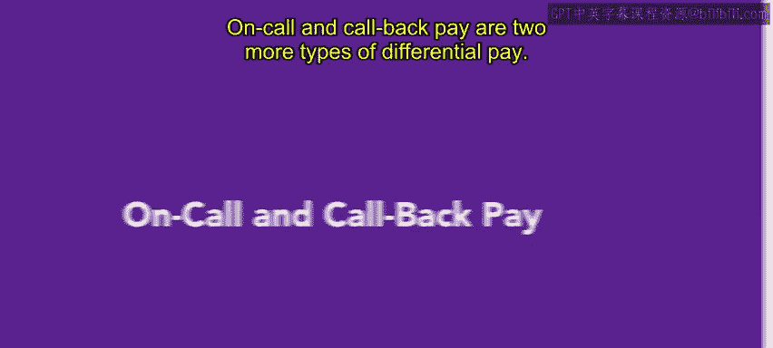
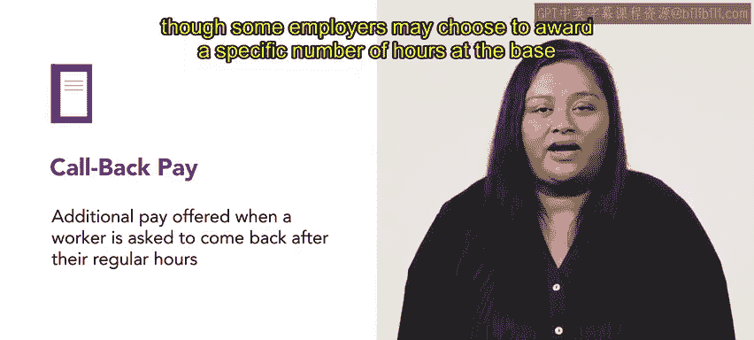

# HRCI人力资源助理课程：第11课：待命与回叫工资 💼

在本节课中，我们将学习两种特殊的薪酬类型：待命工资和回叫工资。这两种薪酬都是为了补偿员工在正常工作时间或条件之外所付出的时间。我们将分别定义它们，并通过实例来加深理解。

## 待命工资详解 ⏰

上一节我们介绍了薪酬差异的基本概念，本节中我们来看看待命工资。待命工资是支付给待命员工的。待命员工在指定时间段内不一定需要工作，但可能需要随时准备响应工作需求。

**核心概念**：待命员工是指未被安排工作，但在特定期间可能需要被要求工作的员工。

例如，有时员工可能不需要在工位上进行主动工作，但如果出现问题，他们需要能够随时投入工作。在这种情况下，员工可能被安排为待命状态。

以下是判断是否需要支付待命工资的关键点：

*   如果员工在待命期间可以自由安排自己的活动，则无需获得补偿。
*   如果员工在待命期间的活动受到限制，则应获得待命工资。例如，一名实习医生被要求留在医院待命以防病人到来，那么该员工应为其待命时间获得报酬。

一些雇主即使在没有法律强制要求的情况下，也可能选择为员工的待命时间支付报酬。

让我们通过Connective公司的例子来理解。提醒一下，Connective是一家专注于视频通信软件的技术公司。

在一次最近的数据库升级中，IT主管Conhan被要求保持待命状态，以防出现任何重大问题。数据库升级在周末进行，期间没有出现问题。除了Conhan的基本工资外，他还获得了周末的待命工资，尽管他实际上并未参与升级工作。

## 回叫工资详解 📞

了解了待命工资后，我们接下来看看回叫工资。回叫工资发生在员工被要求在常规工作时间结束后返回工作岗位，以处理紧急工作事务时。

**核心概念**：回叫工资 = 基础时薪 × 倍数（如2或3），或按特定小时数（超过实际工作时长）以基础时薪计算。

例如，回叫工资通常按基础工资的倍数计算，如双倍或三倍工资。不过，一些雇主也可能选择按基础时薪支付特定的小时数，这个小时数会超过员工实际工作的时长。

让我们再次回到Connective公司的Conhan。在一个周五的下午，Conhan结束了一天的工作准备下班。之后，他接到了一位Connective工程师的紧急电话。最近的数据库升级导致一个软件存储库崩溃，需要尽快从备份中重建，以确保下周工作不受影响。

Conhan因此加班到很晚，重建了存储库。对于这些超出正常工作时间外的额外工时，Conhan获得了双倍工资。

## 总结与回顾 📝

本节课中我们一起学习了待命工资和回叫工资。待命工资和回叫工资不一定相互关联，但两者都反映了员工需要为组织保持何种程度的“可用性”。这两种薪酬类型都要求员工有高度的奉献精神，同时也提供了相应的补偿。

在接下来的课程中，你将会学到更多不同类型的差异薪酬。