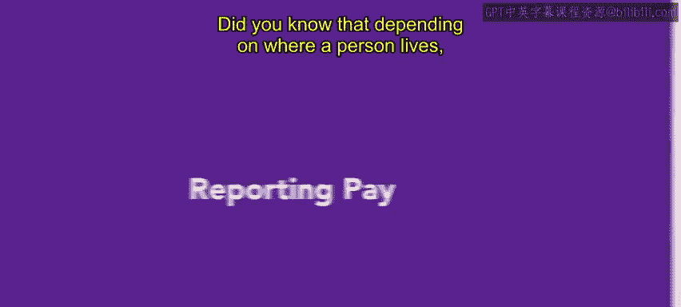

# HRCI《人力资源助理（招聘、学习发展、薪酬福利，1-3课／共5课）｜HRCI Human Resource Associate》 - P134：12_报到工资.zh_en - GPT中英字幕课程资源 - BV1qi421r7ba

Did you know that depending on where a person lives。

 they might be entitled to compensation for showing up to work even if they don't work at all in this video you'll learn about another form of differential pay。

 reporting pay。

An hourly employee who reports to work but is not given a full day's work or perhaps does not work at all。

 is eligible in some states for reporting pay。This situation typically arises when an employer closes early because of bad weather or a similar circumstance。

 In such cases， all employees who have reported to work are entitled to receive some minimum compensation for showing up。

Reporting pay is not required under the Federal Fair Labor Standard Act， FLSA。

 and most states do not mandate it either。 However， it is the law in eight states， California。

 Connecticut， Massachusetts， New Hampshire， New Jersey， New York， Oregon and Rhode Island。

 and the District of Columbia。Let's discuss an example from urban attire as a reminder。

 Uban attire is a clothing company that designs， creates and sells their own line of clothing Denby works at the Ur Attire warehouse and has been called in for a shift during a busy part of the year。

When Denby arrives， it turns out there are more people working in the warehouse than needed Demby waits around for about 20 minutes and then is released from their shift。

Because the warehouse is in a state with reporting pay laws。

 Demby will get paid for half of their shift， even though they didn't work。

Reporting pay is only applicable in certain places and under certain circumstances。

 it's so important for an HR professional to understand all forms of differential pay as laws and legislation are often changing。

In later videos， you'll learn about even more forms of differential pay。

