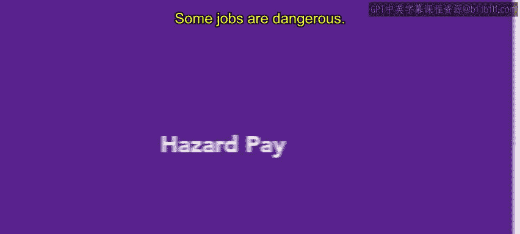

# HRCI人力资源助理课程：第13课：危险工资 💰

在本节课中，我们将学习什么是危险工资，了解其应用场景和常见行业，并探讨在人力资源实践中如何制定相关政策。

## 概述

某些工作具有危险性。在这些情况下，员工很可能获得危险工资。

## 危险工资的定义与示例

上一节我们提到了危险工资的存在，本节中我们来看看它的具体定义和常见例子。

危险工资是指为补偿员工在工作中所面临的生理和心理风险而支付的额外报酬。它通常适用于在危险地点或危险情况下工作的员工。

以下是几个具体的例子：
*   员工被指派在战区等危险地点工作。
*   员工在处理爆炸物或危险废物等危险情况下工作。

## 危险工资的支付形式

了解了危险工资的适用场景后，我们来看看它通常如何计算和支付。

危险工资通常以额外的**小时危险费率**形式发放。其计算公式可以表示为：
**总工资 = 基础工资 + (危险工作时间 × 危险时薪加成)**

不过，一些雇主也可能选择在完成危险任务后支付一笔**一次性奖金**。

## 法律依据与常见场景

由于危险工资的支付没有统一的法律规定，其具体实施依赖于公司政策。本节我们来了解其法律背景和通常被认定为危险的情况。

根据《公平劳动标准法案》，法律并不强制要求支付危险工资。同时，法律也没有对“危险条件”给出明确定义。

根据求职网站Indeed的信息，通常被认为属于危险的情况包括：
*   敌对地区
*   极端气候条件
*   矿山或其他工业环境
*   医疗机构
*   战区

此外，某些工作本身就具有潜在危险性。

## 提供危险工资的常见行业

基于上述危险场景，我们可以进一步了解哪些行业更普遍地提供危险工资。

再次引用Indeed的信息，通常提供危险工资的行业包括：
*   伐木业
*   商业捕捞
*   航空业
*   农业
*   建筑与园林绿化

## 人力资源实践与总结

既然没有法律强制规定危险工资，也就没有标准的支付费率。通常，雇主会为员工在危险条件下工作的小时数，支付其基础费率一定百分比的额外报酬。

在您未来的人力资源工作中，可能会协助制定和执行组织的危险工资政策。

本节课中我们一起学习了危险工资的概念、支付形式、适用场景及相关行业知识。接下来，您将学习更多关于差别工资类型的知识。