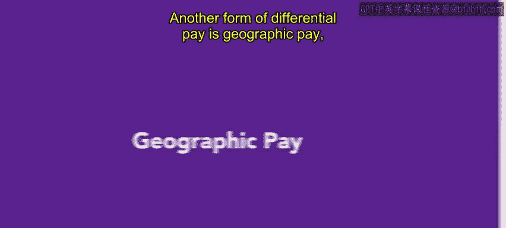
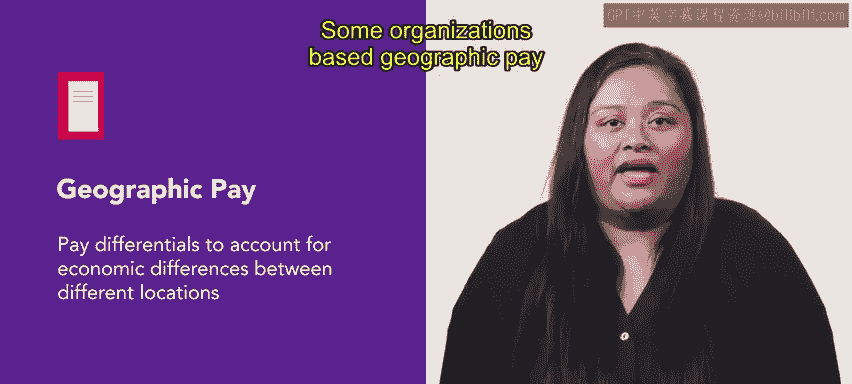
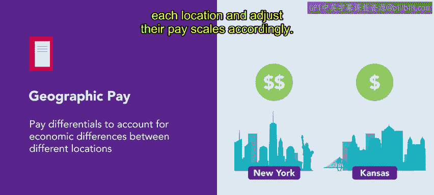

# HRCI人力资源助理课程：第14课：地域工资差异 🌍

在本节课中，我们将学习一种重要的薪酬差异形式——地域工资。我们将探讨其定义、两种主要的制定方法，并通过一个具体案例来理解其应用。

---

## 地域工资的定义

地域工资是差异薪酬的一种形式，它与员工居住和工作所在地点相关。同一职位，根据员工所在地的不同，其薪酬水平可能更高或更低。

上一节我们介绍了差异薪酬的概念，本节中我们来看看其中一种具体类型——地域工资。

---

## 地域工资的制定方法

大多数在多个地点拥有员工的组织都会提供地域工资差异。这一做法旨在平衡不同地区之间的经济差异。

以下是两种主要的制定方法：

*   **基于生活成本**：一些组织根据各地生活成本的差异来调整薪酬。例如，支付给高成本地区（如纽约市）员工的薪酬，会高于低成本地区（如堪萨斯城）的同岗位员工。
*   **基于劳动力成本**：这是更常见的做法。组织使用薪酬调查来确定每个地区特定职位的普遍薪资水平，并据此调整自身的薪酬等级。

---

## 如何评估与实施

在基于劳动力成本的方法中，人力资源专业人员需要借助专业工具进行评估。

人力资源专业人士可以使用社区与经济研究委员会（C2ER）提供的生活成本指数来评估不同地区的生活成本差异。该指数允许用户设定和比较不同地区的消费者价格趋势。

该指数审查了全美300多个大都市区，针对一篮子共60种常见商品和服务的本地消费者价格。这些比较可以帮助人力资源团队为生活在相对更昂贵或更便宜地区的员工确定公平的薪酬。

---

## 案例分析：Connective公司

让我们通过Connective公司的例子来具体理解。Connective是一家开发通信软件的分布式办公公司。Elba和Fen是两位软件工程师，他们拥有相似的经验水平和教育背景，担任相同的职位，属于相同的薪酬等级。

*   **Elba**：居住在生活成本较高的地区。
*   **Fen**：居住在生活成本较低的地区。

根据生活成本指数数据，人力资源团队确定Elba的生活成本比平均水平高出约20%，而Fen的生活成本比平均水平低约10%。

这意味着，如果Elba的年薪是80，000美元，那么Fen的可比收入应约为60，000美元。计算公式可以简化为：
`Fen的薪酬 ≈ Elba的薪酬 / (1 + Elba地区成本溢价比例) * (1 + Fen地区成本溢价比例)`
代入数据：`60000 ≈ 80000 / 1.20 * 0.90`

如果不进行这种调整，Elba的薪资购买力将下降，能购买的商品和服务更少。这个案例说明了在为远程工作者考虑薪酬方案时，生活成本信息非常有用。

---

## 总结与展望

本节课中我们一起学习了地域工资差异。根据组织的政策，地理位置在薪酬决定中扮演的角色可能重要，也可能不重要。

随着远程工作越来越普遍，根据当地生活成本调整薪酬的问题在未来的人力资源工作中将变得更加重要。未来，你可能需要承担研究和制定地域工资建议的任务。

你已经接近本课的尾声，做得很好。