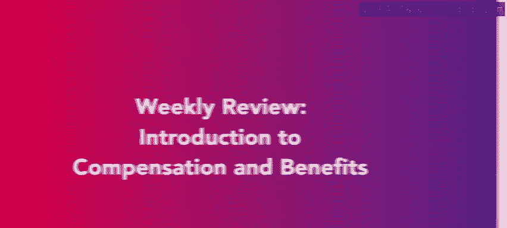
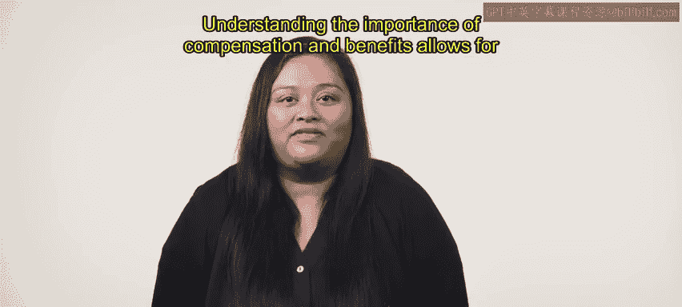
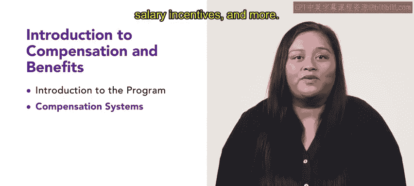

# 薪酬与福利导论：1.5：每周回顾

在本节课中，我们将对第一周所学的薪酬与福利核心知识进行回顾与总结。

恭喜你完成薪酬与福利课程第一周的学习。到目前为止，你已经学到了许多关于薪酬与福利的知识。

理解薪酬与福利的重要性有助于实现更好的工作与生活平衡，并提升员工的工作表现。

## 第一课回顾：课程介绍

在第一课中，我们介绍了本课程。你熟悉了课程大纲、讲师以及本课程的特点。

## 第二课回顾：薪酬体系

上一节我们介绍了课程概览，本节中我们来看看薪酬体系。

在第二课中，你学习了薪酬体系。薪酬体系构成了薪酬与福利的主体，并为员工提供激励。

以下是我们在课程中讨论的不同薪酬类型：
*   **基本工资**
*   **薪水**
*   **激励薪酬**等

## 第三课回顾：工资与差别工资

接下来，我们回顾了关于工资的核心概念。

最后，你学习了工资与差别工资。作为一名人力资源专业人士，保持对工资和差别工资的了解至关重要，以确保为正确的岗位分配正确的薪酬。

## 总结与展望

本节课中我们一起回顾了第一周关于薪酬与福利的基础知识。

本周的薪酬与福利回顾到此结束。下周，你将在此信息基础上，学习组织结构和薪酬。第二周包含许多对你的HR角色有用的信息和实用技巧，请继续保持良好的学习状态，迎接第二周。

