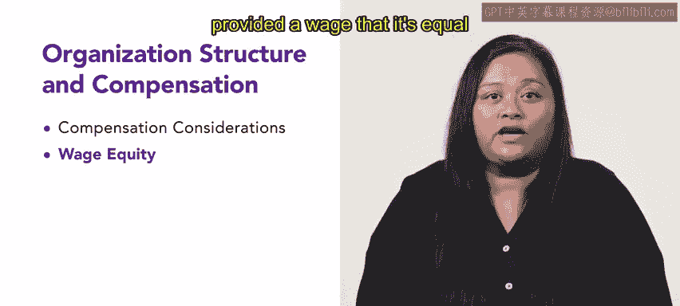

# HRCI《人力资源助理（招聘、学习发展、薪酬福利，1-3课／共5课）》：P138：16_每周介绍：组织结构与薪酬

## 概述

在本节课中，我们将开始薪酬福利课程的第二周学习。我们将聚焦于**组织结构与薪酬**，探讨公司如何设计薪酬体系以回报员工。课程将涵盖薪酬考量因素、工资公平性以及绩效薪酬与激励措施。

---

## 第一课：薪酬考量因素

上一节我们介绍了本周的学习主题，本节中我们来看看薪酬设计时需要考虑的具体因素。理解不同的薪酬形式是人力资源专业人员的重要知识。

以下是薪酬考量中需要关注的几个核心方面：

*   **职位定价**：为特定职位确定市场化的薪酬水平。
*   **竞争性薪酬**：确保公司提供的薪酬在劳动力市场中具有吸引力。
*   **激励措施**：设计奖金、提成等可变薪酬以激励员工。

---

## 第二课：工资公平性

了解了薪酬的基本考量后，我们需要关注一个至关重要的议题：工资公平性。掌握这一主题对人力资源从业者很重要，因为它帮助我们判断员工获得的工资是否与具有相似技能和职责的同事平等。

工资公平性的核心目标是确保**同工同酬**，消除不合理的薪酬差距。

---

## 第三课：绩效薪酬与其他激励形式

在讨论了确保内部公平性的工资体系后，本节我们将探讨如何通过薪酬激励绩效和特定行为。这些激励措施旨在奖励卓越表现和公司期望的行为。

以下是几种常见的激励形式：

*   **绩效薪酬**：将薪酬与个人或团队的工作成果直接挂钩。
*   **技能工资**：为员工获得或掌握新的、对公司有价值的技能而支付额外报酬。
*   **服务奖项**：表彰员工长期服务的忠诚度。
*   **团队激励薪酬**：基于团队整体绩效发放的奖金。

---

## 总结

本节课中我们一起学习了薪酬福利课程第二周的核心内容：**组织结构与薪酬**。我们首先探讨了薪酬设计的**基本考量因素**，如职位定价和竞争性薪酬。接着，我们深入了解了**工资公平性**的重要性及其原则。最后，我们介绍了多种**绩效薪酬与激励形式**，包括技能工资和服务奖项。掌握这些知识有助于构建一个既公平又具有激励性的薪酬体系。