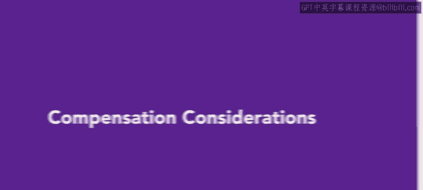
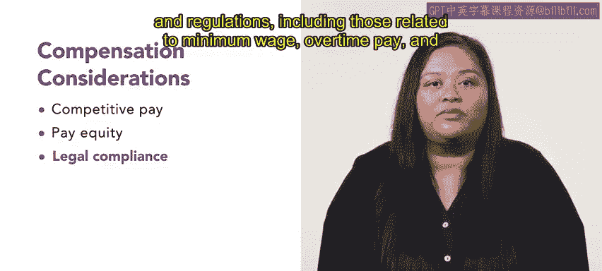

# HRCI《人力资源助理（招聘、学习发展、薪酬福利，1-3课／共5课）》：第17课：薪酬考虑因素 💼

在本节课中，我们将学习影响薪酬决策的三个重要因素。薪酬包括工资和非货币性福利，组织在决定员工薪酬时必须考虑多个方面。我们将探讨这三个关键因素：竞争性薪酬、薪酬公平性以及法律合规性。

## 薪酬的定义

薪酬是指员工为工作所获得的所有报酬，包括工资和非货币性福利。组织在决定员工薪酬时，主要关注以下三个方面：

### 1. 竞争性薪酬

首先，组织必须考虑其薪酬是否具有竞争力。这意味着公司支付的薪酬应与同行业、同一地区其他公司的薪酬水平相当。如果公司未能提供具有竞争力的薪酬，可能会面临以下问题：
- 高离职率
- 吸引不到优秀人才
- 员工士气低落

### 2. 薪酬公平性

薪酬公平性是指确保担任相似岗位和职责的员工获得平等的薪酬。为了实现薪酬公平性，组织可以采取以下措施：
- 建立明确的岗位分类和薪酬等级
- 定期审查和调整员工薪资，以维持公平性

### 3. 法律合规性

最后，组织必须确保其薪酬实践符合所有适用的法律和法规。这些法规包括：
- 最低工资
- 加班工资
- 同工同酬

## 总结

本节课中，我们学习了影响基本薪酬决策的三个关键因素：竞争性薪酬、薪酬公平性和法律合规性。理解并实施这些实践将有助于组织建立一个公平、透明且具有竞争力的薪酬体系。