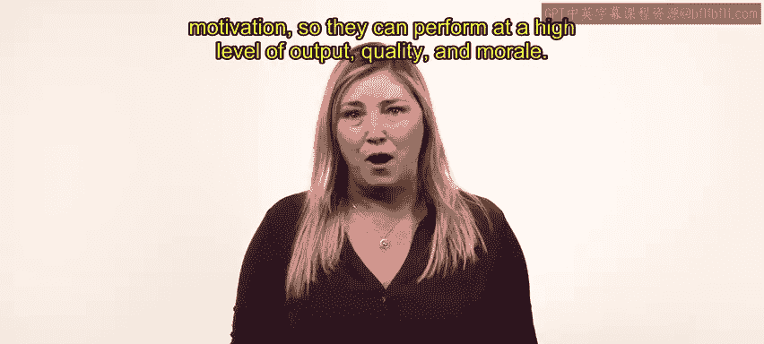
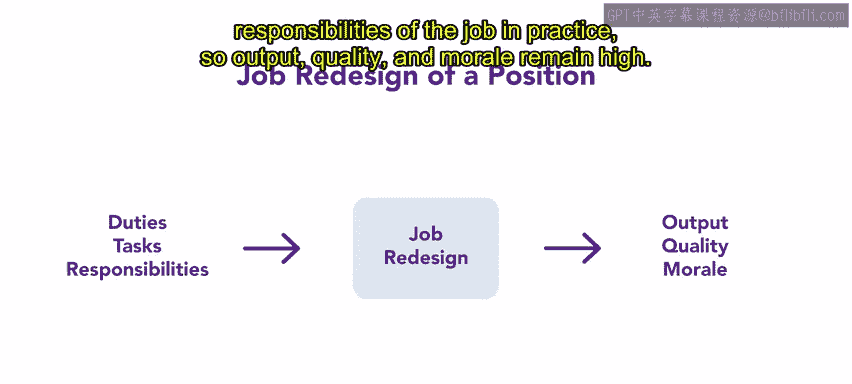
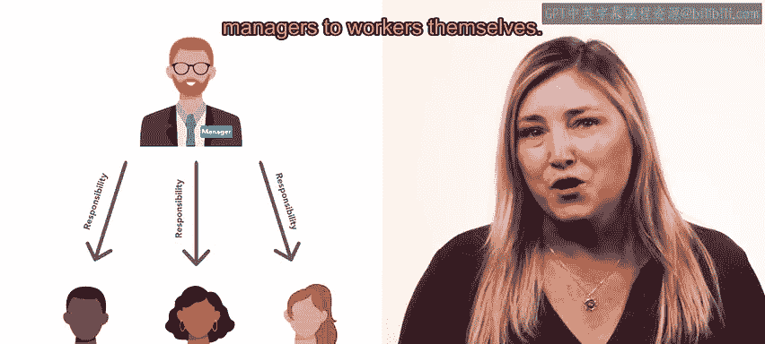
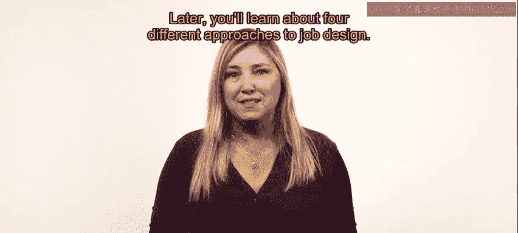

# HRCI人力资源助理课程：P13：工作设计和工作重新设计 📝

在本节课中，我们将要学习工作设计和工作重新设计的概念、工具与方法。工作设计是人力资源管理中的一项核心活动，旨在通过优化岗位职责与员工动机的匹配，来提升组织的产出、质量和士气。

## 概述

上一节我们重点讨论了人力资源需求预测与评估，学习了组织需求、不同类型的员工以及不同的工作方式。本节中，我们来看看如何通过工作设计和工作重新设计，将员工个人动机与岗位要求相结合，从而实现高水平的产出、质量和士气。

## 工作设计与工作重新设计的定义

工作设计是指人力资源专员识别特定岗位需要履行的职责、任务和责任，并确保其具备适当的激励水平以提高生产力的过程。

工作重新设计则是对已经过工作设计的岗位进行重新评估。在实践中，原有的岗位职责、任务和责任可能需要调整，以维持高水平的产出、质量和士气。

## 工作设计/重新设计的工具

以下是几种可用于设计或重新设计工作的工具。

*   **工作简化**：将一个岗位的某项职责剥离，并分配给另一个岗位。这也被称为**工作专业化**。
*   **工作扩大化**：增加一个岗位所执行任务的种类，使其工作内容更加丰富。
*   **工作丰富化**：尝试在特定岗位中加入更具激励性和回报性的工作内容。

工作扩大化与工作丰富化都涉及角色的扩展。这种扩展可以被视为水平扩展或垂直扩展。

*   **水平扩展**：也称为水平加载，指用更全面的岗位取代专业化的岗位。水平加载增加了员工负责完成的任务数量。
*   **垂直扩展**：也称为垂直加载，指改变岗位以赋予员工更多的责任和权力。通常，垂直加载会将管理者的责任转移给员工自身。

## 设计方法：人性化方法与工作特征法

如有需要，人力资源专员会根据员工的人性需求和动机，而非单纯的组织目标（如产出和质量）来组织工作。这被称为**人性化方法**。

另一种方法是**工作特征法**。当人力资源专员根据工作特征法进行工作设计或重新设计时，会考虑影响员工动机的五个维度：技能多样性、任务完整性、任务重要性、自主性和反馈。

以下是这五个维度的具体含义：

*   **技能多样性**：描述一个岗位的职责是常规性的还是不断变化的。
*   **任务完整性**：由员工的参与程度定义，即是从头到尾参与，还是只完成一个子任务。
*   **任务重要性**：指一项职责对组织成功或对社会的重要性。
*   **自主性**：与员工在产出方面拥有的自由裁量权相关。
*   **反馈**：来自管理者或主管的关于员工工作表现的看法。

当人力资源专员在工作特征法中全面考虑这五个动机因素时，整个组织将保持高昂的士气并实现最高生产力。

## 工作重新设计的实施步骤

在进行特定岗位的工作重新设计时，人力资源专员应遵循一系列行之有效的程序。

以下是具体的实施步骤：

1.  **核对差异**：协调岗位描述或岗位规范中的内容与实际工作内容之间的任何差异。
2.  **重新分配职责**：将职责、任务和责任重新分配给能力更强或动机更高的员工。
3.  **提供培训**：为新分配的职责提供培训。
4.  **修订文件并定期回顾**：修订适用的岗位描述和岗位规范，并定期进行回顾。

## 总结

本节课中，我们一起学习了工作设计和工作重新设计。设计和重新设计工作有潜力显著提高整个组织的动机和生产力。作为一名人力资源专业人士，将岗位与员工相匹配是一项有用且有益的任务。在后续课程中，你将学习到四种不同的工作设计方法。