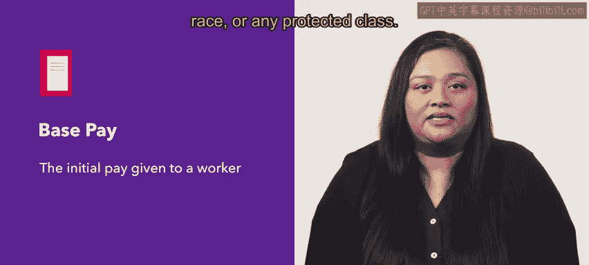
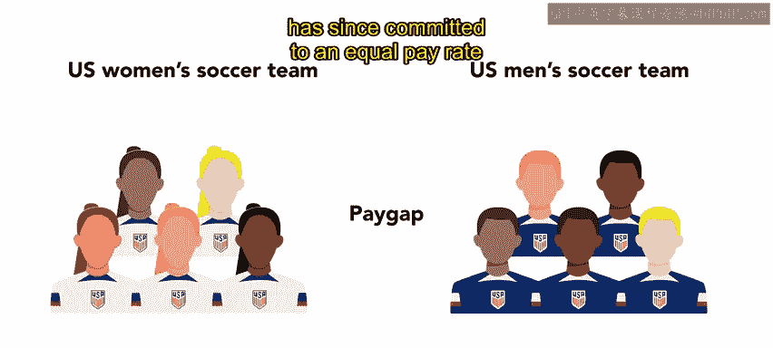
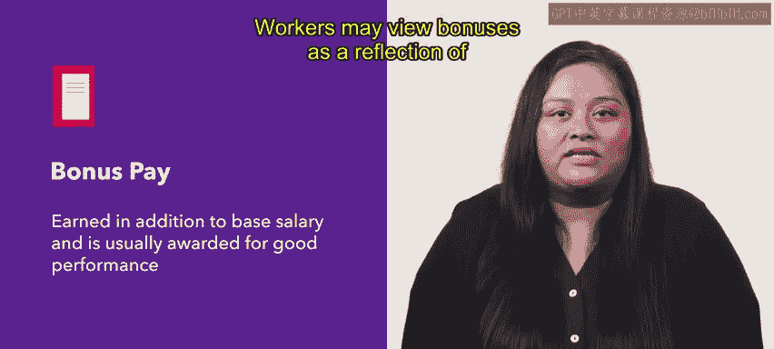
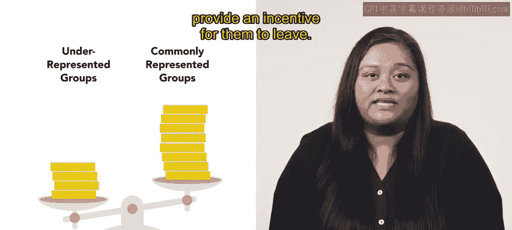
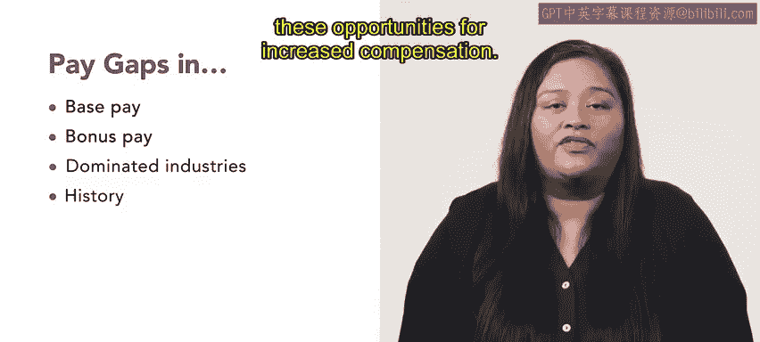

# HRCI人力资源助理课程：第20课：薪酬差距 💰

在本节课中，我们将学习薪酬差距这一重要议题。我们将定义薪酬差距，描述其产生的多种形式，并通过实例加以说明。理解薪酬差距是解决和缩小这一差距的关键。

薪酬差距指的是不同群体员工之间的薪酬差异。这些群体通常基于性别或种族划分。当从事相同工作、拥有相同经验和资历的不同群体获得不同薪酬时，薪酬差距就产生了。

薪酬差距可能以多种形式出现，例如基本工资、奖金以及行业主导因素。接下来，我们将逐一探讨这些形式。

## 基本工资差距

基本工资是支付给员工的初始薪酬。它可以按不同方式计算，例如时薪或年薪。地理位置等因素也会影响基本工资。理想情况下，基本工资不应因性别、种族或任何受保护类别而不同。但遗憾的是，现实并非总是如此。薪酬差距可能从起薪阶段就已开始。

例如，经过长达数年的争议，美国女子足球队以2400万美元和解了一项同工同酬诉讼。此前，她们每赚1美元，其收入仅为美国男子足球队球员的38美分。此后，美国足球联合会承诺实现男女国家队的同工同酬。

## 奖金差距

奖金是在基本工资之外，通常因良好绩效而获得的报酬。员工可能将奖金视为其努力、工作贡献和组织价值的体现。然而，当来自代表性不足群体的成员获得较低的奖金时，就会产生薪酬差距。

这些员工可能将这种薪酬差距视为其组织价值的体现，并可能因此产生离职的动机。

## 行业主导与薪酬差距

某些行业由特定性别或种族主导。这种构成会影响该行业的薪资水平。例如，男性主导的行业通常包含薪酬最高的工作，而女性主导的行业则包含薪酬最低的工作。

即使在女性主导的行业中，女性的收入也常常低于男性。乔治城大学教育与劳动力中心报告指出，在美容美发这个女性主导的行业中，女性每赚1美元，其收入仅为男性的63美分。

历史因素，例如认为女性应留在家中而男性应外出工作的观念，也促成了薪酬差距。这种观念意味着男性更适合可能需要更长工作时间和更少休假的高级职位。

## 工作模式与选择的影响

这种观念也强化了女性应承担更多育儿和家庭职责的看法。例如，一项哈佛大学的研究显示，平均而言，男性工作时间更长、加班更多，并承担更多临时轮班。女性则更常休无薪假，并避免在节假日和周末工作。

这些工作模式和选择上的差异会加剧性别薪酬差距。男性可能因其额外的工作时间而获得更高报酬。与此同时，女性则可能错失这些获得更高报酬的机会。

## 总结

本节课中，我们一起学习了薪酬差距的概念及其对社会中个人的重大影响。薪酬差距可能体现在基本工资、奖金和行业构成等多个方面。解决和缩小这些差距需要制定相应的程序和政策，以在工作场所创造更多的平等与公平。