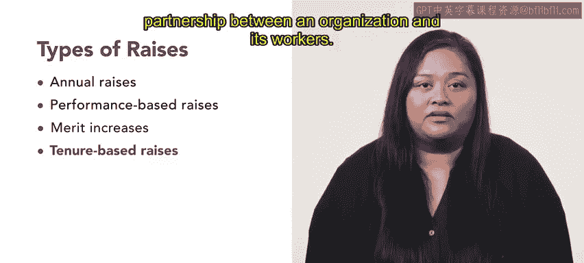

# HRCI《人力资源助理》课程：P144：22_加薪 💰

在本节课中，我们将探讨组织可能为员工提供的各种加薪类型。我们将讨论授予加薪的不同标准，以及如何有效地运用这些标准来奖励优秀员工并推动业务成功。

---

组织使用加薪标准来确定员工是否有资格获得薪资增长。

薪资增长可以授予为以下几种加薪类型之一：年度加薪、基于绩效的加薪、功绩加薪或基于资历的加薪。

每种加薪类型都有其优点和缺点，组织必须仔细考虑哪些类型最能有效激励其员工。

接下来，我们来逐一讨论每种加薪类型。

以下是四种主要的加薪类型：

*   **年度加薪**：指组织内每位员工每年获得一次固定的薪资增长。加薪幅度可能由多种因素决定，包括组织的财务表现、行业标准或生活成本。例如，您的组织可能为所有员工提供3%的年度加薪，以跟上通货膨胀率。
*   **基于绩效的加薪**：基于个人绩效的加薪。这种加薪通常与年度绩效评估流程相结合，员工的加薪幅度通常与其绩效评级挂钩。绩效更高的员工通常会获得更高的加薪。例如，一位超额完成销售目标的销售代表可能获得5%的加薪，而一位达到目标的员工可能获得2%的加薪。
*   **功绩加薪**：与基于绩效的加薪类似，两者都基于员工的工作表现。然而，功绩加薪是在员工表现出卓越的工作绩效时授予的，而不是仅仅达到特定的绩效目标。管理者可以随时授予功绩加薪。这种加薪通常是为了表彰特定的成就，例如完成一个具有挑战性的项目或承担额外的职责。例如，一位成功领导公司网站重新设计的网络开发人员，其年薪可能会获得5%的功绩加薪。
*   **基于资历的加薪**：根据员工在组织内工作的时间长短授予的加薪。基于资历的加薪被视为一种保留策略，旨在建立组织与员工之间的长期伙伴关系。例如，一个组织可能会为在该组织工作五年或以上的员工提供4%的加薪。

---

在授予加薪时，为了确保公平性，组织应考虑**薪资曲线**、**薪资等级**和**薪资范围**。

一次加薪如果使员工的薪资超出了其薪资范围，可能会造成不公平现象。

除了我们讨论过的加薪类型，还有其他处理薪酬增长的方式。

组织可以考虑根据生活成本变化调整薪资曲线。

另一种选择是，使较低薪资岗位的工资增长速度高于较高薪资岗位。这被称为**递减率增长**。

还有一种方法是**固定金额增长**，即每个人都获得相同金额的工资增长。

---

本节课中，我们一起学习了组织可以用来激励和保留员工的不同加薪类型。清晰地向员工传达薪酬结构和政策非常重要，包括加薪技能和奖金计划，以便他们知道如何获得加薪。