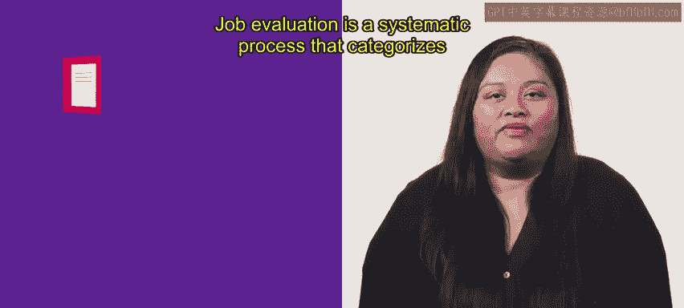
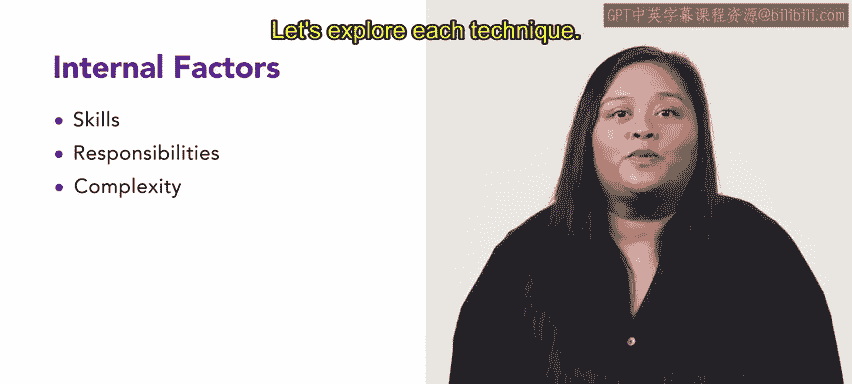

# HRCI《人力资源助理（招聘、学习发展、薪酬福利，1-3课／共5课）｜HRCI Human Resource Associate》 - P145：23_工作评估.zh_en - GPT中英字幕课程资源 - BV1qi421r7ba

Have you thought about how organizations establish fair employee wages in this lesson。

 we will learn about wage equity。 One part of achieving wage equity is job evaluation。

 This video will introduce job evaluation and explore four common techniques。

 used to align wage levels， point factor， ranking， classification and factor comparison。

By the end of this video， you will have a clear understanding of each technique and how organizations use them in practice。

 let's get started。

Job evaluation is a systematic process that categorizes all jobs according to the level of responsibility and skills required。

Job evaluation occurs early in the process when creating a compensation system for an organization。

 This process aims to establish fair and equitable wage levels for all jobs by analyzing job responsibilities and skills。

 Or can ensure that employees are paid appropriately based on their job' relative value。

 Organs use different techniques to accomplish job evaluation。

 The four primary techniques are point factor， ranking， classification and factor comparison。

These techniques are used to price jobs according to their worth within the organization。

 They focus on internal factors such as skills， responsibilities and complexity。

These techniques differ from market based job evaluation in market based job evaluation。

 external market data such as labor market define a job's value Let's explore each technique。

The point factor method examines different parts of the job to determine appropriate pay。

During the review， the job is deconstructed into smaller parts。

 each part is assigned points based on its importance。

 the jobs with the highest points receive the highest pay。For example。

 a component of a job that requires a lot of experience might get more points Once all parts of a job are given points。

 the organization can determine how much the job is worth and set fair compensation。

Another technique is job ranking。 Jo ranking organizes jobs based on their importance to an organization。

 This technique is fairly straightforward and works best for smaller organizations with a manageable number of job titles。

 Jobs are placed in a hierarchy with a top hierarchy representing specialized jobs with a high value。

All jobs are then compared using this hierarchy。The next technique is job classification In this method of evaluation。

 job classes are created by grouping positions with common characteristics The job classes are then graded and assigned a pay range For instance。

 a large organization has team leaders and many departments marketing。

 sales and HR in job classification， all team leaders are assigned to the same grade。

Directors across these departments are assigned to a higher grade or class。

The factor comparison method is a combination of the ranking and points factor methods。

 factor comparison ranks job factors and then assigns a monetary value to each In this method。

 a job is compensated as a collection of factors rather than per person。 For example。

 an organization establishes a compensation system for its sales department。 First。

 it ranks the job requirements or factors within the department。

 These factors might include education， experience or technical skills。 Next。

 it assigns a monetary amount to each factor。 The sum of the factors determine compensation。

Remember， evaluating the salary of a role is a key part of an organization's compensation strategy。

 Fair compensation helps the organization attract and retain top performers in a competitive job market。

 You now understand the key tools used to determine the relative value of different jobs within an organization in upcoming videos you'll learn how these tools can be used to meet wage equity goals。

