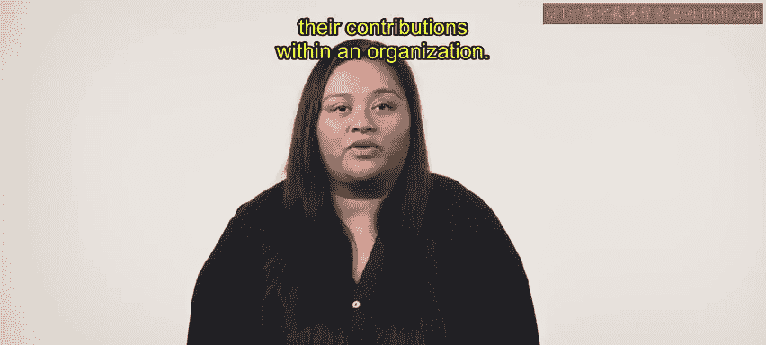

# HRCI人力资源助理课程：第24课：薪酬结构与宽带薪酬 💰

在本节课中，我们将学习如何构建透明、公平且合理的薪酬结构。我们将重点探讨宽带薪酬、红绿圈技术以及职位评估在薪酬结构设计中的作用。

---

## 概述 📋

构建透明、公平且经过深思熟虑的薪酬结构对一个组织至关重要。它有助于吸引和留住人才，并确保员工感到被重视，从而激励他们在组织中发挥最佳水平。

上一节我们介绍了薪酬结构的重要性，本节中我们来看看几种具体的薪酬结构设计方法。

---

## 什么是宽带薪酬？ 📊

宽带薪酬是一种构建薪酬体系的方法。它创建数量有限的薪酬带，并且每个薪酬带的最低与最高薪酬水平之间差距非常大。

当组织采用宽带薪酬时，所有职位都会被归入某个薪酬等级中。例如，一个组织可能将所有与销售相关的职位合并到一个单一的“销售薪酬带”中。

在这个薪酬带内部，存在不同的薪酬范围或等级。以下是销售薪酬带的一个示例：

以下是销售薪酬带内不同级别的示例范围：
*   **初级员工**：薪酬范围为 **30,000 至 40,000**。
*   **中级员工**：薪酬范围为 **45,000 至 60,000**。
*   **高级销售专业人员**：薪酬范围为 **70,000 至 80,000**。

宽带薪酬有助于在薪酬方面营造公平感，并减少员工因从事类似工作而薪酬差异过大的感知。

---

## 红圈与绿圈技术 🔴🟢

除了宽带薪酬，人力资源专业人员还可以使用红圈与绿圈技术来构建薪酬体系。该技术用于确定员工的薪酬是否处于与其技能、经验和职责相似的员工的薪酬范围内。

您在本课程的前面部分已经学习过这项技术。作为回顾：
*   薪酬低于最低薪酬范围的员工处于 **绿圈** 中。
*   薪酬高于最高薪酬范围的员工处于 **红圈** 中。

---

## 职位评估的作用 🧑‍💼

职位评估也是薪酬结构设计过程中的一个重要环节。组织中的所有职位都应根据所需的职责和技能水平进行分类。

通过职位评估，人力资源专业人员可以根据经验、教育背景和职责，确定每个职位的适当薪酬范围。这个过程有助于确保员工因其工作和在组织内的贡献而获得公平的报酬。

---

## 总结 ✨

本节课中，我们一起学习了人力资源专业人员如何使用宽带薪酬以及红绿圈技术，在组织中建立透明的薪酬体系。我们也了解了职位评估作为薪酬结构设计过程的重要组成部分。您可以运用这些方法来创建公平且有效的薪酬结构，从而吸引和留住人才。