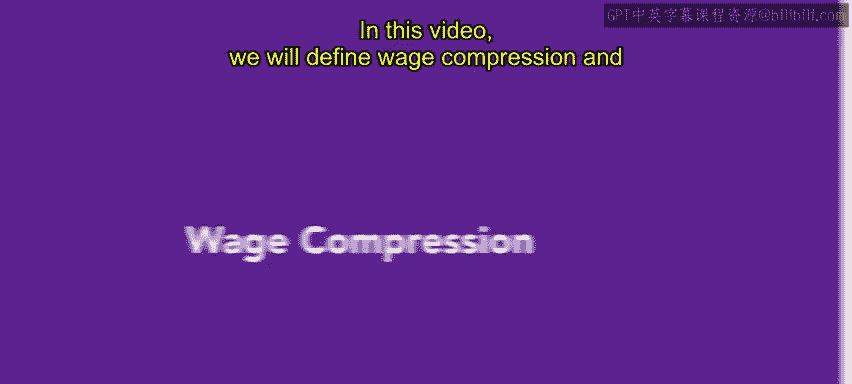
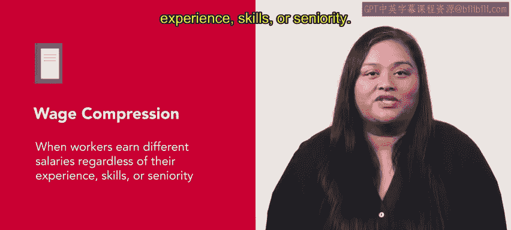
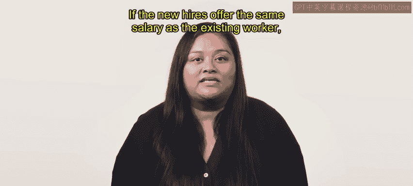
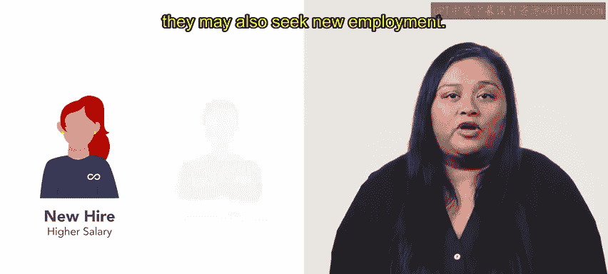
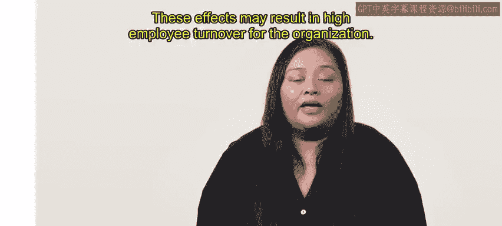
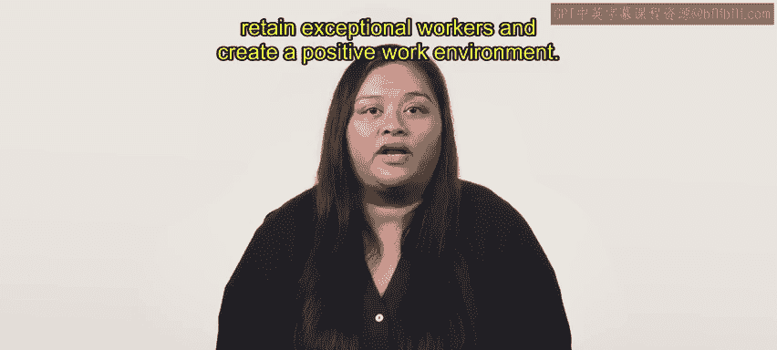

# HRCI人力资源助理课程：第25课：工资压缩 📊



在本节课中，我们将定义工资压缩，并探讨其对组织的影响。我们将分析导致工资压缩的因素，例如特定技能的高市场需求，并为人力资源专业人士提供解决方案。

## 什么是工资压缩？🤔


上一节我们介绍了课程目标，本节中我们来看看工资压缩的定义。



工资压缩是指员工无论其经验、技能或资历如何，却获得不同薪资的现象。

**公式：** 工资压缩 ≈ 新员工薪资 ≥ 资深员工薪资



例如，一名新员工加入你的组织，其技能组合与一位已在公司工作多年的员工相似。如果新员工的薪资与现有员工相同，就发生了工资压缩。

## 工资压缩的成因与后果 🔍

了解了定义后，我们来看看导致工资压缩的具体原因及其带来的后果。

当特定技能在市场上需求很高时，工资压缩的风险会显著增加。如果组织难以找到某个职位的合格候选人，可能会提供高薪以保持竞争力。这些高薪可能导致工资压缩，因为新员工的收入可能超过现有员工。

以下是工资压缩可能引发的几个后果：

*   **职场纠纷：** 员工可能对组织的公平性产生质疑。
*   **士气低落与生产力下降：** 员工可能变得消极，降低工作效率。
*   **人才流失：** 员工可能开始寻找新的工作机会。
*   **高员工流动率：** 上述影响最终可能导致组织人员流失率升高。





## 如何解决工资压缩问题？🛠️

认识了问题的成因和危害后，本节我们将探讨人力资源专业人士可以采取的解决方案。

工资压缩可以通过逐步提高薪资过低员工的工资，同时降低薪资过高员工的加薪幅度来解决。这些调整有助于在工作场所实现更公平的薪酬。

解决工资压缩问题还能降低员工流动率。当员工感到自己得到了公平的报酬时，他们离开组织的可能性会更小。

最后，组织可以实施透明且一致的薪酬策略，在确定薪酬时综合考虑经验、技能、职级和资历。


**核心策略代码描述：**
```python
def adjust_compensation(existing_employees, new_hires):
    for employee in existing_employees:
        if employee.salary < market_rate:
            employee.increase_salary(gradually) # 逐步提高低薪员工工资
    review_and_standardize_pay_increases() # 审查并标准化加薪幅度
    implement_transparent_pay_structure() # 实施透明的薪酬结构
```


对这个问题给予密切关注，可以确保员工获得公平的报酬，并帮助组织留住人才。

## 总结 📝

本节课中我们一起学习了工资压缩的相关知识。



工资压缩会严重影响员工的士气和生产力，进而影响组织的整体绩效。人力资源专业人士应考虑薪酬策略，并制定公平、平等的薪酬结构。通过解决任何薪酬不足的问题，组织可以招聘并留住优秀的员工，从而创造一个积极的工作环境。