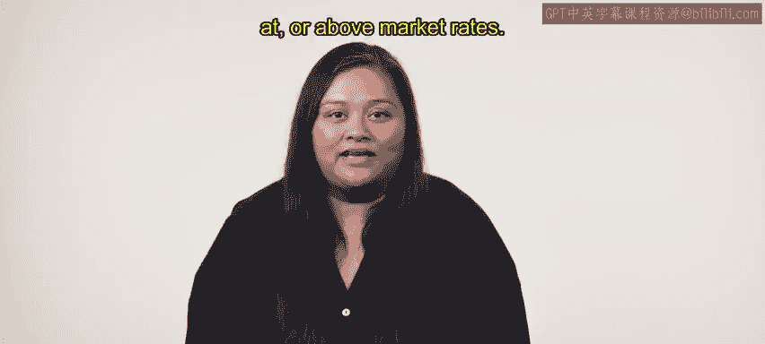
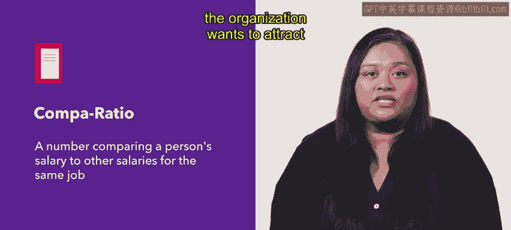
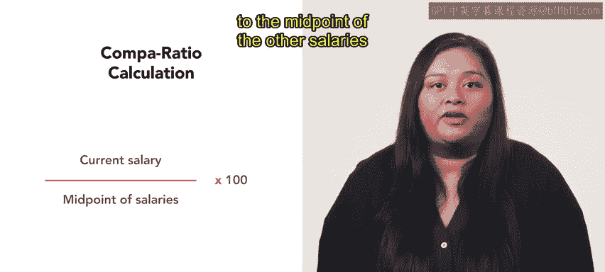
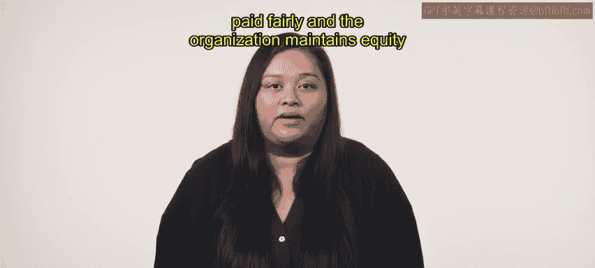

# HRCI《人力资源助理（招聘、学习发展、薪酬福利，1-3课／共5课）｜HRCI Human Resource Associate》 - P148：26_薪酬比率.zh_en - GPT中英字幕课程资源 - BV1qi421r7ba

In this video， we will discuss the comp ratio， how to calculate it and how to use it to determine if an employee is paid below。

 at or above market rates。 Let's begin by defining comp ratio。

The Comp ratio or the comparison ratio is a number comparing a person's salary to other salaries for the same job。

It enables HR professionals to calculate how close an employee's compensation is the middle of an organization's or market's pay range Idely。

 employees in comparable positions should have similar comp ratios This ratio is also important to calculate if the organization wants to attract new talent with competitive pay。

The comp ratio is usually presented as a percentage and is calculated by taking an employee's salary and comparing it to the midpoint of the other salaries in the organization's pay range。

For example， if an employee earns 45，000 per year in a job where the salary midpoint is 50。

000 per year， the comp ratio is 45，000 divided by 50，000 times 100 equals 90%。

A00% comb ratio means an employee is paid at the exact midpoint of the salary range。

 a ratio higher or lower than 100% indicates that the employee is either overpaid or underpaid。

An employee with less experience might have a comp ratio of 80 to 90%。

 while one with more experience may earn over 100% let's look at another example。Devin。

 an HR manager at Urban Attire， is assessing whether members of Urban Attires design team members are being paid competitively。

 They want to ensure that the designers are being paid fairly and adhering to a pay rate that is close to the midpoint or median salary。

To investigate this， Devin needs to calculate the comp ratios for the employees。First。

 Devon determines the midpoint of a salary range for the design employees with similar titles。

 They find that the lowest salary is 45000， and the highest is 60000。

 So the midpoint is 45000 plus 60000 which is 100500， divided by 2， which equals 52500。 Therefore。

 the midpoint salary for a designer at urban attire is 52500。

The midpoint salary is used because it indicates the salary of the organization is prepared to pay for the position。

Deon then compares the salaries of each designer to this midpoint and determines their comp ratio。

 One designer earns 50000 to calculate the comp ratio， Devon divides 50000 by the midpoint's salary。

52500， which equals 0。952。 They multiply this number by 100 to display the ratio as a percentage。

 The comp ratio is 95。2%。 Devon continues to calculate comp ratio for other designers and finds they have comp ratios between 93 to 98% across the board。

 They conclude that urban attires paying most of their designers a wage that slightly below the midpoint for the team。

 They can use this information to help inform the company's competitive pay efforts and policies。

By calculating employee comp ratios， HR managers can ensure that all their employees are paid fairly and the organization maintains equity。

