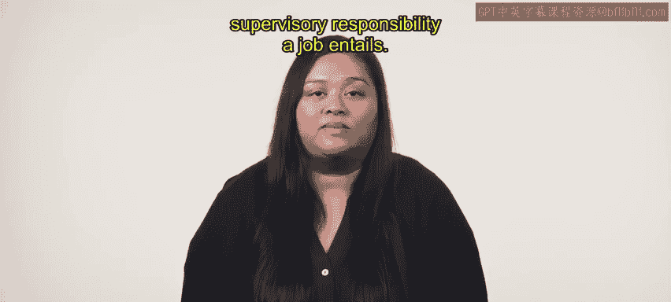
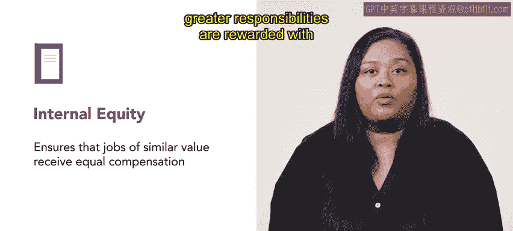
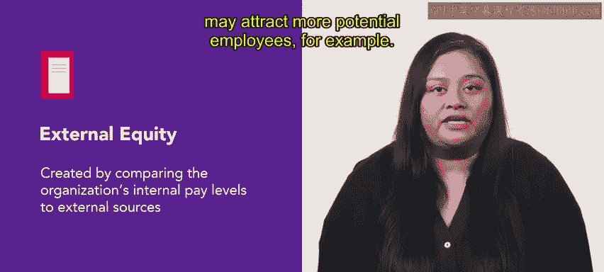
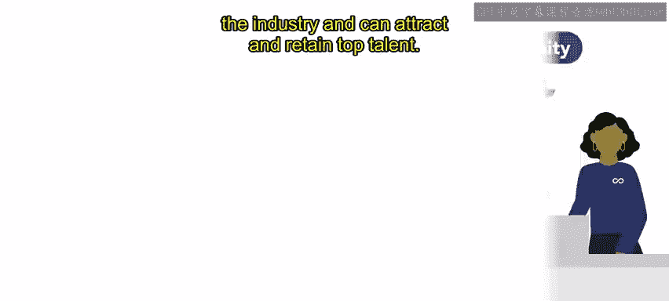

# HRCI《人力资源助理（招聘、学习发展、薪酬福利，1-3课／共5课）｜HRCI Human Resource Associate》 - P149：27_内部和外部公平.zh_en - GPT中英字幕课程资源 - BV1qi421r7ba

In this video， we will explore internal and external equity and how organizations use them to strengthen their compensation strategy。

 Let's get started。 Human resource managers use a process called job evaluation to categorize jobs within their organization。

 according to the level of responsibility and skills required。

Job evaluation also considers the amount of supervision a job requires and the amount of supervisory responsibility a job entails。

Once an evaluation is complete， managers create a system of internal equity。

 internal equity ensures that jobs of similar value receive equal compensation。 For instance。

 jobs that require higher skills and greater responsibilities are rewarded with more pay than jobs with lesser requirements。

External equity is created by comparing the organization's internal pay levels to external sources。

 Sal surveys shared by other organizations are a frequent source for this data。

 After reviewing the data， organizations may choose to match or exceed the pay levels of similar external jobs。

 Ors that offer above market compensation may attract more potential employees， for example。

Internal equity ensures that organizations pay employees fairly for their work based on their job responsibilities。

 qualifications and skills。 This equity increases employee engagement and motivation。 Exnal equity。

 on the other hand， ensures that organizations remain competitive in the industry and can attract and retain top talent。

Internal and external equity are critical components of an organization's compensation strategy。

 fair pay that is comparable to external jobs， creates an engaged and motivated workforce and maintains an organization's competitive position for talent。

