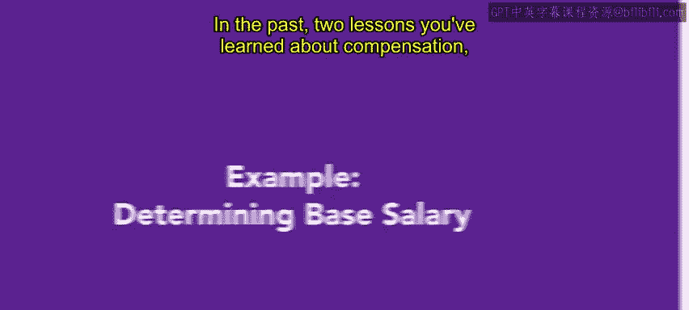
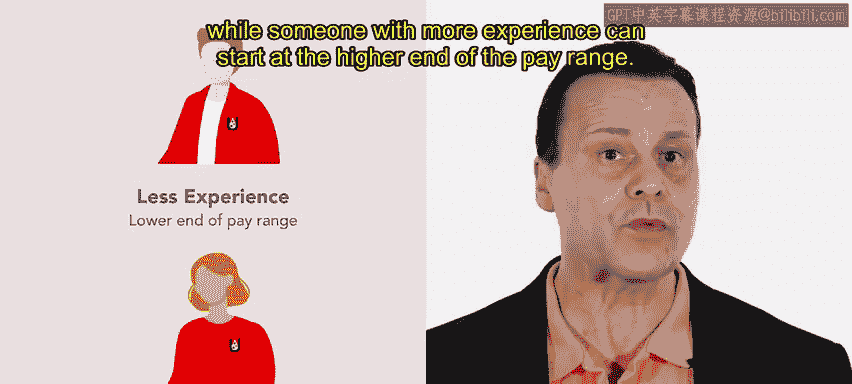

# HRCI《人力资源助理（招聘、学习发展、薪酬福利，1-3课／共5课）｜HRCI Human Resource Associate》 - P151：29_示例：确定基本工资.zh_en - GPT中英字幕课程资源 - BV1qi421r7ba

In the past two lessons， you've learned about compensation， incentives and wage equity。 Now。

 we're going to examine a real world example of how a base salary is determined For this example。

 we'll use slicelice you。 Slice you is a chain of pizza restaurants that make delicious。

 reasonably priced pizza。😊。

The organization is focused on the college demographic。

 and they want to open locations near as many colleges and universities as they can。

Jay is an HR specialist working at SeUHQ。Recently， the manager of logistics came to Jay and requested that a new role be created to help with delivery management。

Currently， this falls under the job description for logistics manager。 but as the company has grown。

 so has the responsibility。Jay's excited to help Designing a salary is something they don't get to do very often。

 but it's always a challenging and rewarding process。To begin。

 Jay conducts a credible compensation benchmarking survey。

 Jay reviews job listings for similar roles， articles from industry groups and large data sets gathered from surveys。

After some initial research and conversations with the logistics team。

 it's been decided that it makes sense to offer the role as a salari F LSA exempt position。Now。

 Jay needs to decide what a competitive salary for this position would be。

There are a number of factors that need to be considered。

J needs to make sure the pay is competitive with other similar roles。

 ensure that the pay is equitable with other roles cross slice you。

 and that the roll complies with all applicable labor laws。

To account for different experience levels and education of the applicants。

 J sets a pay range rather than a set salary number。That way， someone one who's a good fit。

 but has less experience can start at the lower end of the pay range。

 while someone with more experience can start at the higher end of the pay range。

 This isn't a role that pays hourly wages。 So Jay doesn't need to worry about different types of differential pay。

 but they do take the time to determine what the roll's total compensation would be。

Taking into account the additional benefits and incentives that Slicu offers like health care and stock options。

Jay has a clear understanding of what the organization will pay for the new role beyond just the base salary。

Ja feels the base salary is fair and competitive。 Those applying for the role will hopefully be talented and excited to work for slicelice you。

😊，Determining a base pay requires a lot of research。

It's an important step when an organization creates a new role。

The determined base salary is a starting point， but when interviewing applicants。

 there will also be some negotiation involved。Coming up。

 you'll find out more about incentives and benefits。

