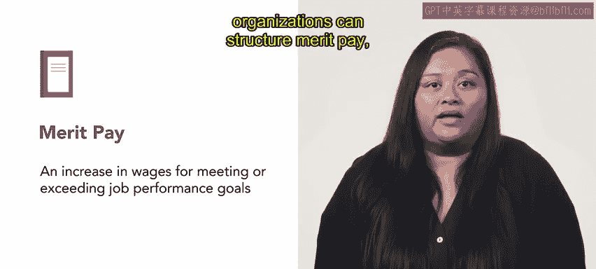
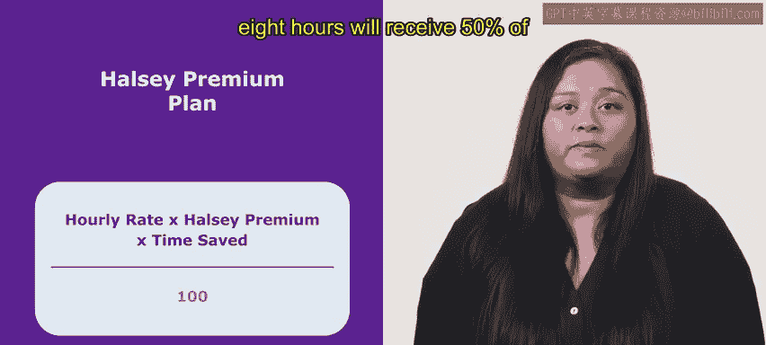
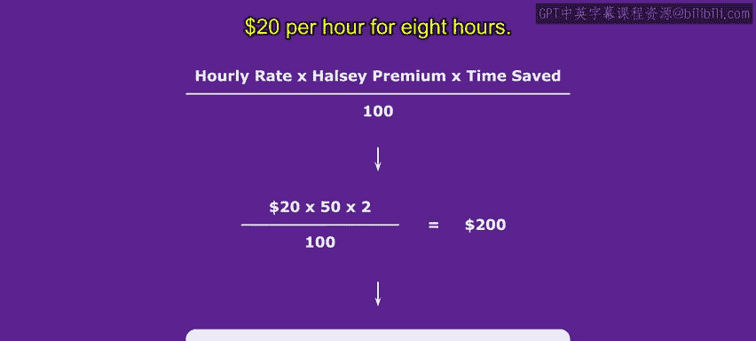
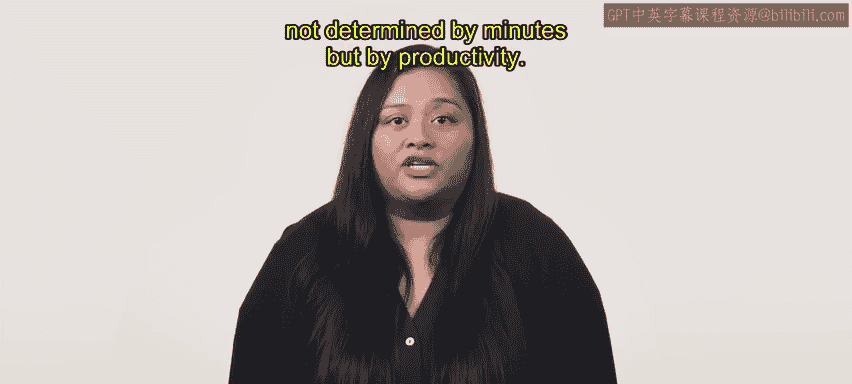
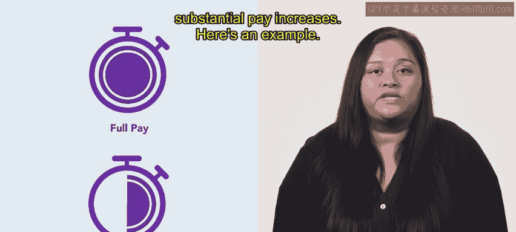
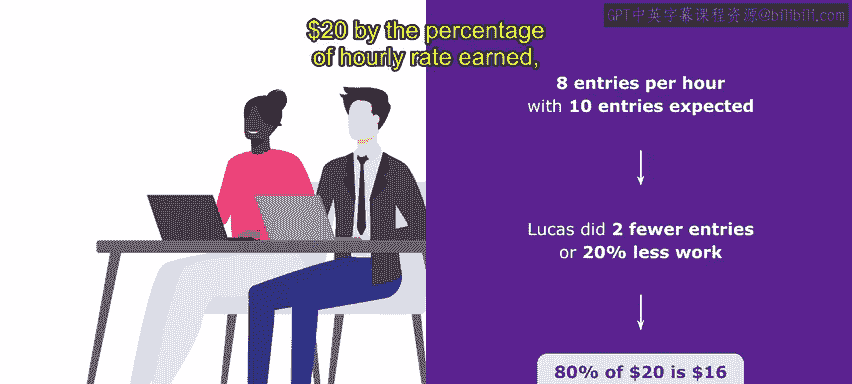
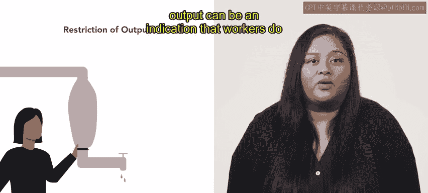

# HRCI《人力资源助理（招聘、学习发展、薪酬福利，1-3课／共5课）｜HRCI Human Resource Associate》 - P154：32_绩效奖金.zh_en - GPT中英字幕课程资源 - BV1qi421r7ba

Organizations have several methods to choose from when increasing employee pay。

 One popular method is known as merit pay。 In this video。

 we will define merit pay and discuss the two approaches organizations use to structure it。

 A Haley premium plan and the standard hour plan。 A merit increases a form of compensation that rewards employees for meeting or exceeding job performance goals。

Organizations might use merit pay tocentivize top performers。

 align employee goals with organizational objectives or increase productivity to illustrate the various ways organizations can structure merit pay。

 let's review two examples。

The Halsey premium plan is a compensation strategy that rewards employee efficiency with this plan。

 employees earn an hourly wage if they complete tasks efficiently in less time than expected。

 they are awarded additional pay， a percentage of the hourly rate for the time saved。

This predetermined percentage is known as the Halsey premium。

 and it generally varies from 30% to 70%。 Here is an example。

An HR manager at a software company wants to incentivize employees to increase their efficiency。

 they implement a Halsy premium and set it at 50%。This means an employee who completes a 10 hour task in 8 hours will receive 50% of their hourly rate for the two hours they saved to calculate the Hsey premium bonus multiply the employee's hourly rate $20 by the Hsey premium 50% and the hour saved2 the employee earns an additional $20 through the Hsey premium bonus。

 This is added to their base pay $20 per hour for 8 hours。

 The standard hour plan connects performance to employee pay。 First。

 time and motion studies determine how long it takes to perform a task or a series of tasks。

 Then an hourly rate is established。 whether the employee earns the hourly rate is not determined by minutes but by productivity。

For instance， if the employee completes an hour's worth of work in 60 minutes。

 then they earn the hourly rate， if they produce less than an hour's worth of work。

 they receive a portion of the hourly rate relative to the work completed。In contrast。

 employees who exceed the expected hourly work output can earn substantial pay increases。

Here's an example。Rva and Lucas work under the standard H Plan， which ties their pay to productivity。

The HR manager sets a productivity standard for data entry tasks。

 all employees must complete 10 entries in one hour。Rva completes 12 entries in an hour。

 exceeding the productivity standard。 As a result， they earn an additional 20% pay。

 Revas hourly pays $20， so they earn $24 for that hour of work。On the other hand。

 Lucas only completes eight entries in one hour， which is less than the expected productivity standard。

 Therefore， Lucas earns only a percentage of their hourly rate based on the work completed。

At an hourly rate of $20， Lucas earned 16。The HR manager calculates Lucas's pay by multiplying the hourly rate $20 by the percentage of hourly rate earned 80 and dividing the total by 100。

Marriit paid plans such as the Hsy premium plan link employee pay to their level of productivity while these approaches can motivate employees to work more efficiently and increase output。

 they may cause employees to engage in restriction of output or soldiering these terms refer to when employees intentionally lower their productivity to keep performance standards low。

Restriction of output can occur when new employees enter a workspace。

 Productivity increases as the new employee learns their job。

 It may surpass the productivity levels of their colleagues。 if productivity suddenly drops。

 usually to align with that of their colleagues。 This is an indication of restriction of output。

 Employees may also restrict output when they are concerned that increase productivity will cause their managers to raise the expected standard of performance。

This challenge can sometimes be addressed by having employees work alone。Ultimately。

 restriction of output can be an indication that workers do not trust their managers and solutions may require greater communication。

As these two methods illustrate， merit pays an effective way to motivate employees and increase productivity。

 However， it is important for organizations to strike a balance between incentivizing productivity and setting realistic performance standards。

 Organizations should structure merit pay to meet their specific needs and goals。

