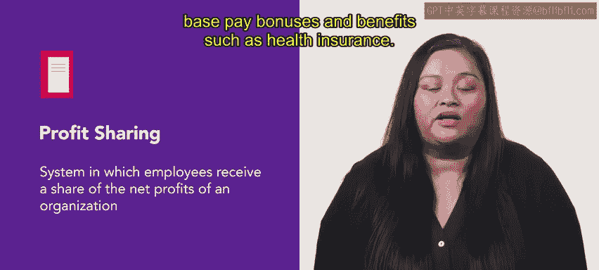

# HRCI《人力资源助理（招聘、学习发展、薪酬福利，1-3课／共5课）｜HRCI Human Resource Associate》 - P156：34_利润分享.zh_en - GPT中英字幕课程资源 - BV1qi421r7ba

One of the first documented profit sharing plans in the United States was introduced in 1794 at New Geneva。

 Pennsylvania， Glaworks， since then profit sharing has become a widely used method for organizations to incentivize and reward their employees。

In this video we will explore profit sharing and learn about its different forms by the end of this video you will understand how profit sharing benefits organizations and employees and how to implement it effectively Let's get started。

😊。

Prot sharing is a system in which employees receive a share of the net profits of an organization。

 the aim is to increase employee productivity through motivation。

Profit sharing fits into a broader compensation strategy。

 and an organization may offer profit sharing in addition to base pay。

 bonuses and benefits such as health insurance。

Let's discuss three forms of profit sharing to better understand this concept。

One form of profit sharing allows organizations to share a portion of their profits with employees and cash。

 This type of profit sharing provides a direct financial incentive for employees to work hard and contribute to an organization's success。

For example， a software company sets aside 5% of its annual net profits to give to its employees as a cash bonus。

 each employee's bonus is allocated based on the employee's job responsibility。

 seniority and base pay At the end of the year， eligible employees receive a cash bonus paid out as part of their regular paycheck。

Another form of profit sharing stock options with this plan。

 employees receive shares of an organization's stock instead of cash。

 an employee stock ownership plan or ESOP is a type of profit sharing in which an organization contributes to its own stock to employee retirement plans。

 Employees own the stock directly and benefit the stock increases in value。

 ESOP is enable organizations to share their profits with employees while offering them a long termm investment plan。

 A deferred profit sharing plan is another option。 In this type of plan。

 an employer deposits a portion of the organization's profits into a deposit account or pension plan。

For example， an IT company sets up a deferred profit sharing plan that deposits a portion of its profits into a pension plan。

 when a worker retires they're able to take advantage of the pension plan that was funded with the company profits。

 an employee doesn't pay any taxes on these funds until they are withdrawn。

As you've just learned， implementing a profit sharing plan can improve relationships between organizations and employees。

 increase motivation， and ultimately improve overall performance。

