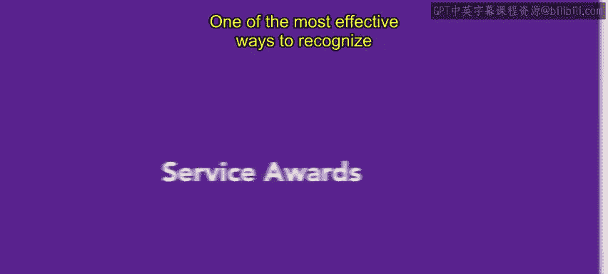
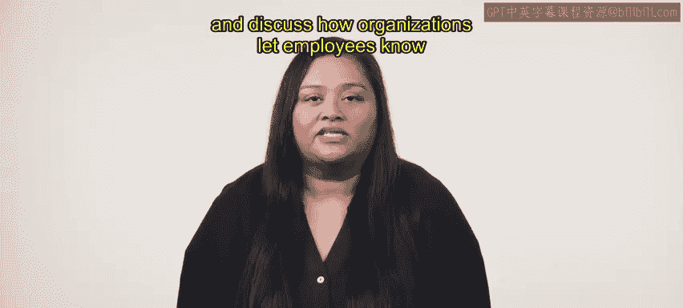
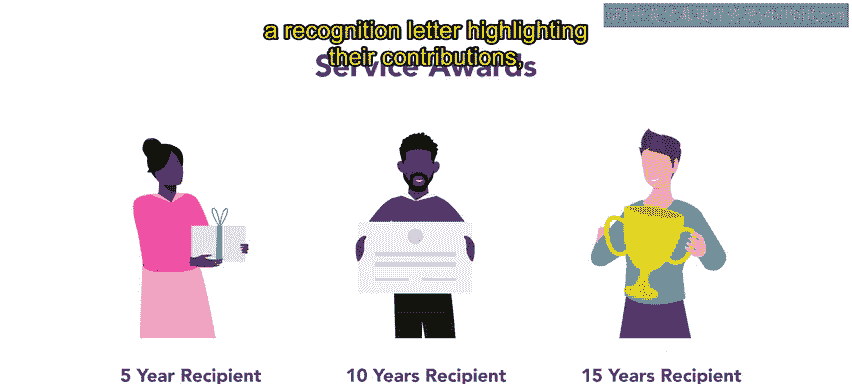
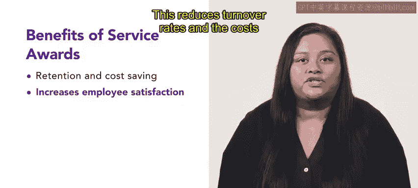
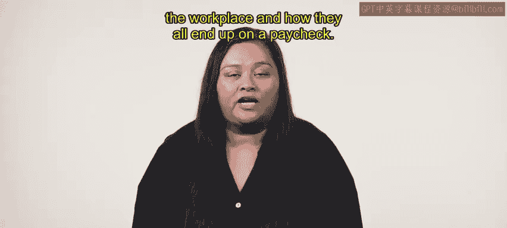

# HRCI《人力资源助理（招聘、学习发展、薪酬福利，1-3课／共5课）｜HRCI Human Resource Associate》 - P158：36_服务奖励.zh_en - GPT中英字幕课程资源 - BV1qi421r7ba

One of the most effective ways to recognize and retain employees is their service awards In this video。

 we will define service awards， highlight their importance and discuss how organizations let employees know that their loyalty and contribution is appreciated。

Service awards are recognition programs that honor employees for their tenure with an organization。

Employees typically receive these awards at specific intervals， usually every five years。

 with each interval carrying more valuable rewards。 Service awards can be monetary。

 such as a bonus or gifts， such as a plaque or trophy。

 It allows organizations to celebrate their longstanding employees' work anniversaries based on the amount of time they have been with the organization。

 For example， an organization might honor employees ten year milestone by giving them a recognition letter。

 highlighting their contributions。 A bonus and a personalized gift basket。

 Service awards are an effective way for organizations to recognize and celebrate employee's loyalty and commitment。

😊。

When employees feel appreciated by an organization， they are more likely to remain with them。

 This reduces turnover rates and the costs associated with hiring and training new employees。

 They also have a positive impact on an organization's culture and reputation by highlighting employee contributions and organization shows that it values and appreciates them。

 making it more attractive to job seekers。 Additionally。

 organizations can encourage positive word of mouth and increase customer loyalty by recognizing and rewarding their employees。

As an employee， service awards can be an exciting incentive to work towards as an organization。

 service awards can be an effective tool to retain valuable employees Later。

 you'll continue to learn about incentives in the workplace and how they all end up on a paycheck。

