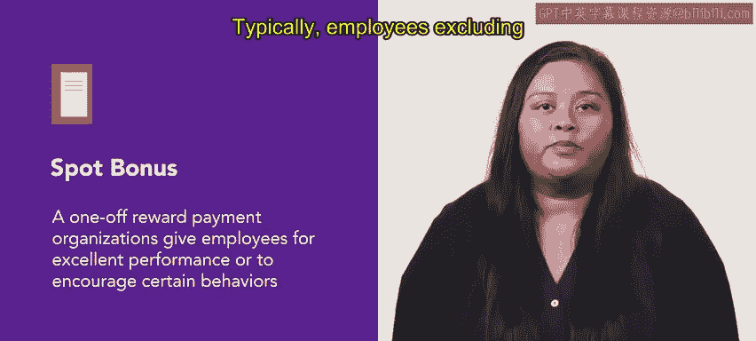

# HRCI人力资源助理课程：第37课：即时奖金 💰

在本节课中，我们将学习什么是即时奖金，以及组织如何利用它来提升员工士气和激励员工。

即时奖金是组织为表彰员工的卓越表现或鼓励特定行为而发放的一次性奖励。通常，除高层管理人员外的员工都有机会获得即时奖金。这类奖金通常颁发给个人而非团队。接下来，我们将详细探讨组织如何使用即时奖金。

## 即时奖金的激励作用 🎯

上一节我们介绍了即时奖金的基本概念，本节中我们来看看它的核心激励作用。即时奖金能激励员工更努力地工作，以达成组织目标。当员工知道自己的辛勤工作会得到认可和奖励时，他们更有可能付出额外的努力。

以下是即时奖金激励作用的具体体现：
*   **奖励卓越表现**：例如，当一名员工在紧迫的期限内出色完成一个具有挑战性的项目后，组织可能会立即奖励他/她一笔奖金，金额可能是 **$50**、**$100** 或 **$500**。
*   **形式多样化**：即时奖金也可以是非货币形式的奖励，例如礼品卡或额外的休假时间。

## 制定有效的即时奖金计划 📝

了解了即时奖金的激励作用后，我们来看看如何制定一个有效的即时奖金计划。在制定计划时，明确奖金标准以体现决策的一致性和公平性至关重要。

以下是制定有效即时奖金计划的关键步骤：
*   **明确标准**：清晰列出获得奖金的标准。当员工知道期望是什么时，他们会明白奖励是基于其绩效，而非主观偏见。
*   **及时发放**：员工在达到标准后应立即获得奖金，以维持其积极性和热情。
*   **避免偏袒**：如果某些员工持续表现优异，组织应避免每次都给予奖金奖励，以防止被视作偏袒。这体现了奖励所有优秀员工，而非仅限个别人的意愿。
*   **因人而异**：最后，在制定计划时，组织应通过了解员工的动机来发放合适的奖金。需考虑到并非所有员工都喜欢相同的奖励，因此应提供多样化的奖励选择以适应所有员工。

## 总结 📚

本节课中，我们一起学习了即时奖金。我们了解到，通过使用即时奖金来认可和奖励员工的卓越表现，组织可以提升团队士气，并营造积极向上的激励文化。