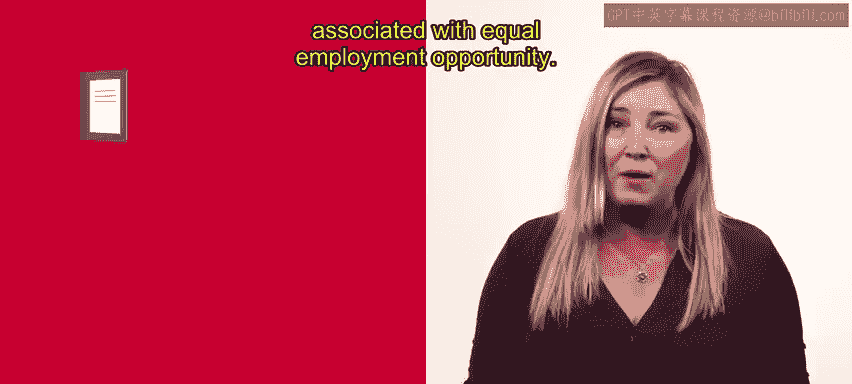
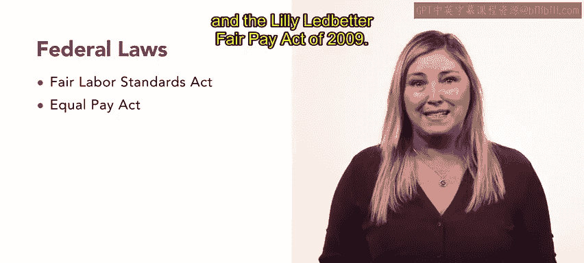
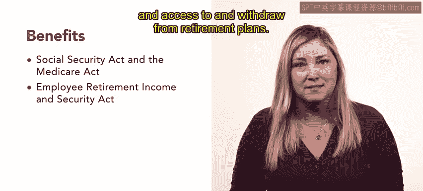
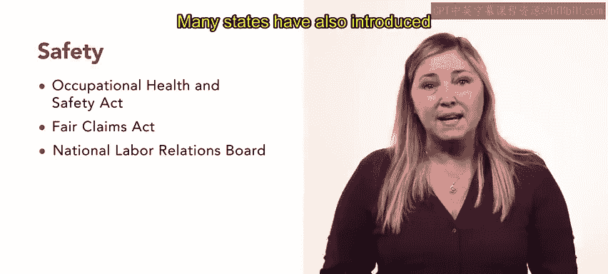

# HRCI人力资源助理课程：P15：工作设计中的法律问题 📜

## 概述

在本节课中，我们将要学习在美国进行工作设计时需要考虑的一系列重要法律问题。这些法律旨在确保公平就业机会、规范薪酬福利、保障工作场所的健康与安全，并保护员工免受歧视。

正如您所了解的，工作设计与再设计是提升员工生产力、效率和积极性的有力工具。现在，让我们来探讨一些影响工作设计过程的美国法律。

## 平等就业机会相关法律

工作设计中的法律问题通常与平等就业机会相关。平等就业机会旨在保护员工和潜在员工免受歧视性行为的影响。

以下是几项核心的平等就业机会法律：

*   **1964年《民权法案》第七章**：该法案规定，基于**种族、肤色、宗教、性别或国籍**在职位描述中进行歧视是非法的。此规定适用于拥有15名或以上员工的私营雇主、州和地方政府以及教育机构。性骚扰也违反了第七章。
*   **《就业年龄歧视法》**：该法规定，歧视40岁或以上的人，使其无法在拥有20名或以上员工的政府机构、私营企业或拥有25名以上成员的工会中任职，是非法的。
*   **州与地方法律**：此外，许多州和市镇也通过了法律，以防止基于**性取向、父母或婚姻状况以及政治派别**等其他个人特征的歧视。

作为人力资源专业人士，研究和理解可能适用于您所在组织的当地法规非常重要。

## 反歧视与合理便利

遵守《美国残疾人法》和《怀孕歧视法》至关重要。

*   **《美国残疾人法》**：该法禁止设计不向潜在残疾员工提供**合理便利**的工作职责和任务。
*   **《怀孕歧视法》**：该法规定歧视孕妇是非法的。它还要求雇主必须修改雇佣条款，允许休产假的员工返回**相同的岗位**。

## 薪酬与工作描述的法规限制

联邦法律也对工作描述中关于职责和任务的表述有所限制。

*   **《公平劳动标准法》**：该法要求雇主明确说明职责和任务是否需要**强制加班**，以及该职位是否支付**法定最低工资**。
*   **薪酬平等**：如果提及薪酬，根据1963年《同工同酬法》和2009年《莉莉·莱德贝特公平薪酬法》，**男女薪酬必须平等**。

到目前为止，我们已经介绍了影响员工招聘和薪酬方式的法律。接下来，让我们回顾几项与员工福利及健康安全相关的立法。

## 福利与健康安全法规

以下是保障员工福利与工作场所安全的核心法律：

*   **《社会保障法》与《医疗保险法》**：要求所有雇主必须为社会保障和医疗保险进行报告并匹配缴款。
*   **《雇员退休收入保障法》**：详细规定了与员工**退休金归属**以及从退休计划中**提取资金**相关的规则。
*   **《家庭与医疗休假法》**：赋予符合条件的员工因特定家庭和医疗原因（如孩子出生或领养，或照顾生病的家庭成员）享受**12周无薪休假**的权利。
*   **健康保险相关法律**：
    *   **《综合预算协调法》**：要求雇主在员工被解雇或辞职后，为其提供**购买医疗保险延期**的选择权，使员工在寻找新工作期间能维持保险。
    *   **《健康保险携带和责任法》**：规定无论员工是否有**既存健康状况**，都必须能够转换到新工作，并将其前雇主的保险转移到新的保险计划中。这防止了医疗保险计划内的歧视，并确保员工能够维持对其健康状况的同等护理水平。

## 工作场所安全与申诉

工作场所安全与健康规则有助于避免危险的工作环境。

*   **《职业安全与健康法》**：概述了这些安全与健康法规。如果工作环境在法律上被认为不安全，被要求执行相关职责和任务的员工可能会获得**举报人保护**。
*   **申诉与工会**：根据《虚假申报法》，关于待执行职责和任务的申诉也可以提交给**国家劳工关系委员会**（如果组织允许工会组织）。
*   **反欺凌立法**：许多州还引入了**反欺凌立法**，以禁止工作场所骚扰。

## 雇佣关系终止

在大多数州，合同期限届满前终止雇佣关系不受特殊保护。除了蒙大拿州，美国所有州的员工都是**随意雇佣**。在蒙大拿州，终止雇佣关系**仅在有正当理由时**才被允许。

## 总结

本节课我们一起学习了影响工作设计过程的一系列美国法律。这些法律涵盖了平等就业机会、反歧视、薪酬规范、福利保障以及工作场所安全与健康等多个方面。了解并遵守这些法律对于人力资源专业人士至关重要，它们不仅保护了员工的权益，也为组织构建合法、公平且高效的工作环境提供了框架。随着新立法的通过，您需要持续关注法律如何影响人力资源行业及您的组织。