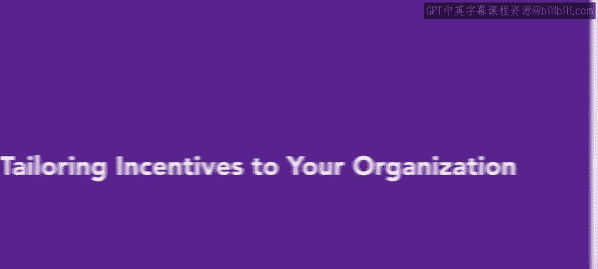
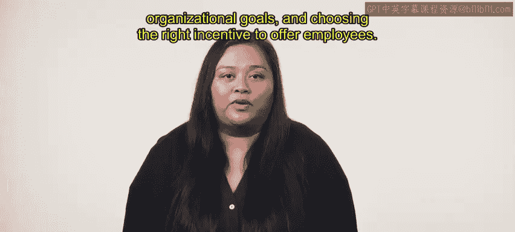

# HRCI《人力资源助理（招聘、学习发展、薪酬福利，1-3课／共5课）｜HRCI Human Resource Associate》 - P160：38_为组织量身定制激励措施.zh_en - GPT中英字幕课程资源 - BV1qi421r7ba

As you've learned， incentives can go a long way in helping organizations achieve their goals In this video。

 we will explore the steps in creating an effective incentive plan。

 discuss how it motivates and rewards employees and provide examples to help you get started。

Before creating an incentive plan， organizations should define the behaviors and outcomes they want to encourage in their employees。

 For example， a retail organization that wants to increase its sales might create an incentive plan that rewards the sales team for reaching targets or achieving the highest sales per quarter。

After determining the desired behaviors and outcomes。

 it is important to understand employees preferences Employ are motivated by different factors。

 some might prefer monetary rewards while others prefer time off。

Sending an employee survey is a good way to get an idea of the rewards to use in an incentive plan。

Once the organization has determined the type of incentives it wants to offer。

 it's essential to create an easy to understand and transparent incentive program。

 employees need to know what to do to earn the incentive and what the reward will be。

Organizations can offer various types of incentives to motivate their employees。

 These include bonuses， commissions， profit sharing and stock options。

 Each type of incentive has advantages and disadvantages。

 and organizations should consider which incentive structure works best for their employee and their goals。

 organizationsization might also offer other incentives such as time off。

 Fl work arrangements and professional development opportunities。

 The goals to find the incentives that align with the organizationss goals and motivate employees to perform at their best。

 Here's an example。 A software company wants its developers to maintain high standards and meet project deadlines。

 The company creates an incentive plan that includes bonuses and stock options。

 They offer a biannual bonus to developers who complete projects on time。

 They also offer stock options to all developers to incentivize them to stay with the company and contribute towards its growth。

You've just learned that creating an effective incentive plan involves understanding what motivates employees。

 tailoring those motivators to organizational goals。

 and choosing the right incentive to offer employees。

