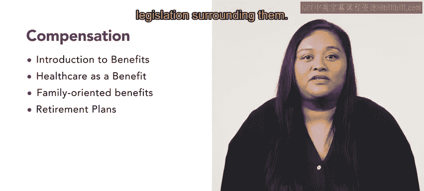

# HRCI人力资源助理课程：第3周：福利介绍 💼

在本节课中，我们将开始学习薪酬福利课程的第三周内容，重点介绍员工福利。我们将探讨福利的不同形式、成本考量、分类，以及具体的福利类型，如健康福利、家庭导向福利和退休计划。

## 概述

本节课程将介绍员工福利的基本概念。我们将首先了解福利的成本与回报，然后学习福利的不同分类方式。

---

## 第一课：福利的成本与回报 💰

上一节我们完成了薪酬部分的学习，本节中我们来看看福利。福利以多种不同形式存在。

在考虑福利时，有许多因素需要考量，成本是其中之一。

除了理解福利的成本，你还将学习福利的不同分类。

以下是福利的主要分类：

*   **法定福利**：法律要求企业必须提供的福利，例如社会保险。
*   **自愿福利**：企业自愿提供给员工的福利，用以吸引和留住人才，例如补充医疗保险。
*   **货币与非货币福利**：货币福利直接体现为金钱，如奖金；非货币福利则是其他形式的回报，如额外假期。

---

## 第二课：健康福利 🏥

了解了福利的基本分类后，本节我们将深入探讨一种具体的福利——健康福利。

事实证明，提供健康福利不仅能支持员工，还能提高员工保留率。

接下来，你将学习不同类型的家庭导向福利。

以下是常见的家庭导向福利类型：

*   **儿童保育**：提供托儿所或保育补贴。
*   **灵活支出账户**：允许员工税前支付特定医疗或抚养费用。
*   **休假津贴**：提供带薪的家庭事务假、育儿假等。

---

## 第三课：退休计划 🏦

在学习了健康与家庭福利后，本节我们将关注员工的长期保障——退休计划。

在学习本课程的过程中，你将接触到不同的退休计划及相关立法。

---

## 总结

本节课中，我们一起学习了员工福利体系。我们从福利的成本和分类入手，接着探讨了具体的健康福利和家庭导向福利，最后介绍了为员工未来考虑的退休计划。这些知识是构建全面薪酬福利方案的基础。