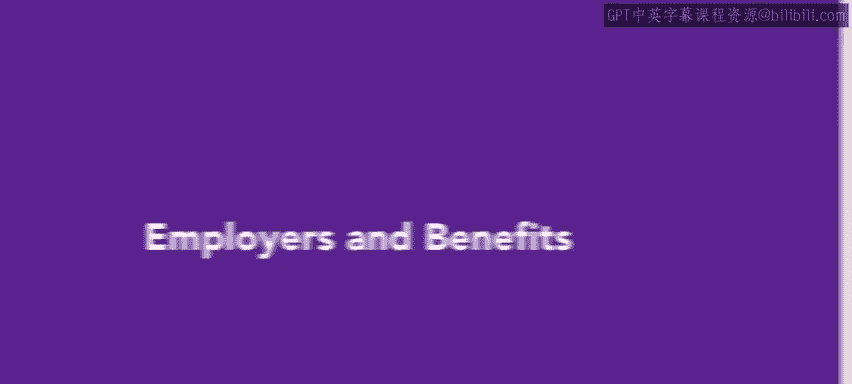
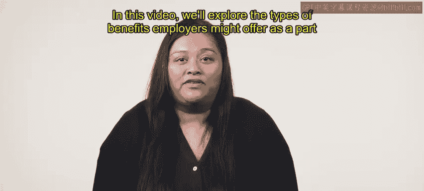
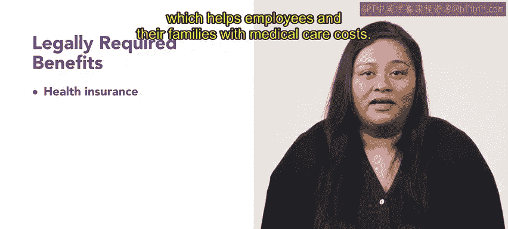
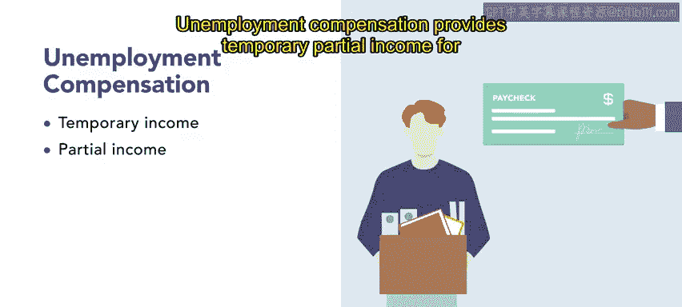
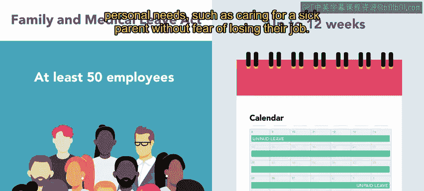

# HRCI《人力资源助理（招聘、学习发展、薪酬福利，1-3课／共5课）｜HRCI Human Resource Associate》 - P163：41_雇主与福利.zh_en - GPT中英字幕课程资源 - BV1qi421r7ba

When most people consider job benefits， monetary compensation is their first thought， however。

 there are many other elements that might be included in a benefits package such as lifestyle or other kinds of perks some benefits are legally required depending on local。

 state and federal regulations。In this video， we'll explore the types of benefits employers might offer as a part of a benefits package let's start with benefits employers are legally required to provide to full time employees。

😊。

Employers are legally required to provide access to health insurance。

 which helps employees and their families with medical care costsEmploys are also responsible for Medicare and Social Security contributions which cover health care and provide income during retirement In addition。

 employers must provide workers compensation insurance unemployment insurance and family and medical leave which mitigate economic hardships that result from disability。

 workplace injury and loss of employment。

We'll cover health care as a benefit in greater detail in the later lesson For now。

 let's explore a few of these other benefits。 Social Security benefits ensure that individuals have income after they retire。

 Medicare provides health insurance coverage after age 65 and for those with disabilities or medical conditions。

Workers compensation insurance covers employees who incur injuries and illnesses from performing their jobs these costs can include medical care。

 rehabilitation， paid leave and replacement income。

Unemployment compensation provides temporary partial income for employees who lose their jobs involuntarily。

 the Family and Medical Leave Act or FMLA requires organizations with at least 50 employees to provide workers with up to 12 weeks of unpaid leave。

An individual who has worked for an organization for at least 12 months can take this time to balance family and personal needs。

 such as caring for a sick parent without fear of losing their job。

Employers can also offer optional health related benefits， these benefits can include dental， vision。

 life and disability insurances。

In addition to those we've discussed， there are a few more optional benefits employers may offer。

Many companies also have benefits that provide free services to employees these benefits can include onite child care。

 commuter allowances， tuition reimbursement， free snacks or beverages。

 reimbursed or subsidized gym memberships and flexible work arrangements。

For employees who are relocating for a new position。

 some companies might also provide financial assistance in the form of pay adjustments or bonuses relocation benefits can also include moving expenses。

 temporary housing assistance with buying and selling homes and support for family members。

 such as helping a spouse to find work。

Now that you have learned about the types of benefits an employers either required or may choose to offer。

 we will next explore strategies for documenting your organization's total rewards。

