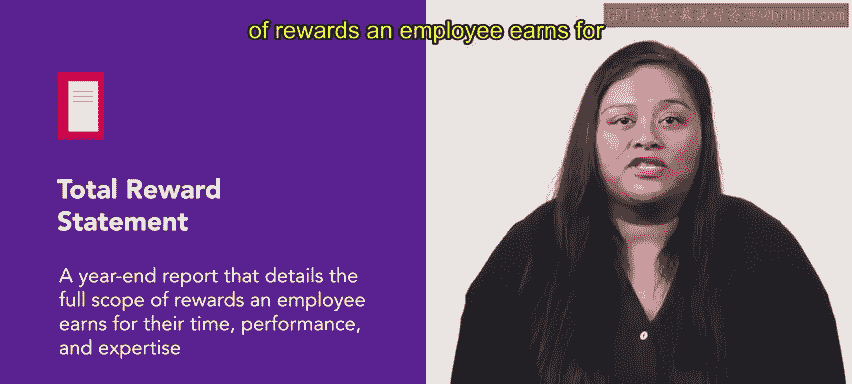

# HRCI人力资源助理课程：第42课：总薪酬策略与声明 💰

在本节课中，我们将学习总薪酬策略与总薪酬声明的概念，了解它们如何将货币与非货币报酬结合起来，并探讨其在人力资源管理中的重要性。

## 概述

上一节我们学习了不同的福利类别及其如何与薪资结合，为新员工构建薪酬方案。一旦确定了薪酬方法，制定实施这些报酬的计划就至关重要。本节中，我们来看看总薪酬策略与声明。

## 总薪酬策略

总薪酬策略包含货币性报酬与非货币性报酬。

### 货币性报酬

货币性报酬指组织为其员工承担成本或支付的所有项目。以下是其主要组成部分：

*   **现金报酬**：基本工资、奖金等。
*   **养老金福利**：为员工退休后提供的保障。
*   **401K匹配缴费**：公司为员工退休储蓄计划提供的匹配资金。
*   **健康保险费**：公司为员工健康保险支付的费用。
*   **带薪休假**：包括年假、病假等。
*   **股票期权**：赋予员工在未来以特定价格购买公司股票的权利。
*   **激励计划**：与绩效挂钩的奖金计划。
*   **员工持股计划**：让员工持有公司股份的计划。

### 非货币性报酬

非货币性报酬包括内在报酬与外在报酬。内在报酬提升员工的自尊，例如完成一项具有挑战性任务带来的满足感。😊 外在报酬则指来自他人的积极感受，例如与同事建立的良好关系。非货币性报酬还包括因良好表现而获得的认可、良好的职业发展机会，以及诸如弹性工作时间和远程办公等生活方式福利。😊

这些报酬分配的框架被称为**总报酬策略**。制定总报酬策略时，必须考虑许多因素，包括法律问题、环境因素、组织的竞争力以及劳动力市场状况。

## 总薪酬声明

总薪酬声明是一份年终报告，详细说明了员工因其时间、绩效和专业知识所获得的全部报酬范围。这些声明有助于提高透明度，加强关于薪酬的沟通，并已被证明可以提高员工保留率。

总薪酬声明通常描述以下内容：

*   员工薪资
*   医疗福利
*   弹性支出账户
*   股票期权
*   奖金
*   伤残福利
*   员工援助计划
*   学费援助
*   带薪休假

此外，还可以包括其他福利，例如：

*   弹性工作时间表
*   远程办公
*   宠物保险
*   现场托儿服务
*   公司提供的餐饮
*   公司产品和服务的折扣

## 总结与回顾

本节课中，我们一起学习了总薪酬策略与声明。总薪酬声明很有用，但许多组织仍对使用它们持犹豫态度。一些组织担心员工会对报告中的数据感到不满，或者员工会将自己的福利与同事以及其他地方类似工作的福利进行比较。尽管如此，它仍然是规划福利方案的重要工具。

接下来，你将进一步了解福利的成本以及如何降低这些成本。