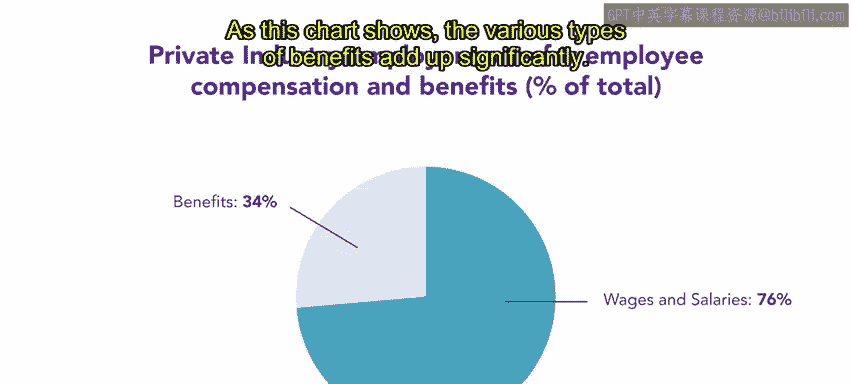
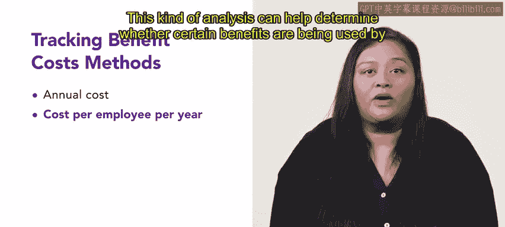

# HRCI人力资源助理课程：第43课：福利成本 💰

在本节课中，我们将学习福利成本如何成为员工总薪酬中日益重要的一部分，并了解如何追踪和分析这些成本。

---

上一节我们介绍了雇主可能提供的福利类型及其记录方式。本节中，我们来看看福利成本如何演变，以及如何对其进行衡量。

根据美国劳工统计局的数据，1929年，雇主在每1美元工资支出中，平均花费约3美分用于福利。如今，这一数字已增长至约30美分。这种增长主要是因为福利成本的增速远高于通货膨胀率。

对于员工超过500人的公司，福利成本目前相当于直接薪酬成本的**34%以上**。这种增长在很大程度上可归因于法律强制要求的支付和福利，尤其是健康保险。如下图所示，各类福利的累积成本相当可观。

---

组织需要追踪福利成本，以判断哪些福利物有所值，哪些则不然。

以下是两种主要的福利成本追踪方法：

*   **年度总成本法**：计算提供某项福利的年度总成本。
*   **人均年成本法**：衡量每年为每位员工提供该福利的平均成本。其计算公式为：
    `人均年成本 = 年度福利总成本 / 享受该福利的员工人数`

这种分析有助于判断某项福利是否仅被一小部分员工使用，从而评估其成本效益。

---

让我们通过一个例子来理解人均成本的计算。

假设一家公司每年为其员工支付健康保险的总成本为 **$195,000**。该公司共有 **25** 名员工。根据公式计算：

`人均年成本 = $195,000 / 25 = $7,800`

这意味着，该公司为每位员工提供的健康保险，年均成本为 **$7,800**。

---

尽管并非所有福利都以货币形式直接奖励给员工，但所有福利对雇主而言都意味着成本支出。因此，追踪福利成本不仅是控制预算的重要环节，也是设计和优化福利方案的关键依据。

---

**本节课总结**

本节课中，我们一起学习了：
1.  福利成本在总薪酬中的占比已大幅增长。
2.  追踪福利成本的两种主要方法：**年度总成本法**和**人均年成本法**。
3.  通过一个具体计算示例，掌握了`人均年成本`的公式与应用。

接下来，你将学习组织如何采取措施来降低福利成本。