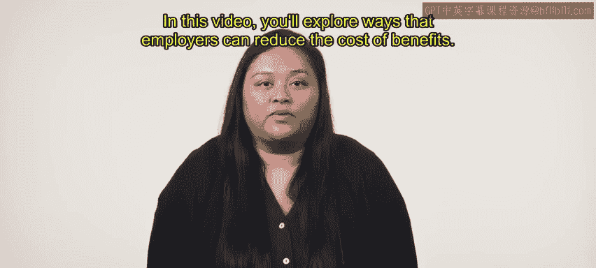
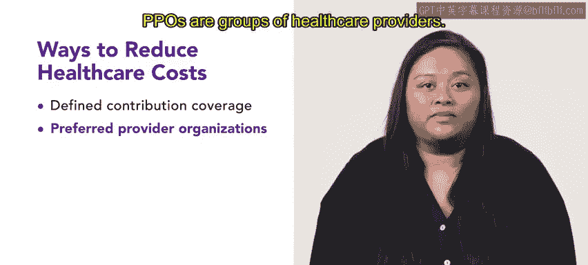

# HRCI《人力资源助理（招聘、学习发展、薪酬福利，1-3课／共5课）｜HRCI Human Resource Associate》 - P166：44_雇主如何降低福利成本.zh_en - GPT中英字幕课程资源 - BV1qi421r7ba

As you've learned， the cost of benefits has climbed for employers。

 the rising price of health care in particular constitutes much of these increased costs。

  employers have responded in a variety of ways， some of which include increased employee deductibles。

 coinsurance， and the use of preferred provider and health maintenance organizations。In this video。

 you'll explore ways that employers can reduce the cost of benefits。

First， some employers have begun offering defined contribution coverage in response to rising health care costs in defined coverage plans。

 employees contribute a fixed amount to the health coverage costs each year Any unused amount of this sum remains in the employee's account for future health costs in circumstances where that account is depleted。

 the employer agrees to cover the remainder of the health care expenses in catastrophic circumstances where the expense is substantial。

 insurance covering the employee and the employer pays the remaining costs these plans shifts some of the financial burdens of health costs away from employers and back to employees while still providing some of the assurance and support of traditional benefit options。

Other employers rely on preferred provider organizations or PPpoOs to reduce costs PPpoOs are groups of health care providers Employs and insurance companies enter contracts with these provider groups to receive health services at reduced fees Employees are required to use health services provided by the PPpoOs。

 Another way to reduce costs of health care coverage is through employee wellness programs which have become increasingly popular。

 These programs focus on changing undesirable or risky employee behavior both at work and at home。

 Unsirable behaviors include unhealthy eating habits and smoking。

Although employee wellness programs often require significant investments by an employer。

 the payoff can be tremendous in some circumstances。

 usually a small number of employees produce a disproportionate amount of health care costs if wellness programs address underlying lifestyle issues for those employees。

 health care costs can be greatly reduced。Some companies have employed flexible benefits packages。

 also called cafeteria plans and 125 plans in an attempt to reduce the cost of benefits These flexible packages provide employees with a sum of money allocated to their benefits plan and then permit individual employees to choose where to spend those credits each year。

 These plans recognize that different employees have varying needs and wants。

 and they aim to minimize the chance that company funds will be funneled into benefits that go unused。

For example， a flexible plan might allow employees the option of a vision plan as employees without visual impairments choose not to opt into the vision plan。

 the employer cuts down on wasted expenses such flexible plans also carry risks of their own however flexibleible benefit plans come with more administrative costs these costs arise because it is more difficult to communicate and coordinate these plans Furthermore。

 if only higher risk employees select health insurance coverage then the premium rate for the organization might rise。

For example， a flexible plan might allow employees the option of a vision plan as employees without visual impairments choose not to opt into the vision plan。

 the employer cuts down on wasted expenses such flexible plans also carry risks of their own however。

 Fl benefit plans come with more administrative costs these costs arise because it is more difficult to communicate and coordinate these plans Furthermore。

 if only higher risk employees select health insurance coverage。

 then the premium rate for the organization might rise。

Defined contribution plans transfer much of the risk of retirement investment away from the employer and onto the employee。

For defined contribution plans， an employee authorizes their employer to deduct a specific amount from their paycheck and invest that sum in a specified bundle of investments。

 often mutual stock funds or bond investments。Some organizations promise to provide an employee with an established amount of money at retirement。

 This is called a cash balance plan。 Typically， deposits are made into a cash balance plan account annually。

 These deposits are calculated after interest to add up to the appropriate amount of the time of retirement。

Employee tend to like cash balance plans because they are easy to transfer from one workplace to another After resigning from an organization。

  employees can withdraw funds from these plans。

Although costs of benefits are rising， there are ways to reduce them while still providing employees great benefit packages。

Coming up， you'll explore defined benefits and 401Ks。

