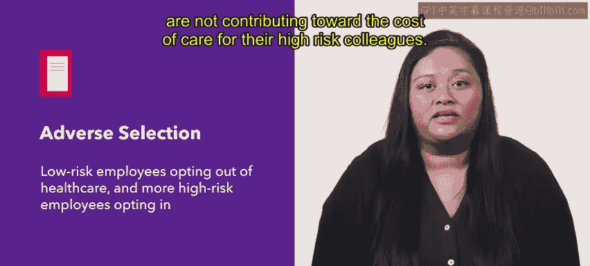
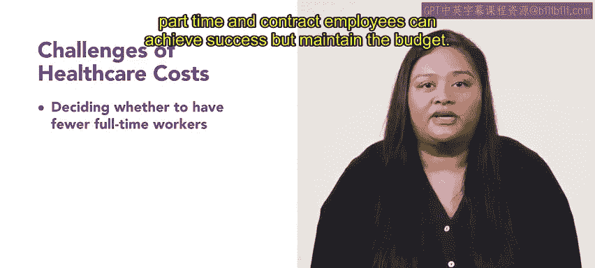
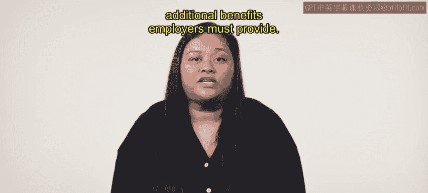

# HRCI人力资源助理课程：第45课：医疗保健福利及其挑战 🏥

在本节课中，我们将要学习为员工提供医疗保健福利时，雇主所面临的主要挑战。我们将探讨成本控制、员工选择行为以及相关法规如何影响福利方案的设计与管理。

---

雇主长期以来习惯于为全职员工提供医疗保险计划。然而，医疗保健成本在预算支出中占很大比重，组织几乎在任何情况下都会寻找降低成本的方法。额外的成本通常由员工承担。

提供灵活的医疗保健福利伴随着高昂的代价。一些计划允许员工选择是否加入医疗保险，或在不同的保障层级之间进行选择。

这种选择可能导致更多低风险员工选择退出福利，而更多高风险员工选择加入。这种现象被称为**逆向选择**，其成本高昂，因为低风险员工没有为其高风险同事的医疗成本做出贡献。

各类规模的组织都面临着与成本相关的挑战。接下来，我们来看看他们可能遇到的一些具体情景。

以下是组织在控制医疗成本时可能考虑的情景：

*   **调整用工结构**：例如，如果只有全职员工有资格享受医疗保险，那么雇佣更少的全职员工和更多的兼职及合同工，是否会带来显著的财务激励？在考虑医疗成本时，组织必须评估何种全职、兼职和合同工的组合既能实现业务成功，又能维持预算。
*   **采用自助式福利包**：在这种方案下，组织可以通过转向自助式福利包来控制成本。在此选项中，员工可以选择更多的薪酬、休假时间或其他成本低于医疗保险的福利，以代替参与公司的医疗保险计划。这对于那些通过配偶雇主维持保险的员工来说可能很有吸引力。
*   **平衡成本与竞争力**：或许最重要的是，组织必须考虑成本控制措施在何时会使其健康计划失去竞争力。在人才竞争激烈的市场中，福利不足或将过多费用转嫁给员工，可能会阻碍候选人应聘，或鼓励现有员工离职。

组织还必须考虑州或联邦法规规定的雇主必须提供的额外福利。

以下是两项重要的相关法规示例：

*   **《患者保护与平价医疗法案》（PPACA）**：这是一项于2010年签署的医疗改革法案。该法案对雇主有多方面影响，但最重要的是，它确保美国人能够获得可负担的医疗保健。虽然不强制要求雇主提供医疗保险，但该法律会对不提供可负担的基本医疗保险的大型组织进行处罚。
*   **《统一综合预算协调法案》（COBRA）**：COBRA要求雇主在员工被解雇、辞职或工作时间减少后，为其提供延续购买医疗保险的选项。必须延续保险的时间长度根据员工离职的原因而有所不同。COBRA不要求雇主为因重大过失被解雇的员工提供延续保险选项。

---

本节课中，我们一起学习了提供医疗保健福利的主要挑战。尽管医疗保健是全日制员工福利包的重要组成部分，但对雇主而言成本可能很高。如果人力资源团队能够充分认识到我们今天讨论的问题，就能更有效地进行预算编制和福利管理。

接下来，你将学习具体的健康保险计划类型。