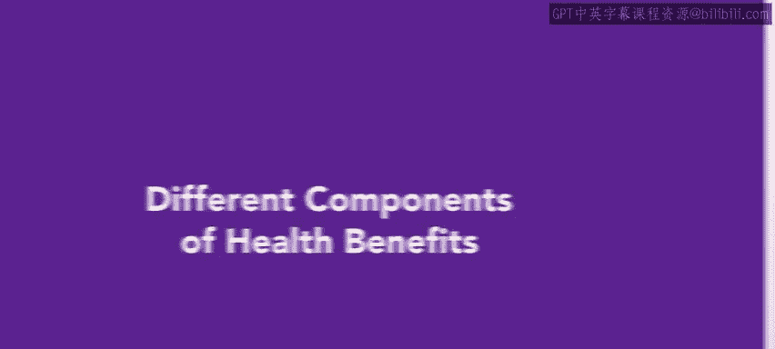
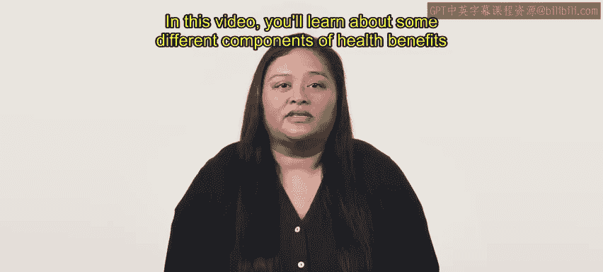
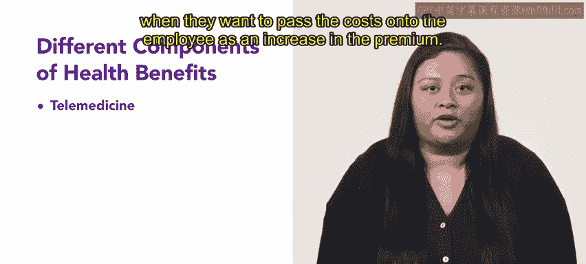
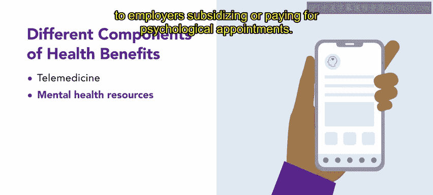
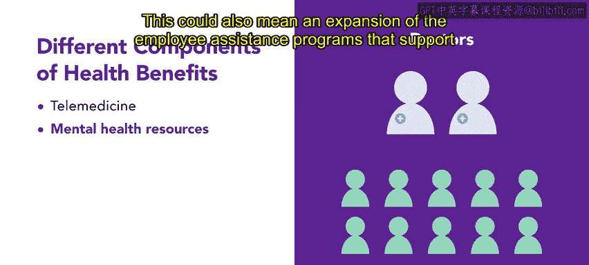
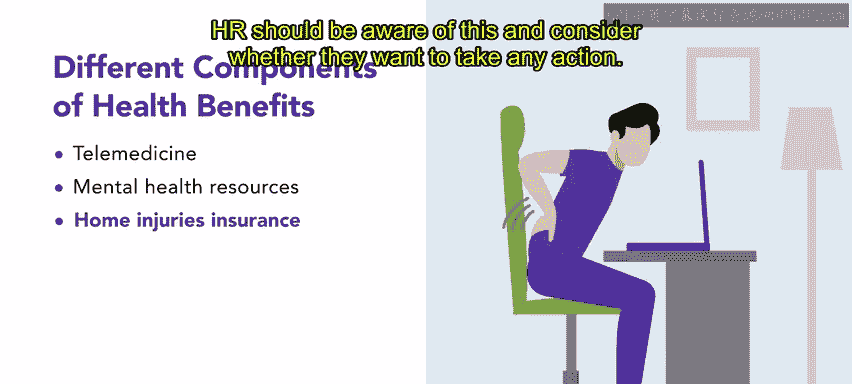

# HRCI《人力资源助理》：P168：46_健康福利的不同组成部分 🏥

在本节课中，我们将学习现代职场健康福利的几个不同组成部分。健康福利是对员工的投资，最终也是对组织的投资，它能带来更高的员工留任率、生产力和工作满意度。提供实用健康福利的雇主，表明了他们对员工福祉的承诺，并有助于在竞争中脱颖而出。

上一节我们介绍了健康福利的重要性，本节中我们来看看几种具体的福利形式。

## 远程医疗

远程医疗是最常见的健康福利之一，近年来相当受欢迎。事实上，由于新冠疫情对医疗服务方式带来的改变，远程医疗预计将持续扩展。医疗服务提供者和患者都接受了虚拟诊疗的机会。

员工有时会期望医疗保险计划能满足这种需求，这可能会改变医疗成本。雇主必须决定是否以及何时将这部分成本以提高保费的形式转嫁给员工。

从实际角度看，线上预约更容易融入工作日，无论员工是否在现场办公，都更高效、更便捷。组织层面应权衡这种健康选项的收益与成本。

## 心理健康资源

许多公司也认识到心理健康资源作为其医疗相关福利一部分的价值。这些资源可以很简单，例如免费订阅心理健康应用程序，或者雇主补贴或支付心理咨询费用。

需要记住的是，2020年，行为健康护理的需求远远超过了合格心理健康专业人员的供给，并且这种情况预计不会改变。对于咨询师、治疗师和精神科医生而言，虚拟访问也将持续流行，甚至可能超过对初级保健虚拟预约的需求。这也可能意味着支持心理健康的员工援助计划会得到扩展。

## 居家办公相关伤害

居家办公相关的伤害也在增加。组织必须考虑与居家办公空间导致的人体工学损伤相关的工伤赔偿索赔之间的关联。

即使配备了正确的设备，不良姿势也可能悄然出现。在办公室时，当我们感觉到别人的目光，会坐得更直。我们会走去开会、上下楼梯，并且通常可以接触到多把椅子和其他人性化的办公用品，这些物品可以免费使用。

而在家时，员工必须主动选择保持良好的姿势、在白天走动以及购买人体工学用品。人力资源部门应意识到这一点，并考虑是否要采取任何行动。

---

本节课中，我们一起学习了现代健康福利的多个组成部分。现在您对它们有了更详细的了解，可以开始为您的团队制定最佳的医疗福利方案了。在接下来的课程中，您将探索医疗保健计划。