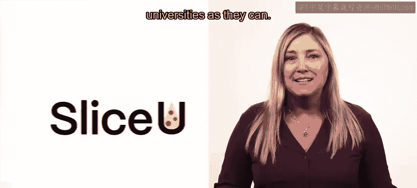
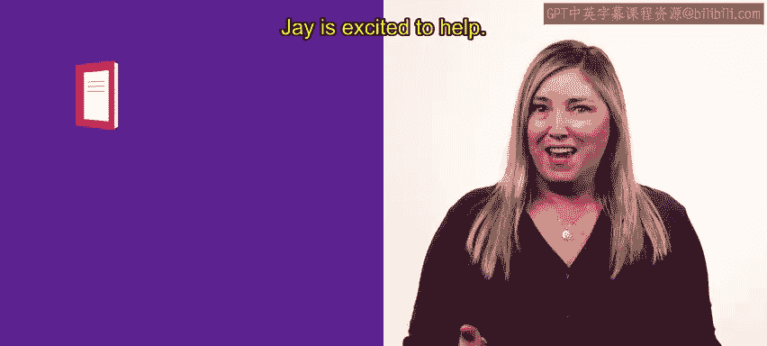
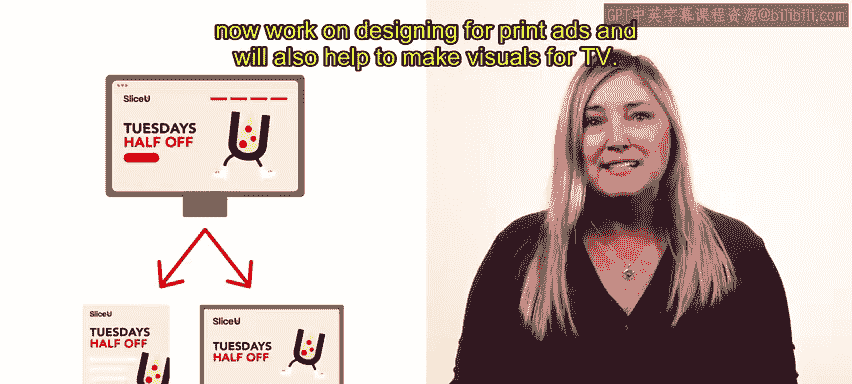
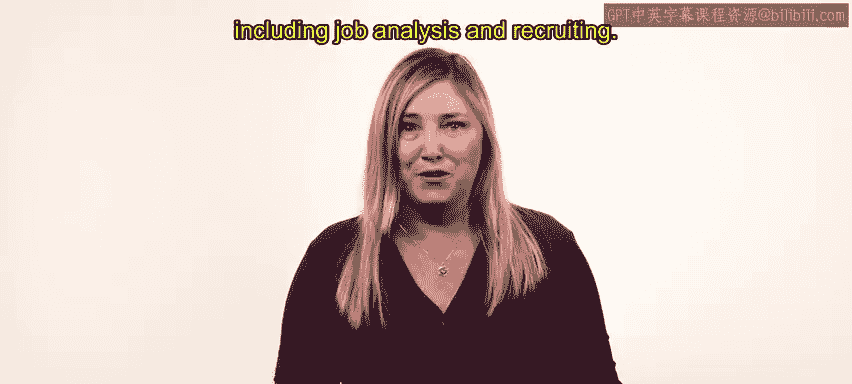

# HRCI人力资源助理课程：P16：示例：工作设计 🍕

在本节课中，我们将通过一个虚构组织的实例，来具体探讨如何设计与再设计工作岗位。我们将跟随人力资源专家杰伊，看他如何帮助一位平面设计师迪伦重新规划其工作角色，以实现个人动机与岗位职责的更好匹配。

上一节我们介绍了工作设计的基本概念，本节中我们来看看一个具体的应用案例。

---

## 案例背景：SliceU披萨连锁店

我们以“SliceU”披萨连锁店为例。这是一家制作美味且价格合理的披萨的餐厅连锁品牌。SliceU的目标客户是大学生群体，因此其战略是在尽可能多的大学附近开设分店。

杰伊是SliceU总部的一名人力资源专员。近期，平面设计团队的经理向杰伊提及，其团队成员迪伦可能希望重新设计自己的岗位角色。

---

## 人力资源的介入：动机与岗位的对齐

杰伊很乐意提供帮助。确保员工的个人动机与其工作岗位相一致，是杰伊职责的重要组成部分。为此，杰伊与迪伦安排了一次会议。

---

## 员工诉求：寻求更多责任

迪伦在SliceU担任初级平面设计师已约18个月。他非常喜欢目前的工作，但希望承担更多责任。在会议中，杰伊和迪伦探讨了**工作扩大化**的可能性。

迪伦已准备好为团队做更多贡献，并希望确保自己不会因重复性的平面设计任务而感到厌倦。扩大其工作角色似乎是一个很好的选择，迪伦的经理也对此表示支持。

SliceU经常开展许多小型在线促销活动，这些活动需要相对简单的平面设计任务，这构成了迪伦日常工作的主要内容。

---

## 解决方案：实施水平工作扩大化

杰伊和迪伦确定，**水平工作扩大化**（即增加同层级、不同性质的任务）可能会让这个岗位更有成就感。

除了迪伦原有的平面设计任务外，他的新职责将包括：
*   设计平面广告。
*   协助制作电视广告的视觉内容。

---

## 配套措施：确保合法合规

随着岗位说明书中的任务和职责发生变化，迪伦的薪酬也将相应调整。为确保一切合法、恰当且有据可查，杰伊核查了此次岗位再设计是否符合《公平劳动标准法》和《同工同酬法》的规定。

所有法律检查均通过。各方对此结果都感到满意，这看起来是一次非常成功的岗位再设计。

---

## 总结与展望

对齐动机与岗位职责有助于提升所有相关人员的生产力。杰伊在此次再设计过程中采取了非常人性化的激励方法，并将迪伦置于流程的中心。预计迪伦将在其重新设计的岗位中获得更高的成就感、快乐感和工作动力。

在本节课中，我们一起学习了如何通过一个具体案例来应用工作再设计的原则，特别是工作扩大化。接下来，你将更深入地探讨人才获取流程，包括工作分析和招聘。