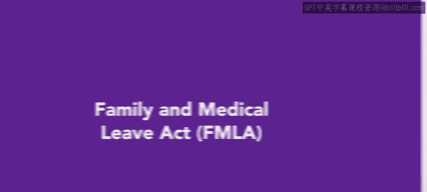
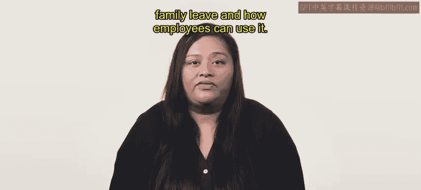
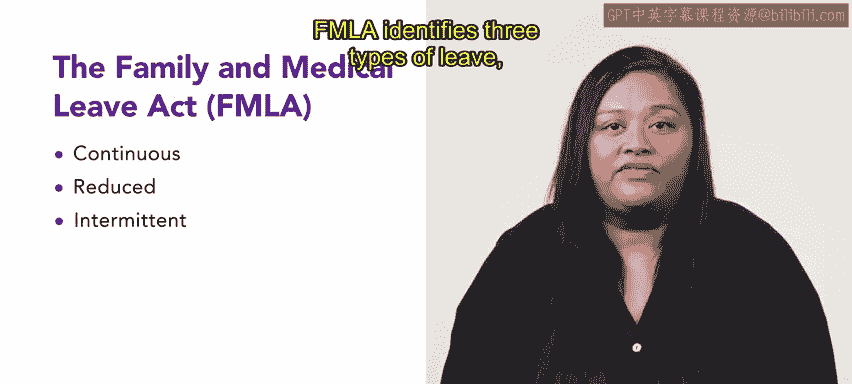
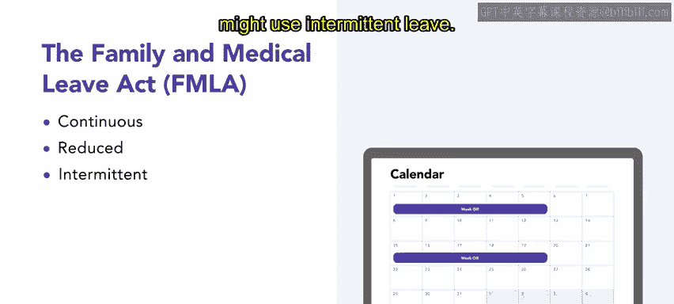
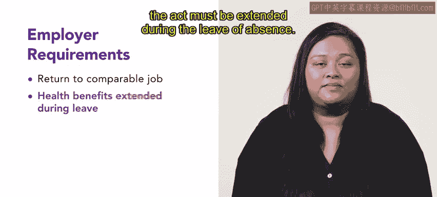
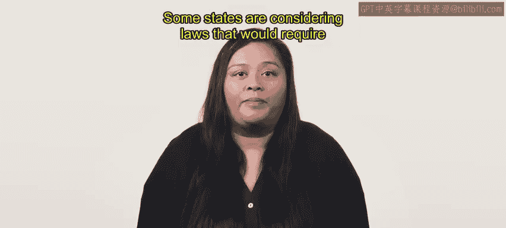

# HRCI《人力资源助理》课程：第51课：家庭和医疗休假法（FMLA）🏠💼

在本节课中，我们将要学习《家庭和医疗休假法》（FMLA）。这是一项重要的美国联邦法律，它为符合条件的员工提供了在特定家庭或医疗情况下享受无薪休假的权利。我们将了解FMLA的起源、休假类型、适用条件以及雇主和员工各自的责任。

---

## 法律概述与背景

《家庭和医疗休假法》于1993年成为法律。它规定雇主必须在员工迎接新生儿、照顾家庭成员或接受医疗护理等情况下，提供最长12周的无薪休假。这种无薪休假通常被称为家庭假。

---

## FMLA的三种休假类型

上一节我们介绍了FMLA的基本概念，本节中我们来看看FMLA具体定义的三种主要休假类型。理解这些类型对于正确管理和申请休假至关重要。

以下是FMLA规定的三种休假类型：

*   **连续休假**：指员工因故长时间离开工作岗位，通常从连续缺勤三天后开始计算。例如，**产假/陪产假**就是连续休假的一个典型例子。
*   **缩减工时休假**：指员工在特定时期内减少其通常的工作时间表。这可以是每天工作小时数的减少，也可以是每周工作天数的减少。例如，一位**正在从疾病中恢复、尚无法全职工作**的员工可能会使用缩减工时休假。
*   **间歇性休假**：指员工因单一疾病或伤害而多次、非连续地离开工作岗位。为了适应员工的需求，公司可能会将其安排到一个具有同等薪酬和福利的替代岗位上。例如，一位**需要接受长期治疗（如化疗）** 的员工可能会使用间歇性休假。

---

## 员工权利与雇主义务

了解了休假的类型后，我们来看看FMLA为员工提供了哪些核心权利，以及雇主需要承担哪些相应的义务。

FMLA要求雇主保证，因我们讨论过的合格条件而休假的员工，在返回时将能够复职到**相同或类似的岗位**。

此外，根据该法案享有健康福利的员工，在休假期间其**健康福利必须得以延续**。

---

## 适用条件与重要规定

明确了权利和义务后，本节我们将深入探讨FMLA的具体适用条件、计算方式以及一些重要的特殊规定。

FMLA**不要求**为以下员工提供无薪休假：
*   工作未满一年的员工。
*   每周工作时间少于25小时，或在过去12个月内工作时长少于**1250小时**的员工。
*   属于公司**薪酬最高的前10%** 的员工。

同时，一年中至少有20周雇员人数**少于50人**的雇主可豁免遵守FMLA。

在判定员工是否有权享受家庭假时，**只应计算员工实际工作的小时数**。因此，带薪休假时间、无薪休假和带薪假期不计入员工获得家庭假资格所需的最低工作时长。

此外，雇主有时需要在员工休假返回后支付奖金。特别是，如果**该员工在休家庭假期间，所有其他员工都获得了奖金**，那么雇主就必须向该员工支付这笔奖金。

雇主可能要求员工在开始无薪休假前先用完所有带薪假期，并且在实际可行的情况下，可以要求员工提前**30天**通知。一些州正在考虑立法，要求在类似情况下提供**带薪**家庭假。

此类法案和福利对于满足员工家庭需求的重要性难以夸大。作为参考，估计数据显示**80%** 的女性劳动力会在其工作生涯中怀孕。在许多家庭中，成年人都需要工作，且有许多单亲在职父母。此外，婴儿潮一代的老龄化使得55岁以上的工作者越来越多。

---

## 课程总结

本节课中，我们一起学习了《家庭和医疗休假法》（FMLA）。我们了解了这项法律旨在为员工在关键的家庭和医疗时刻提供工作保障和无薪休假。我们详细探讨了三种休假类型（连续、缩减工时、间歇性），明确了员工的复职权和福利延续权，并分析了法律的适用条件与重要例外规定。FMLA是员工福利的重要组成部分，因为它为帮助实现更公平的工作环境提供了指导准则。

接下来，你将学习关于儿童保育福利等更多内容。