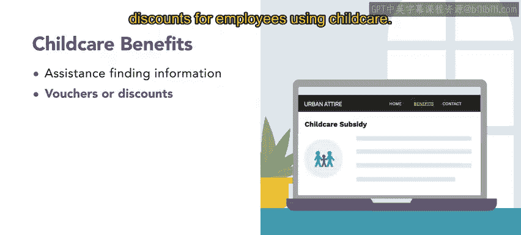
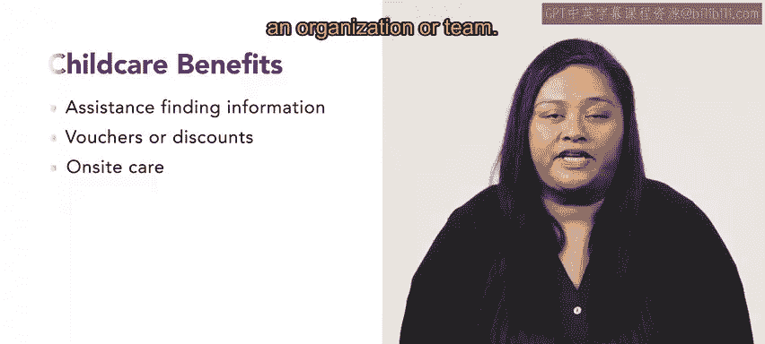

# HRCI人力资源助理课程：第52课：儿童保育福利 👶

在本节课中，我们将学习雇主可能提供的各类儿童保育福利。这些福利正变得越来越普遍，对于帮助员工平衡工作与家庭生活至关重要。

雇主提供多种潜在的儿童保育福利，这些福利正日益受到欢迎。

## 信息援助服务

上一节我们介绍了儿童保育福利的概况，本节中我们首先来看看最常见的一种形式：信息援助服务。这是最简单的一种儿童保育福利。

这种福利是指协助员工寻找关于现有儿童保育服务的成本和质量信息。大约36%的雇主提供此类帮助。

以下是信息援助服务的一个例子：
*   艾弗里和她的伴侣计划在不久的将来收养一个孩子。
*   艾弗里向人力资源部门的娜瑞咨询相关资源。
*   娜瑞指引她查阅员工福利在线数据库，其中包含关于儿童保育的板块。
*   娜瑞提到，数据库中有链接和文档提供他们所在城市的儿童保育信息。

## 经济补贴与现场保育

了解了信息援助后，我们来看看更具实质性的支持方式：经济补贴和现场保育服务。

艾弗里发现，公司为他们提供了另一项资源：一项针对在公司工作满一定年限员工的补贴。

大约5%的组织（如案例中的公司）会为使用儿童保育服务的员工提供代金券或折扣。

此外，大约9%的组织会在工作场所提供儿童保育服务。然而，为雇主提供现场保育会带来责任问题和高昂成本，这也是案例公司不提供现场保育的原因。目前尚不清楚提供现场保育是否能显著影响员工绩效或出勤率。尽管如此，如果组织或团队能够承担，这仍然是一项非常有吸引力的福利。

## 课程总结

本节课中我们一起学习了向员工提供儿童保育福利的各种方式。如果条件允许，组织提供此类福利是一个好主意。

在下一课中，你将学习弹性支出账户。