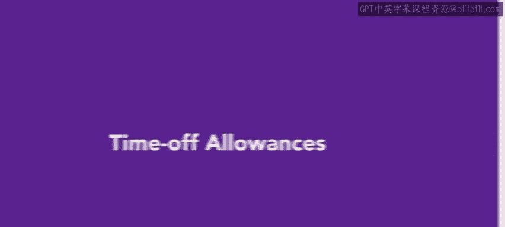
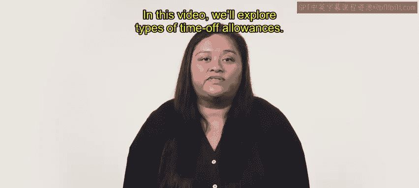
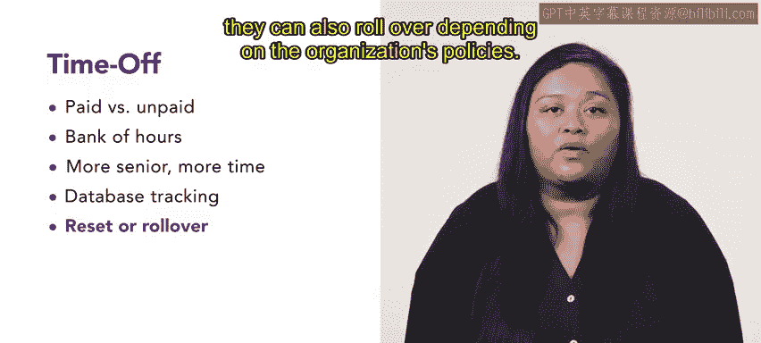

# HRCI人力资源助理课程：第54课：休假津贴 🏖️

在本节课中，我们将学习休假津贴这一员工福利。休假津贴是帮助员工实现工作与生活平衡的重要工具。我们将探讨其类型、运作方式以及不同组织可能提供的各种休假政策。

---

你已经学习了各种以家庭为导向的福利。虽然休假津贴不一定专门针对家庭，但它作为一种福利，能有效帮助员工获得他们期望和需要的工作与生活平衡。

本节中，我们将探讨休假津贴的类型。

---

休假主要分为两种：**带薪休假**和**无薪休假**。休假属于哪一类别，取决于多种因素，例如请假原因、请假时长、员工累积的带薪休假时长以及其他公司规定。

休假通常来源于一个“时间银行”，员工可以因不同原因使用其中的时间，例如生病、度假或个人事务。这个时间银行的额度通常会根据员工的职位及其在组织内的工作年限而变化。

一般来说，员工为组织工作的时间越长，被分配的休假时间就越多。

追踪已使用的休假时间通常很直接，通过数字数据库即可完成。休假时间银行通常每年重置一次，但根据组织政策，也可能允许部分时间结转至下一年。

---

一些组织提供**无限带薪休假**，其政策核心是“只要完成工作”。这意味着，在合理范围内并基于团队需求，员工可以根据需要随时休假。

---

雇主可以提供多种类型和组合的休假津贴，即使在同一组织内部也可能不同。这取决于公司的具体需求和其能够承担的成本。

接下来，你将探索志愿者服务假等更多内容。

---

在本节课中，我们一起学习了休假津贴的基本概念。我们了解到休假主要分为带薪和无薪两类，其额度常通过“时间银行”来管理，并可能随资历增长。此外，一些公司还提供了更灵活的无限休假政策。理解这些不同类型的休假安排，对于管理员工福利和促进工作生活平衡至关重要。