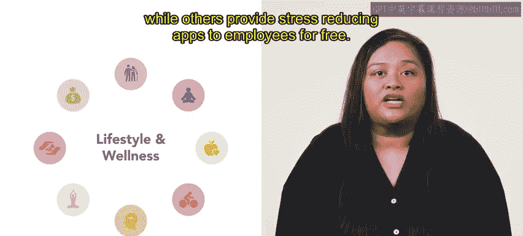
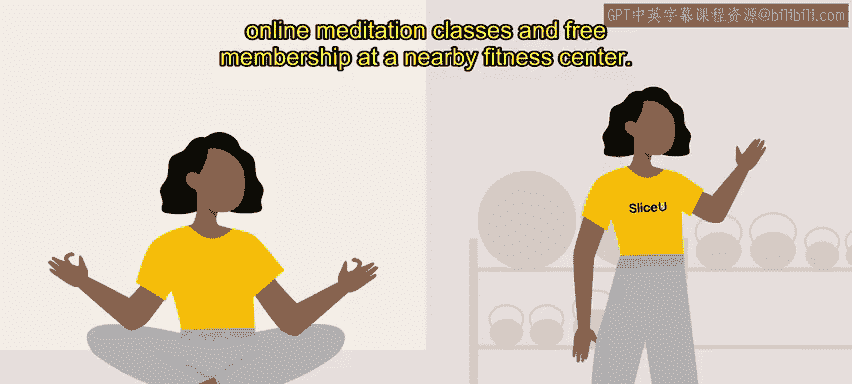

**HRCI人力资源助理课程：第3课：定制您的福利策略** 🎯

在本节课中，我们将学习如何根据组织的员工队伍特点，定制专属的福利策略。一个精心设计的福利方案不仅能吸引顶尖人才，还能有效保留现有员工。

---

### **概述：为何需要定制福利策略？**

组织需要根据其员工队伍的特点来定制福利计划。最终，一个组织的福利策略应达成以下目标：提供的福利需具备竞争力，以吸引和留住最优秀的人才。

---

### **福利策略的核心目标**

福利策略的核心目标可以用一个简单的公式概括：

**有竞争力的福利 = 吸引人才 + 留住人才**

---

### **定制福利包的无限可能**

创建福利包的方式多种多样。以下是设计福利方案时可以考虑的一些元素：

*   **家庭与教育支持**：例如提供现场托儿服务或学费报销。
*   **日常便利与灵活性**：例如提供免费零食、饮料或灵活的工作安排。

无论组织选择哪些元素，都应在适用于整个组织或特定团队的预算范围内进行。

---

### **福利定制实例解析**

上一节我们介绍了福利的多样性，本节中我们来看看具体的实例。让我们以“SliceliceU”公司为例进行分析。

**1. 通勤费用福利**
通勤费用是员工往返工作地点所产生的成本，包括交通票、汽车费用和自行车通勤成本。
在SliceliceU公司，员工享有一项名为“通勤费用报销账户”的福利，允许员工以税前方式扣除通勤和停车费用。这对SliceliceU的员工很有帮助，因为他们中许多人是附近大学的学生，需要从城市的不同区域通勤。

其他雇主也可能提供以下交通福利：
*   为拼车者提供预付加油卡以降低成本。
*   免费交通卡。
*   报销与自行车相关的购买费用。
*   支付交通站点停车费。

**2. 生活方式与健康福利**
组织还可以考虑提供付费访问在线资源的福利，以支持生活方式和健康，例如帮助个人寻找儿童和老人护理服务的资源。
一些组织提供或推广冥想和瑜伽课程，而另一些则为员工免费提供减压应用程序。

健康计划可以进一步扩展，包含以下策略：
*   减压策略。
*   实现更好的工作与生活平衡。
*   促进健康饮食习惯。
*   促进财务健康。

例如，SliceliceU为其员工提供的健康计划包括：访问在线冥想课程以及附近健身中心的免费会员资格。

---

### **总结**

本节课中，我们一起学习了如何定制福利策略。将组织的福利策略根据其员工队伍甚至特定部门进行量身定制，可以吸引新人才并有助于留住现有员工。在接下来的福利课程中，您将学习组织可能提供的退休计划。