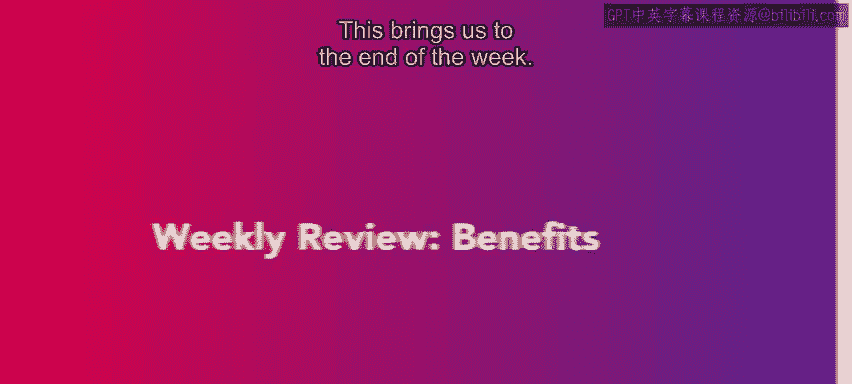
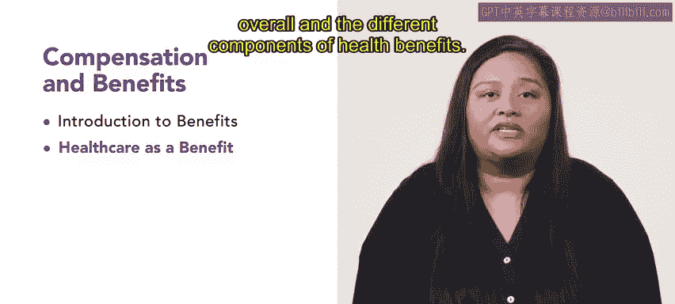
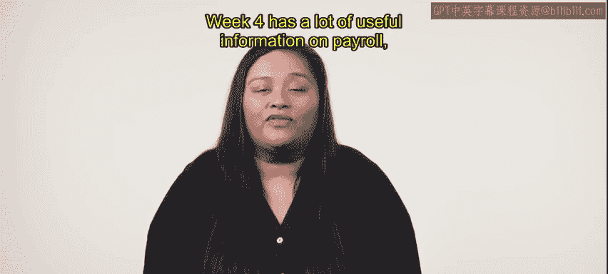

# HRCI《人力资源助理（招聘、学习发展、薪酬福利，1-3课／共5课）｜HRCI Human Resource Associate》 - P187：65_每周回顾：福利.zh_en - GPT中英字幕课程资源 - BV1qi421r7ba

This brings us to the end of the week。 Congratulations on completing the third week of this course。

 You have learned quite a lot about benefits and their contribution to a company's compensation and retention of their employees。

 understanding the impact of benefits on not only employees。

 but organizations as a whole is an important concept for HR professionals In the first lesson。

 you are introduced to benefits as a whole。 This introduction provided you with the knowledge of benefit costs and the purpose behind providing benefits。

😊。

In the second lesson， you learned about health care as a benefit。

 You were able to gather information on health care plans overall and the different components of health benefits。

 In the third lesson， you learned about another type of benefit， family oriented benefits。

 These family oriented benefits included child carere， flexible spending。

 time off allowances and how to customize benefits to meet an employee's needs and interests。

 Finally， in the last lesson， you learned about retirement plans。 As you went through the lesson。

 you were made aware of the different types of retirement plans。

 as well as the acts put in place to protect a person's retirement。😊。

This brings us to the end of this week Next week， you will continue to build off the knowledge you have gained by learning about payroll and benefit technology and design。

 Week four has a lot of useful information on payroll claims， data storage and more on to week4。😊。

