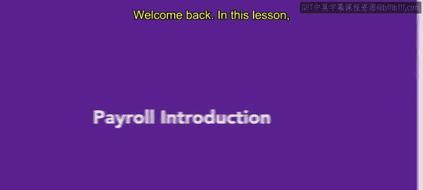

# HRCI《人力资源助理（招聘、学习发展、薪酬福利，1-3课／共5课）｜HRCI Human Resource Associate》 - P189：67_薪资介绍.zh_en - GPT中英字幕课程资源 - BV1qi421r7ba

Welcome back In this lesson， we will introduce payroll。

 Payroll responsibilities can vary across organizations In some organizations。

 Payroll tasks are completed by the HR Department At other organizations。

 payroll tasks are fulfilled by the finance or accounting department。

 sometimes compensation and payroll related tasks are outsourced。 If the tasks are outsourced。

 It is the HR's department's responsibility to select and monitor the vendor。 In addition。

 the Fair Labor standards Act requires that payroll information for nonexemp employees be recorded in an organization's records。

 This record keeping is likely an HR task。Payroll involves calculating pay。

 but also includes managing deductions。 Some deductions are mandatory， such as Social Security。

 Medicare and state and federal income taxes。 These expenses are withheld from employee paychecks and periodically submitted to the IRS or other relevant government agency The amounts withheld and submitted on the employee' behalf are reported on W2 forms at the end of each year。

There are other deductions that occur less frequently， such as court orders or tax levies。

 For these deductions， Ws are withheld or garnished from employees pay in order to settle their debts。

 Employees who have their wages garnished are protected by the Consumer Credit Protection Act。

 or CCPA。The CCPA prohibits employers from terminating employees whose wages are garnished for a single debt and limits the amount that can be withheld during a pay period。

In addition to mandatory deductions， employers may withhold additional voluntary deductions。

 voluntary deductions correspond to optional benefits such as 401K contributions。

 health insurance related expenses and union dues。

To summarize， payroll includes calculating pay and managing deductions from an employee's paycheck The responsibility for these tasks may vary across organizations。

 but HR is most likely a key player In the next lesson， you will learn about payroll schedules。

