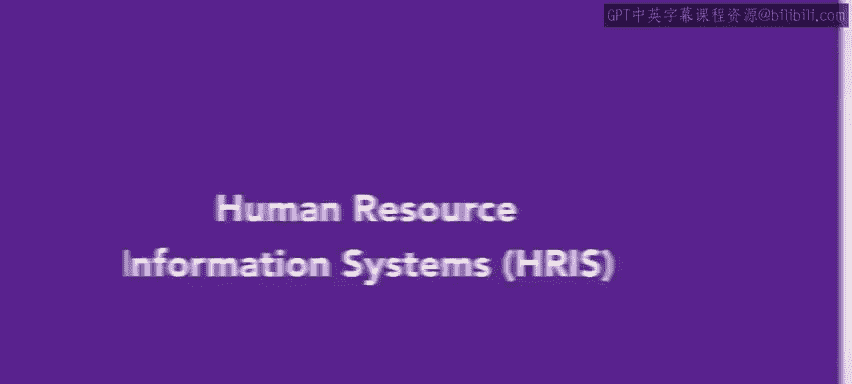

# HRCI《人力资源助理（招聘、学习发展、薪酬福利，1-3课／共5课）｜HRCI Human Resource Associate》 - P192：70_人力资源信息系统（HRIS）.zh_en - GPT中英字幕课程资源 - BV1qi421r7ba

Welcome back in the previous lessons you learned about the various aspects of payroll today we are going to explore human resource information systems。

 also known as an HRIS let's get started。😊。

Human resource information systems organize the information required to calculate and keep track of payroll related issues。

 NH can be an effective way to maintain payroll information in a readily available format。

Generic HRIS software meets the needs of many organizations。

 organizations with specific needs may choose to alter or design their own software， however。

When implementing an HRIS， it is also important to think carefully about what information to store。

 how to record it， and who will have access。

To review， human resource information systems are used by organizations to calculate and keep track of payroll related issues later you will learn about selecting the proper HRIS for your organization。

😊。

