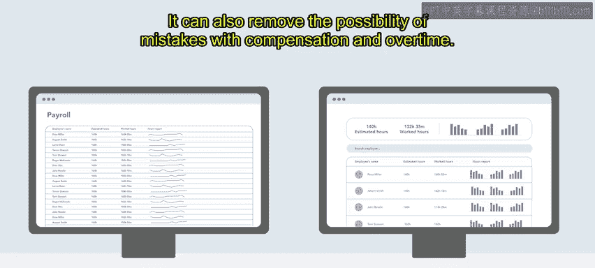
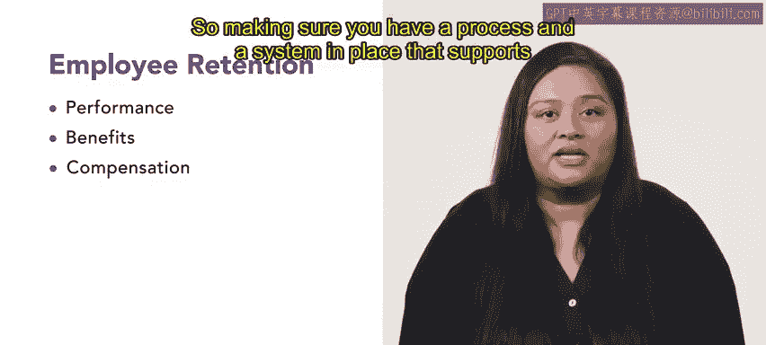
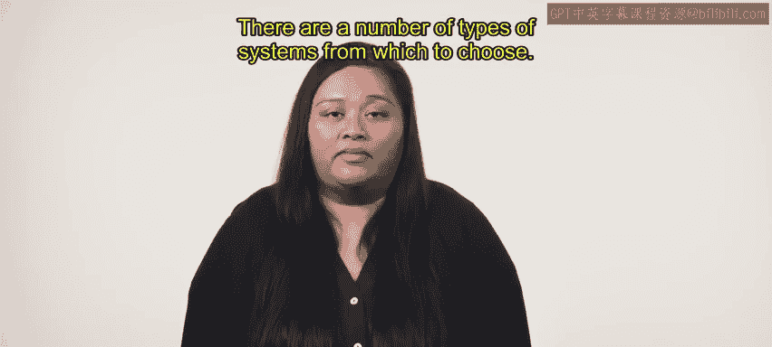
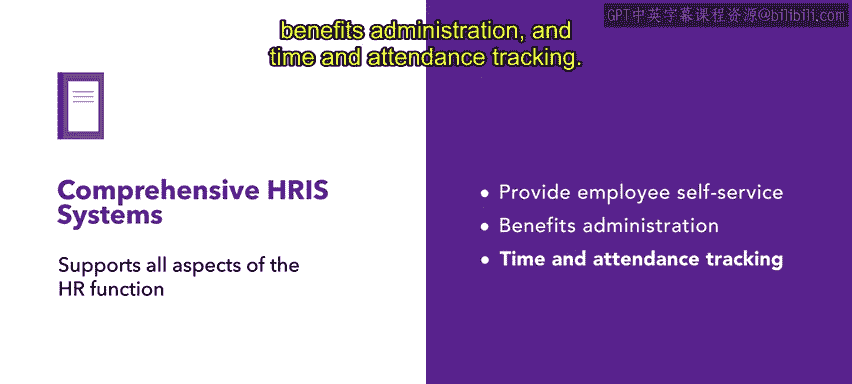

# HRCI人力资源助理课程：P193：选择HRIS 🧑‍💻

在本节课中，我们将学习如何为组织选择合适的人力资源信息系统。我们将探讨HRIS的核心功能、选择时需要考虑的关键因素，以及不同类型的HRIS系统。

---

上一节我们介绍了人力资源信息系统的基本概念。本节中，我们来看看在选择HRIS时需要考虑哪些因素。

HRIS可以广义地描述为支持人力资源职能的技术。它可以包含多种功能，例如跟踪休假与考勤、福利管理、绩效管理、个人信息管理，以及追踪和分析薪资与工时表。

薪资处理涉及大量信息的收集与整合。HRIS是有效管理和组织这些信息，使其易于获取的有效方式。它还能减少薪酬和加班费计算中出错的可能性。

HRIS也是确保遵守法律法规、管理绩效评估以及处理员工福利（如开放注册或报销申请）的有用工具。这些系统通常不可定制，因此仔细思考你的组织能利用哪种HRIS至关重要。绩效、福利和薪酬是影响员工留任的主要因素，因此确保你拥有支持HR流程的系统和程序，将对你的组织非常有利。

另一个需要谨慎选择HRIS的原因是**安全性**。人力资源信息通常很敏感，因此必须受到保护。无论采用何种系统来管理它，该系统都必须是安全的。专业的系统安全涉及引入安全措施来保护物理记录和电子记录。在实施HRIS时，负责人必须仔细考虑存储哪些信息、如何记录信息以及谁有权访问这些信息。

---

为了选择HRIS，你需要确定组织的需求，然后找出能满足该需求的HRIS。有多种类型的系统可供选择。

以下是主要的HRIS类型：

*   **运营型HRIS**：支持人力资源部门的日常运营，例如跟踪员工数据、管理员工档案和处理薪资。
*   **战术型HRIS**：支持特定的人力资源职能。这些系统有助于招聘、绩效管理以及培训与发展。
*   **战略型HRIS**：支持组织的高层规划需求。这些系统有助于面向未来的任务，如劳动力规划、继任规划和人才管理。
*   **综合型HRIS**：支持人力资源需求的各个方面。这类系统可能支持所有其他功能，同时还能提供员工自助服务、福利管理以及时间和考勤跟踪。

---

为你的组织选择正确的HRIS，对于最大化你能实现的成果至关重要。接下来，你将学习如何做出最能促成你成功的选择。

---

本节课中，我们一起学习了选择人力资源信息系统时需要考虑的关键因素。我们了解到HRIS在管理薪资、确保合规、保障信息安全方面的重要性，并认识了运营型、战术型、战略型和综合型等不同类型的HRIS系统。明确组织需求是选择合适系统的第一步。