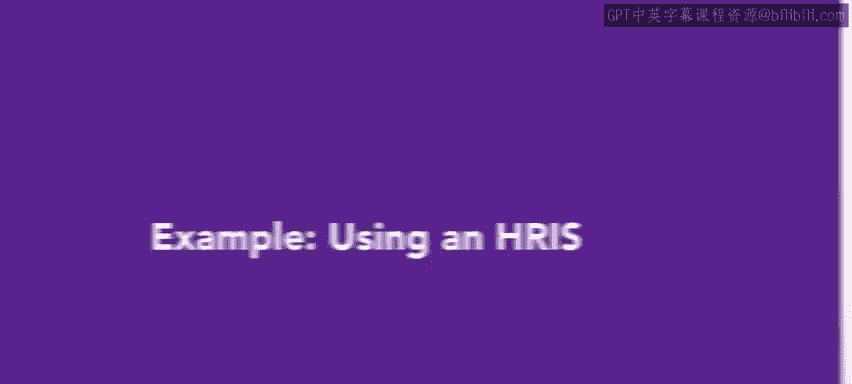
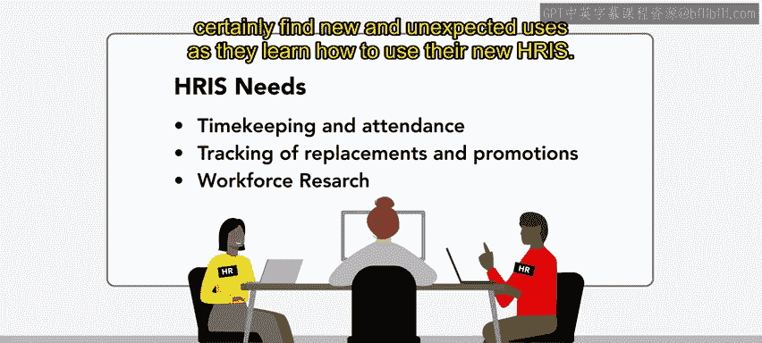
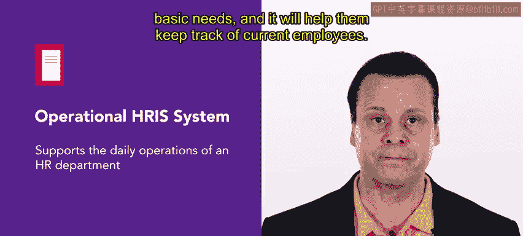

# HRCI《人力资源助理（招聘、学习发展、薪酬福利，1-3课／共5课）｜HRCI Human Resource Associate》 - P194：72_示例：使用HRIS.zh_en - GPT中英字幕课程资源 - BV1qi421r7ba

In this lesson， you've learned about human resource information systems。 Now。

 we'll examine a real world example of how an organization might decide on and use an HRIS S。

For this example， we'll use slicelice U。

Slice you is a chain of pizza restaurants。 They make delicious， reasonably priced pizzas。

 Slic you is focusing on the college demographic。😊。

They want to open up a location near as many colleges and universities as they can。

Jay is an HR specialist working at SliceU HQ。 SliceU uses a few different digital tools for their HR needs。

J has been tasked with finding the one digital tool that the HR team can use to centralize the data that they have。

Before searching for an HRS tool， J works with the rest of the HR team to determine what functions are going to be most important。

Slice you as many non exempt hourly workers， so everyone agrees that timekeeping and attendance are important HRRS features。

Keeping track of replacements and promotions is another HR task that hasn't been very well organized。

 at least not previously。Finally， workforce research is something that the team hasn't been able to easily do。

 so that is also an important feature and consideration。

Ja knows that most HRIS tools do many other things as well。

 and they will certainly find new and unexpected uses as they learn how to use their new HRIS。

With these needs in mind， Jay begins researching an operational HR。

An operational HRRS supports the daily operations of an HRTA department like tracking employer data。

 managing employee records， and processing payroll。As this is slicelicU's first HRRS。

 this seems like it will cover most of their basic needs。

 and it will help them keep track of current employees。

J reaches out to five software providers to start the request for proposal， the RFP。

Three of the providers submit RF P in response。 Jay reviews each RFP and finds that two offers offer and address slices used。

 current needs and different price points。Ultimately。

 Jde chooses the provider with the higher price point because they offered a higher level of SLA service level agreement。

 which would be helpful since this is slicelic used first HRIS。

They move forward with a year long contract and set up some training sessions for the HR team。

Researching and using an HRS can be time consuming， at least at the outset。

But it will certainly save time in the future。The most important aspect of finding and implementing an HR S is how it meets your organization's needs。

 An HR S that doesn't get used or is too hard to use is definitely not worth the investment。

Coming up， you'll find out more about data storage and claims processing。

