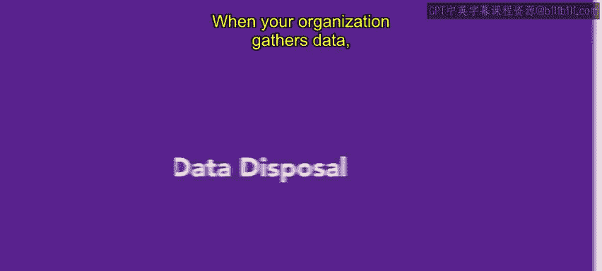
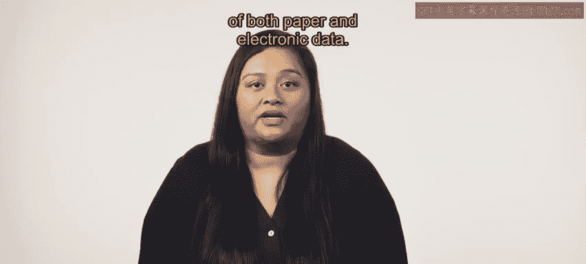
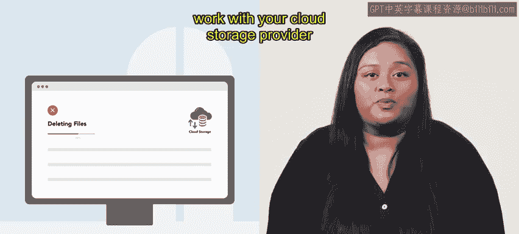

# HRCI人力资源助理课程：第74课：数据处理

在本节课中，我们将学习组织在收集数据后，如何安全地处理敏感信息，包括纸质和电子数据的销毁方法，以及为何这至关重要。

当组织收集数据时，不可避免地会包含敏感信息。因此，采取措施以最小化数据泄露的风险非常重要。每个组织都应制定清晰明确的指南，用于妥善处理纸质和电子数据。

上一节我们提到了制定数据处理指南的必要性，本节中我们来看看具体的数据销毁方法。

妥善处理数据并不像看起来那么简单。以下是针对不同类型数据的处理方式：

*   **纸质记录**：需要被粉碎或焚烧。如果组织自身无法处理纸质数据，可以聘请许多经批准的机构代为处置。
*   **数字记录（硬盘）**：硬盘应被彻底擦除。美国国防部推荐一种名为 **DoD 5220.22-M** 的特定协议来处理数字记录。这种数据销毁方法之所以可靠，是因为它不仅会擦除内容，还会用随机数据覆盖任何现有信息。有许多免费的软件程序可用于执行 **5220.22-M** 擦除。
*   **云存储**：处理起来更为复杂。组织需要与云存储服务提供商合作，确认数据在标准删除选项之外已被彻底销毁。

数据销毁是数据管理过程中最重要的环节之一，因为如果操作不当，这里是最容易发生泄露的地方。如果组织制定并遵循一个计划，就可以避免大多数问题。

本节课中，我们一起学习了保护敏感数据的关键一步——安全的数据销毁流程。我们了解了针对纸质文件、硬盘和云存储的不同处理方法，并认识了 **DoD 5220.22-M** 这一可靠的数字数据擦除标准。接下来，你将学习如果确实发生了数据泄露，应如何处理。