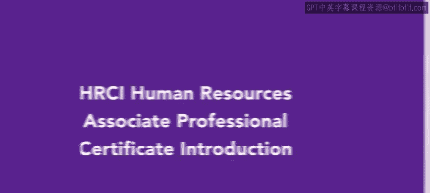

# HRCI人力资源助理专业证书课程：P1：课程介绍 🎯

在本节课中，我们将要学习HRCI人力资源助理专业证书项目的整体结构与核心内容。该课程旨在为学员提供成为人力资源助理所需的专业技能，并帮助学员准备APHR认证考试。

欢迎参加HRCI人力资源助理专业证书项目。您选择了迈向人力资源职业的道路，这令人振奋。本项目将重点培养您成为人力资源助理所需的实用技能。从事人力资源职业将使您能够引导他人完成其职业发展路径，并帮助您的组织凭借强大的员工团队蓬勃发展。

本项目也将帮助您准备参加HRCI人力资源助理专业认证考试，即APHR认证考试。

## 第一课：人才获取 👥

上一节我们介绍了课程的整体目标，本节中我们来看看第一门核心课程。第一门课程名为“人才获取”，专注于人才获取流程的各个方面。

以下是您将在本课程中学到的核心技能：
*   学习预测劳动力需求。
*   学习寻找和招募有才华的候选人。
*   学习如何聘用新员工并使其入职。

## 第二课：学习与发展 📚

了解了人才获取后，我们进入第二门课程。第二门课程是“学习与发展”。本课程将概述在组织中创建有效培训的最佳实践。

以下是本课程的主要内容：
*   学习识别培训需求的不同方法。
*   学习实施培训的不同方法。
*   学习如何评估培训计划的有效性。

## 第三课：薪酬与福利 💰

在掌握了学习与发展后，我们来看看员工激励的另一关键部分。第三门课程是“薪酬与福利”。您将研究雇佣关系中的整体薪酬方案的复杂性。

以下是本课程的核心内容：
*   涉及构建薪酬策略。
*   涉及评估市场中的福利趋势。
*   学习不同的福利选项。
*   学习如何评估不同的薪酬体系和人力资源技术。

## 第四课：员工关系导论 🤝

薪酬福利是吸引人才的基础，而良好的员工关系则是留住人才的关键。第四门课程是“员工关系导论”。

以下是本课程的重点：
*   讨论如何创建和管理组织政策与程序。
*   评估管理层与员工之间的价值观和态度。
*   学习适用于各级员工的绩效管理方法。

## 第五课：合规与风险管理导论 ⚖️

最后，我们来到最后一门课程。最后一门课程“合规与风险管理导论”通过审视风险评估和如何培养风险管理思维，来介绍风险管理和合规策略。

以下是您将学习的内容：
*   学习不同类型的合规要求，包括法律合规和安全合规。
*   学习合规在运营政策中的作用。
*   课程最后将探讨人力资源在组织重组中的角色。

本节课中我们一起学习了HRCI人力资源助理专业证书五门核心课程（人才获取、学习发展、薪酬福利、员工关系、合规与风险）的概要。课程内容非常丰富，让我们现在就开始学习吧。