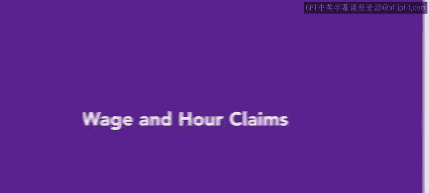
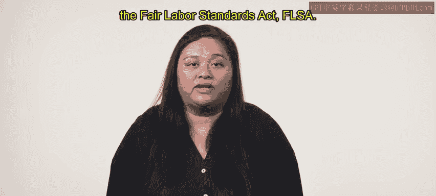
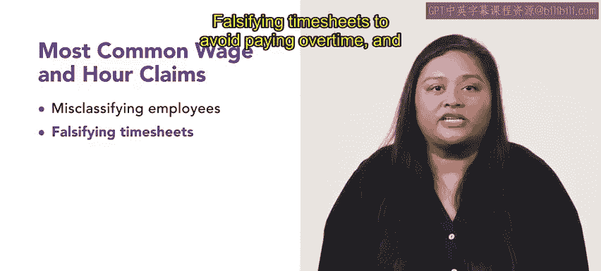
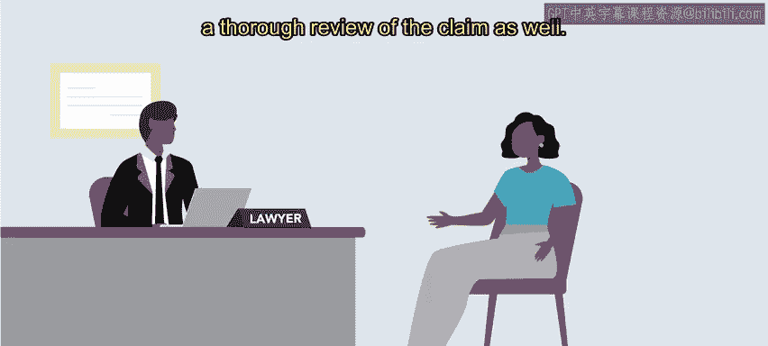
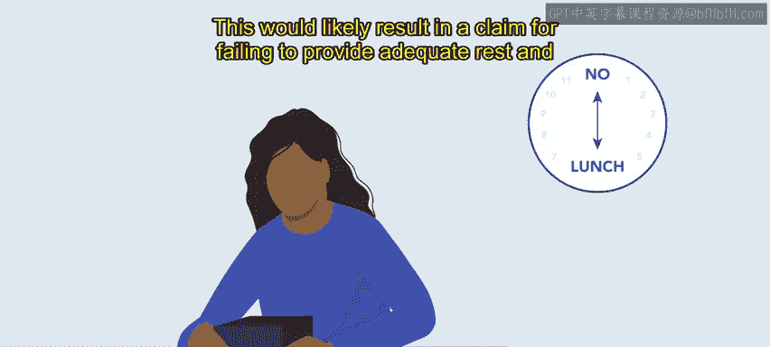
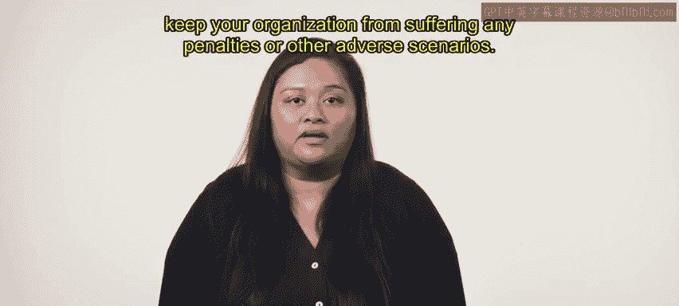

# HRCI人力资源助理课程：P200：工资与工时索赔指南 💼

在本节课中，我们将学习工资与工时索赔的相关知识。这是人力资源领域最常见的索赔类型之一，通常与违反《公平劳动标准法案》（FLSA）有关。我们将了解这类索赔的具体内容、处理流程以及如何有效预防。

## 什么是工资与工时索赔？⚖️

工资与工时索赔是人力资源部门最常见的索赔类型之一。这类索赔通常与违反《公平劳动标准法案》（FLSA）有关。

本节视频将涵盖这些索赔的定义及其处理流程。虽然索赔形式多样，但最常见的三种子类型源于以下情况：

以下是三种最常见的工资与工时索赔子类型：
*   错误地将独立承包商或豁免/非豁免员工分类。
*   伪造工时记录以避免支付加班费。
*   未能提供足够的休息和用餐时间。

## 如何预防工资与工时索赔？🛡️

上一节我们介绍了工资与工时索赔的主要类型，本节中我们来看看如何预防这些索赔的发生。

遵循联邦、州和地方当局关于正确分类承包商或员工类型的指导方针，始终是避免错误分类索赔的关键。使用具备薪酬和考勤模块的人力资源信息系统（HRIS），将使您的组织能够轻松地按照法规管理加班和休息时间。

如果您拥有分布式劳动力，确保核实适用于该员工所在地的具体规则尤为重要。例如，加利福尼亚州对于休息和午餐时间的长度和次数要求，比其他州更为严格。

## 处理索赔的注意事项与后果 ⚠️

如果工资与工时索赔被诉诸法庭，可能会造成高昂代价，尤其是当它们演变成集体诉讼时。由于潜在的法律纠纷，许多保险公司不承保工资与工时索赔。因此，理解员工权利和劳动法对于避免此类索赔的提出至关重要。

如果提出索赔，人力资源部门的责任是尽可能准确和具有代表性，以避免额外的处罚。人力资源部门应通过进行工作分析和理解相关立法来展开调查，以审查员工的索赔。

强烈建议人力资源部门咨询法律顾问，以便对索赔进行彻底审查。

## 实例分析：玛尔塔的案例 🏭

让我们通过一个例子来具体理解。假设一位名叫玛尔塔的员工在工厂组装医疗设备。由于一笔大订单，她和她的同事在特定时间段内不被允许用餐休息，以最大化生产。

这种情况很可能导致一项“未能提供足够休息和用餐时间”的索赔。

## 总结与过渡 📝

本节课中，我们一起学习了工资与工时索赔的核心概念、常见类型、预防措施以及处理时的注意事项。记住，在处理任何类型的索赔时，保持彻底和诚实的态度对于保护组织免受处罚或其他不利情况至关重要。

接下来，你将学习有关残疾索赔的知识以及如何处理它们。