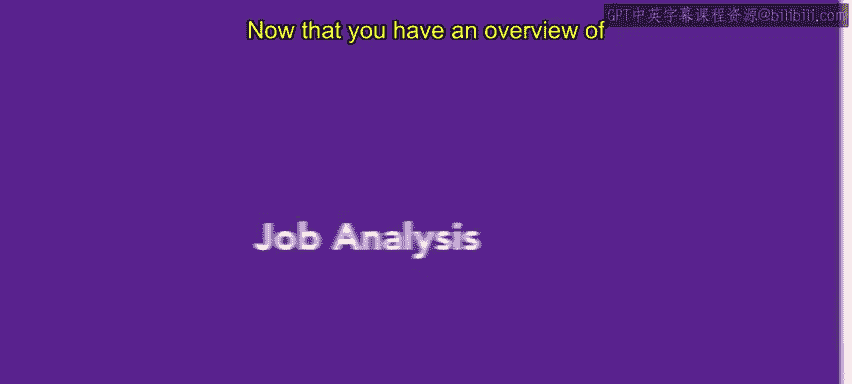
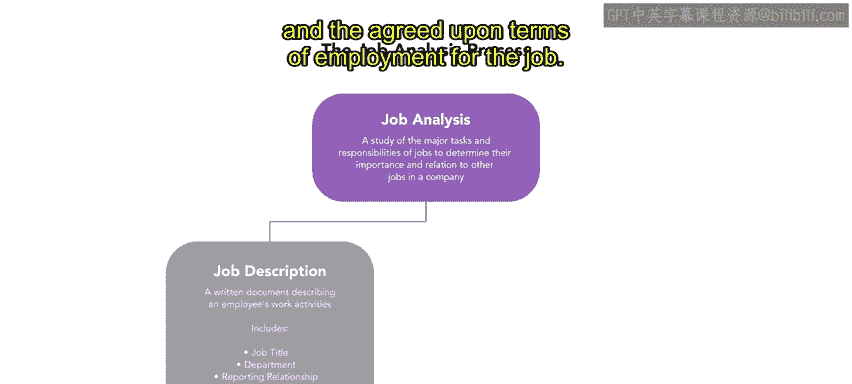
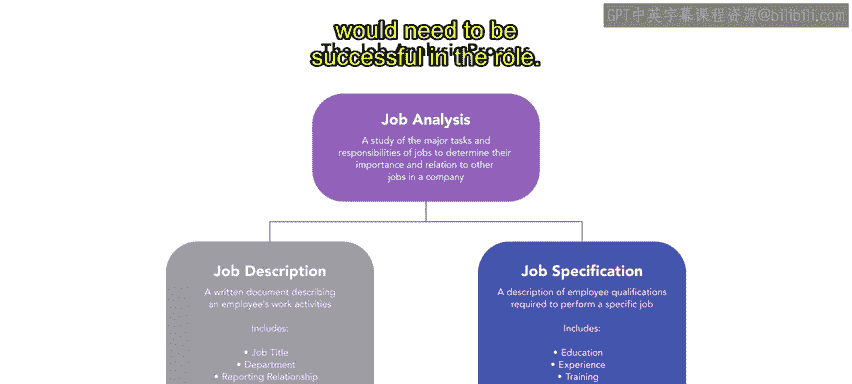

# HRCI《人力资源助理（招聘、学习发展、薪酬福利，1-3课／共5课）》：P20：工作分析

## 概述
在本节课中，我们将要学习招聘流程中的一个核心环节——工作分析。我们将了解工作分析的定义、它的两个主要组成部分，以及如何通过工作分析来确保招聘到合适的候选人。

## 什么是工作分析？
上一节我们介绍了人才获取流程的概览，本节中我们来看看其中的第一个关键步骤：工作分析。

工作分析是对一项工作的任务和职责进行研究，以确定该工作的重要性及其与公司内其他工作的关系。为了为某个职位招聘到合适的人选，你必须了解候选人需要具备哪些技能和能力才能在该工作中取得成功。工作分析通过精确确定特定工作的职责范围来实现这一点。

工作分析包含两个主要组成部分：工作描述和工作规范。

## 工作描述
工作描述是一份描述员工工作任务和职责的书面文件。这份文件详细说明了工作中执行的任务以及工作本身的目的。

以下是创建一份工作描述时通常包含的内容：
*   **职位名称**：例如“全职银行柜员”。
*   **汇报关系**：员工向谁汇报，以及谁向该员工汇报。
*   **主要职责**：员工将执行的关键任务。
*   **雇佣条款**：该职位商定的雇佣条件。

## 真实职业资格
在某些情况下，工作描述可能包含属于真实职业资格的个人特征。真实职业资格（BFOQ）是指为开展业务运营而合理必需的条件。

以下是BFOQ的一些例子：
*   宗教机构可以将个人宗教信仰作为任职资格标准。
*   泳装公司可能只雇佣女性模特来展示女性泳装。
*   联邦航空管理局（FAA）对飞行员和副驾驶有最低年龄要求，并且不雇佣超过60岁的个人。

决定这些资格并将其纳入工作描述时，必须根据《民权法案第七章》的例外条款非常谨慎地进行。

## 工作规范
在确定了工作的主要任务和职责之后，下一步就是创建工作规范。

工作规范描述了员工为执行特定工作所需的资格。规范包括该职位所需的教育背景和经验、与工作相关的任何培训，以及申请者在该职位上取得成功所需的技能、知识和个人特质。

## 实例分析：银行柜员
现在你已经了解了工作分析的基础知识，让我们来回顾一个银行柜员职位的描述和分析。

这份银行柜员工作描述包括：
*   **职位名称**：全职银行柜员。
*   **汇报关系**：银行柜员将直接向银行经理汇报。
*   **主要职责**：根据银行程序处理所有存款和现金。
*   **经验要求**：必须具有相关经验。

该职位所需的任务和技能包括：
*   存入现金和支票。
*   向客户解释银行服务和收费。
*   观察客户行为。

总的来说，这份工作描述强调了在完成任务时注重细节、提供友好的客户服务以及遵守银行程序的重要性。

## 总结
本节课中我们一起学习了工作分析。你现在已经了解到，一次完整的工作分析需要包含工作描述和工作规范。通过深入的工作分析，组织可以为职位招聘到合适的候选人。在后续课程中，你将进一步探索这个概念，并学习完成工作分析的技巧。