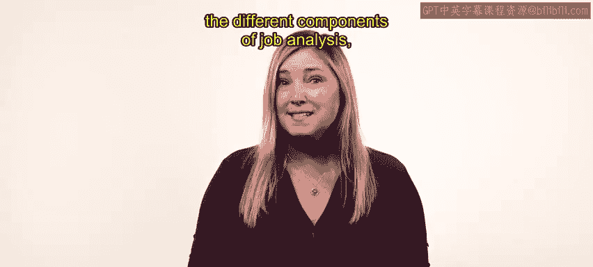
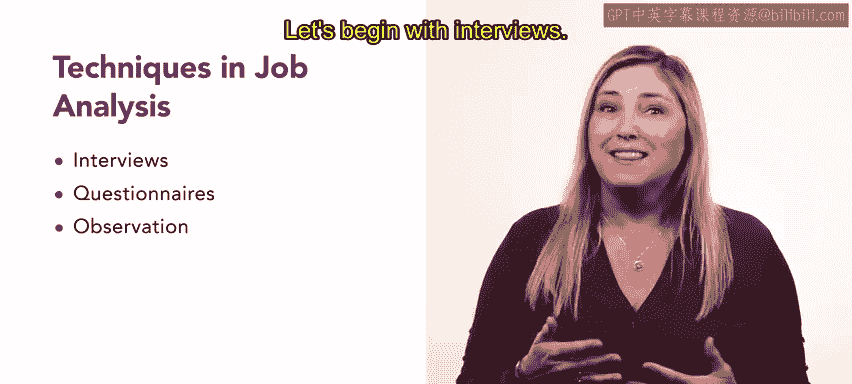
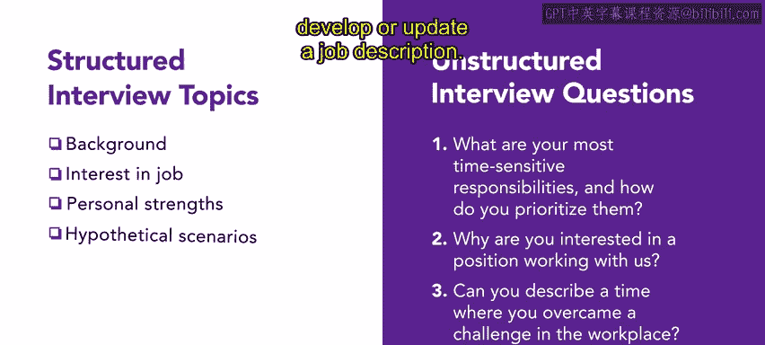
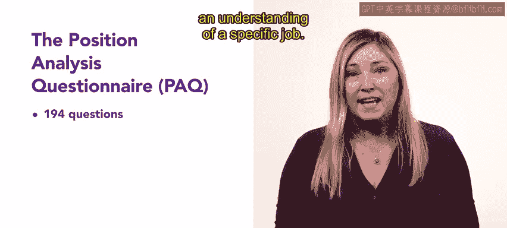

# HRCI人力资源助理课程：P21：工作分析技术 📊

在本节课中，我们将深入学习工作分析的三种主要技术：访谈法、问卷调查法和观察法。我们将探讨每种方法的特点、优势与不足，并了解如何运用这些技术来收集准确的信息，从而制定有效的工作描述和任职资格。

上一节我们介绍了工作分析的各个组成部分，本节中我们来看看具体用于收集信息的三种技术。

## 访谈法 👥

访谈法是一种直接与员工或主管进行交流以获取工作信息的方法。它可以是结构化的，也可以是非结构化的。

以下是访谈法的两种主要形式：

*   **结构化访谈**：使用详细的清单或问题列表，确保访谈者覆盖所有必要的话题。其核心是确保信息收集的全面性和一致性。
*   **非结构化访谈**：使用开放式问题，允许员工根据自己的经验提供深入的回答。例如，可以提问：“**哪些职责对时间要求最紧迫？您是如何确定其优先级的？**” 这类问题能让员工自由回答，并便于访谈者进行后续追问。

访谈法通常易于实施。员工的回答可能揭示出一些未被分配或遗漏的工作职责，这为人力资源团队准确制定或更新工作描述提供了优势。然而，访谈法也存在缺点。访谈过程中的任何不实陈述都可能对收集信息的质量以及整个工作分析过程产生负面影响。例如，员工可能会夸大完成工作所需的专业知识，以使该职位显得更具挑战性或吸引力。

## 问卷调查法 📝

与访谈法类似，问卷调查法在工作分析中也很常见，同样可以分为非结构化和结构化两种形式。如果执行得当，问卷可以像访谈一样有效。但同样地，问卷也可能因信息失真而受到影响。

以下是结构化问卷的一个例子：

*   **职位分析问卷**：这是一种包含194个与工作相关问题的工具。这些问题用于理解特定职位。PAQ由员工或主管填写，在他们的回答中，他们描述并记录执行该角色所需的具体任务、活动和能力。

您也可以使用美国劳工部提供的标准化术语来为结构化问卷创建清晰、准确的问题。这些一致的术语确保了问卷能够为每个角色捕获必要的信息。

## 观察法 👀

观察法是直接观察员工执行工作的过程。您收集关于员工完成的任务和所使用的技能的数据。

这种方法是最准确的，因为它涉及第一手观察，并能清晰地理解工作要求。然而，这种方法也有缺点。与访谈法一样，观察法也需要投入资金和时间。

了解每种方法的优缺点至关重要。在选择最能帮助您创建工作描述和任职资格的技术时，您将运用这些知识。

## 总结 📋

本节课中我们一起学习了如何在工作中分析中运用访谈法、问卷调查法和观察法，以及每种技术的优缺点。后续课程中，您将学习如何利用收集到的信息来创建工作描述。